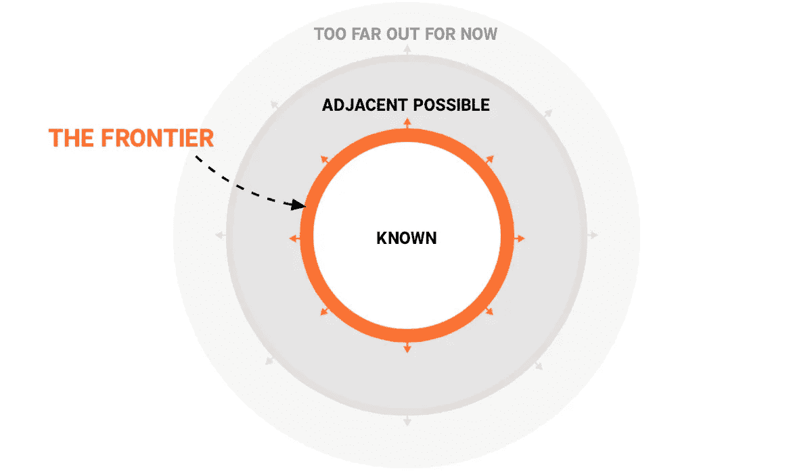
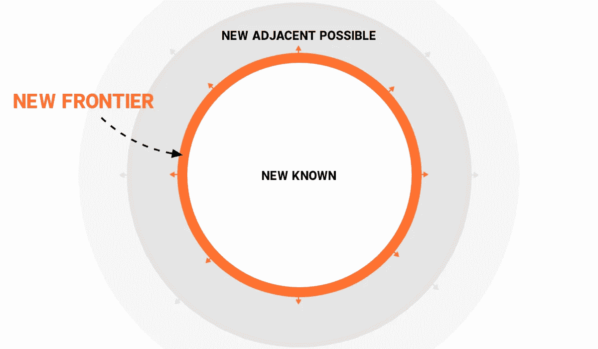

# 寻找你的边疆

> 原文：<https://medium.com/swlh/finding-your-frontier-a68d916957f>

## 如何把自己放在自己冒险的驾驶座上

冒险听起来很不错。刺激。匆忙。魔力。这是一个能刺激感官的前景。

但是在日常生活中，很容易感到被剥夺了冒险的权利。例行任务、不领情的老板和过于拥挤的日程扼杀了日常工作的激情。

这种情况，无论看起来多么真实，都是一种幻觉。

成长和冒险的机会无处不在——如果你知道去哪里找的话。

如果你抬起眼睛，远处有一个特别的地方。这是一个无论在什么情况下都能找到冒险和成长的地方。

那个地方就是**边境**。

# 边境和邻近的可能

边疆就是边缘。这是你目前能力的极限。边界内的一切都是已知的、预期的和安全的。边界之外的一切都是新的、未知的、不确定的。

冒险发生在边境的*。它发生在已知和未知之间的舞蹈中。*

创新专家兼作家史蒂文·约翰逊推广了一个术语，叫做[邻近可能](https://www.edge.org/conversation/stuart_a_kauffman-the-adjacent-possible)。

相邻的可能是任何超出你当前能力范围的事情。当你站在前沿时，如果你真的伸手可及，邻近的可能就是你伸手可及的。

边界不是静态的、固定的边界。相反，它是可扩展的。每向前迈进一步，都有可能扩大疆域。随着边界的扩大，相邻的可能性也在扩大。

尽管突破在当时看起来像是巨大的飞跃，但事实并非如此。相反，创新是一个渐进过程的结果，即向前沿倾斜，并一步一步地扩展邻近的可能性。

没有边界？然后没有成长，也没有冒险。

# 寻找你的边疆

所以你渴望冒险。第一个任务是**找到前沿**。它由以下内容组成:

**边疆=已知*(古老、安全、有保障)* +未知*(新的、不确定的、可怕的)***

边界是已知和未知的结合。这是稳定和不确定性，安全和恐慌，所有的一切。

边界是当你同时感到欲望和恐惧的时候。就在这里“*我想……*”遇上了“*……但是……*”。

这就是诗人大卫·威特称之为 T2 的美丽恐惧:“你一直想要的事情即将发生，但你害怕它真的发生。”

一旦你找到了那种美丽的恐惧感，你就知道你在前沿了。然后第二步是**在边境**成为。

通常我们能感觉到边界在哪里，但我们会回避它。可能是太吓人了。这可能看起来势不可挡。或者也许我们害怕把我们知道的东西留在身后。

不管有什么阻力，都是对完全处于边缘的恐惧。这是一种在未知面前害怕出现和被完全看到的恐惧。

在边缘，我们暴露在自然环境中。这适用于我们所有人，甚至是领导者。大卫·威特说:“领导力的强大动力之一是可见性。可见性的弱点之一是当你可见时，你也能被看见；而当你能被看见的时候，你就能被感动；而当你可以被触摸的时候，你就可以被伤害。”

边疆需要我们所有人。你没有什么可以回避的。只有站在那里，并且全身心地投入其中，你才真正处于生存的悬崖边缘。

一旦你终于鼓起勇气站在边缘，凝视深渊，最后一步就是向前沿倾斜。

身体前倾的第一瞬间会很恐怖、奇怪和不舒服。但是因为它制造的恐惧，它也令人兴奋。它让你活了过来。这是集危险、刺激、乐趣、恐怖和兴奋于一身的鸡尾酒。

你可以让恐惧和抗拒阻止你。或者你可以用它作为一个路标，告诉你去哪里，往哪里靠。一旦你靠得足够近，动量和重力就会解决剩下的问题。

找到。站起来。瘦。

# 为未来的自己练习

有时边界被清楚地标明，但有时却被隐藏起来。无论哪种方式，它总是可以被访问，即使在最无聊的情况下。

如果你面对一个讨厌的同事，你有几个选择。可以叹息不听。你会表现出愤怒、恼怒和沮丧。或者，你可以把这种互动作为一个机会，通过练习换位思考、耐心和领导力来融入前沿领域。

每一刻都是练习的机会。练习更加冷静。练习更加清醒。练习更有同理心。练习更加敢于冒险。练习更加融合。

每次你练习倾斜到你的边缘并坚持不懈，你都在扩大你的能力范围。你在扩大邻近的可能性。随着这种扩张，你正在为未来创造更多的机会和可能性。

你未来的自己是你今天每一个行动的结果。所以尊重未来的自己。在每时每刻寻找前沿。敢于完全呈现在悬崖边。向它倾斜，尽可能扩大邻近的范围。看着新的世界出现。

对我来说听起来像是一次冒险。

## 这篇文章发表在 [The Startup](https://medium.com/swlh) 上，这是 Medium 最大的创业刊物，拥有+442，678 名读者。

## 订阅接收[我们的头条](https://growthsupply.com/the-startup-newsletter/)。

