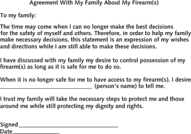

# 枪械安全与痴呆症诊断

> 原文：<https://medium.com/swlh/firearm-safety-and-a-dementia-diagnosis-3bab8e031c09>

美国人口普查局估计，到 2035 年，美国历史上老年人将首次超过儿童。因此，在接下来的几年里，我们将会看到更常见的“老年人”状况相应增加，这是有道理的。这包括阿尔茨海默氏症和其他影响认知功能的痴呆症——包括他们可能不再认识亲密的家人和朋友。

在之前的博客文章中，我已经[提到了枪支暴力限制令](https://thielst.typepad.com/my_weblog/2014/06/gun-violence-restraining-order.html)，以及[个人安全规划](https://thielst.typepad.com/my_weblog/2017/06/disaster-preparedness-for-those-with-functional-limitations.html)，并希望带来这些

今天两个在一起。为什么？因为我在社会支持团体中读到过护理人员在从父母、祖父母、配偶和其他痴呆症患者家中移除枪支时所面临的挣扎。我突然想到，我们更关注仍在开车的老年人的安全。但是，那些拥有枪支的人呢？正如某人可能不再被认为是一个负责任/安全的司机，他们也可能不再被认为是一个负责任/安全的枪支拥有者。

阿尔茨海默氏症协会已经制作了一份概况介绍，提供了一些技巧来帮助护理人员进行对话和处理，但这并不总是容易的。家庭护理人员也需要医生和其他专业护理人员的帮助；在评估过程中，他们至少应该询问一下家中是否有枪。

朋友和家庭成员以及医疗保健提供者需要评估风险，并在护理计划活动期间将谈话重点放在安全上。例如，退伍军人健康管理局建议临床医生和护理团队在对疑似或确诊患有痴呆症的人进行安全筛查时询问枪支问题。

美国内科医师学会也建立了基于公共卫生方法的政策立场来支持护理者。他们建议医疗专业人员就预防与枪支相关的伤害和死亡发表意见，就像医生就其他公共健康问题发表意见一样。*他们鼓励医生就家中拥有枪支的风险向患者提供咨询，特别是当“儿童、青少年、痴呆症患者、精神疾病患者、物质使用障碍患者或其他伤害自己或他人的风险增加的人在场时*

在 [NPR 的一篇文章](https://www.npr.org/sections/health-shots/2018/11/13/660052285/firearms-and-dementia-how-do-you-convince-a-loved-one-to-give-up-their-guns)中，一位心理学家提倡与病人谈论枪支存在和位置的想法，也提出了引导谈话的方法，使其更容易被接受。Joleen Susman 博士建议一种更成功的方法——谈论从驾驶和使用枪支中“退休”——而不是取消这些特权。

急诊室医生艾美奖·贝茨博士也建议在疾病早期进行这些对话，并让亲人参与计划和决策过程。她鼓励使用书面的[枪支协议](https://annals.org/aim/fullarticle/2680727/firearms-dementia-clinical-considerations)，比如下面的样本。

除了不做判断和简单地询问患者家中是否有枪支，加州大学戴维斯分校还为需要和希望对高危患者进行重点干预的医疗保健专业人员制定了[指南](https://health.ucdavis.edu/vprp/WYCD.html)。可用资源还包括[患者讲义](https://health.ucdavis.edu/vprp/WYCD/Files/WhatYouCanDo_PatientHandout_11.20.18.pdf)。

在某些情况下，那些有认知功能障碍的人会变得愤怒、好斗，并拒绝自愿将枪支从他们的财产和/或家中拿走。在这些情况下，家庭成员必须将自身和他人的安全放在谈话的首位 ，并向当地执法部门寻求帮助。

13 个州已经制定了“危险信号”法律，允许执法人员，有时是家属，向法官申请暂时没收那些表现出危险行为的人的枪支。 [NRA 立法行动研究所](https://www.nraila.org/gun-laws/state-gun-laws/)、[吉福兹防止枪支暴力法律中心](http://lawcenter.giffords.org/search-gun-law-by-state/)和[项目枪手](https://www.projectgunner.com/gun-laws-by-state/)是各州法律现状的资源。

我们都有权利持有和携带武器。但是，我们也有责任认识到，为了他人和我们自己的安全，是时候放弃这种特权了。

*最初发表于*[*https://thielst.typepad.com*](https://thielst.typepad.com/my_weblog/2019/02/firearm-safety-and-a-dementia-diagnosis.html)*。*