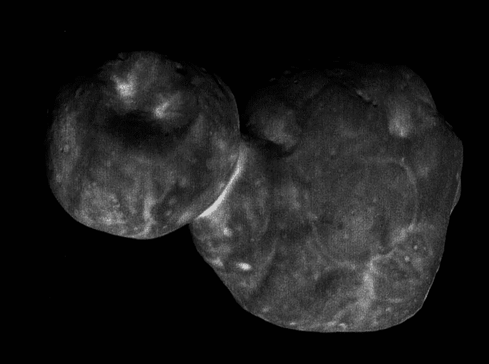

# 新视野号探测器返回的第一个 MU69-Ultima Thule-insights

> 原文：<https://medium.com/swlh/first-mu69-ultima-thule-insights-returned-by-new-horizons-probe-388b33519f9>

## 第一批数据来自美国宇航局的新视野号探测器与 MU69 的相遇，也被称为 Ultima Thule-一种可能在太阳系诞生之初形成的原始物体。

*Main image: The clearest image of MU69–Ultima Thule–captured by the New Horizons probe (NASA)*