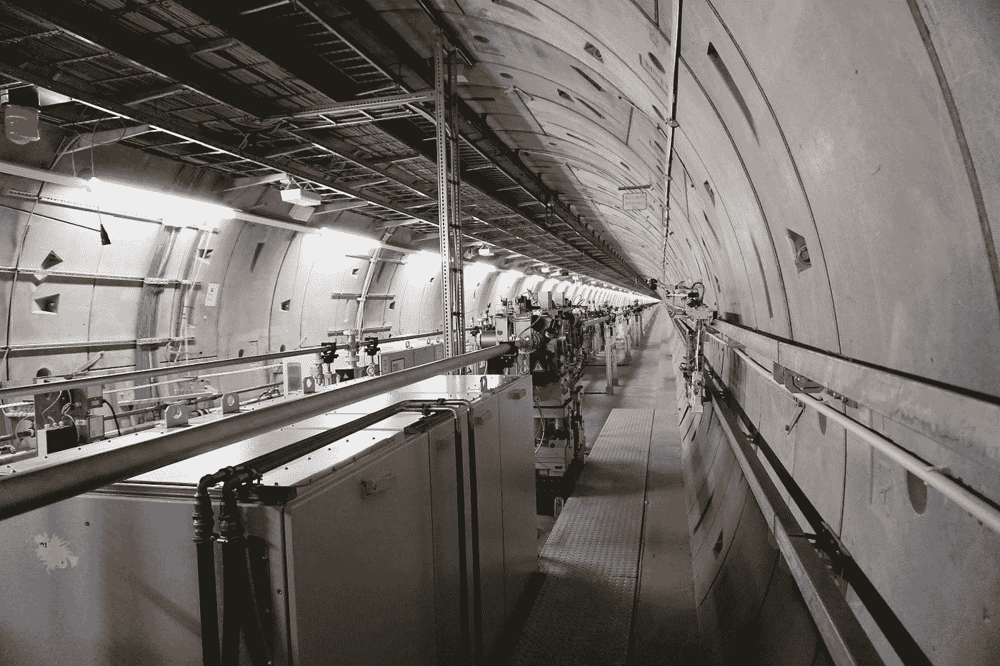

# 首要原则——100 个心智模型#001👽

> 原文：<https://medium.com/swlh/first-principles-c285cc36bcfd>

## 心智模型是通往超人心智的管道。我每天都在发布一个新的心智模型，持续 100 天。

## 埃隆·马斯克的批判性思维工具。

Photo by [Yulia Buchatskaya](https://unsplash.com/@ingwer?utm_source=medium&utm_medium=referral) on [Unsplash](https://unsplash.com?utm_source=medium&utm_medium=referral)

# 第一原则思维是去除所有假设，只关注已经发生的事情…