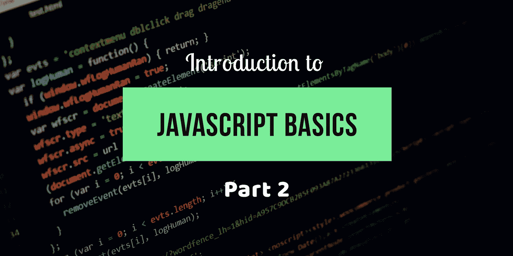

# JavaScript 的第一步—第 2 部分

> 原文：<https://medium.com/swlh/first-step-into-javascript-part-2-4bc2fb724644>

在本文中，我们将学习 JavaScript 中的值、类型、注释、变量和块。



Javascript basics designed by [Vishnu](https://twitter.com/ArchitectUX)

# 值和类型:

为了解释价值观和类型，我们可以试着举个例子:你去一家手机商店，你问员工。

我:这个手机多少钱？

他:是 12400 卢比(是一个**数字**

我: (如果你想买两个你可以很容易地通过添加 12400+12400 = 24800)好吧！那个手机多少钱？

他:他说是“免费”的。(这里他们没有给出数字，而是给出了一个词。)(是一根**弦**

我:手机是否包括耳机？(这个答案可能是也可能不是)(这是一个**布尔**)

同样，在程序中，您可以用不同的表示法来表达这些值。值的表示称为**类型。JavaScript** 有内置类型，被称为**原语值。**

1.  当你需要计算时，你需要一个**数字**。
2.  当你需要在屏幕上打印一些东西时，你需要一个**字符串**。
3.  当你需要作出任何决定时，你就需要**布尔**。(对或错)。

这些值直接包含在源代码中，称为**文字**。字符串由“双引号”或“单引号”表示。数字和布尔文字按原样表示(12，44，True..等等)

```
"This is how string are represented"               //Double Quotes
'This is also how strings can be represented'      //Single Quotes
42                                                 //Number
true                                               //Boolean
```

## 在类型之间转换:

如果你有一个数字，需要在打印时将它转换成字符串，在 javascript 中这种类型的转换称为**强制**。你可以反过来把字符串转换成数字。

```
var a = "44";                  //String
console.log(typeof(a));        //Tells a is a "String"
var b = Number(a);             //Now converts a as a Number
console.log(typeof(b));        // Tells b is a Number now.
```

隐含的强制有点复杂。因为比较两个不同数据类型的值。这就是宽松的平等参与和比较并完成工作的地方。

```
"11.12" == 11.12 //here loose equals kicks in and convert left had side to number 11.12 == 11.12\. Which is true.
```

但是在使用这种隐含的强制时，我们需要更加小心。在使用它之前了解它们的行为，否则可能会导致意想不到的错误。

# 评论:

关于编写代码，你可以学到的最重要的一课是，这不仅仅是为了计算机。对于开发人员来说，代码和编译器一样多，如果不是更多的话。

你的计算机只关心机器码，一系列二进制 0 和 1，它们来自*编译*。你可以编写几乎无限多的程序，产生相同的一系列 0 和 1。你对如何编写程序的选择很重要——不仅对你，而且对你的其他团队成员，甚至对你未来的自己。

但是另一个重要的部分是代码注释。这些是你程序中的一些文本，纯粹是为了向人解释事情而插入的。解释器/编译器总是会忽略这些注释。

关于什么是好的注释代码，有很多观点；我们无法真正定义绝对的普遍规则。但是一些观察和指导是非常有用的:

*   没有注释的代码是次优的。
*   过多的注释(例如，每行一个)可能是代码写得不好的标志。
*   评论应该解释*为什么*而不是*什么*。他们可以选择解释*如果*特别令人困惑。

在 JavaScript 中，有两种类型的注释，它们是

```
//This is the single line comment 
/* This is a 
        multiline
             comment */
```

# 变量:

最常用于跟踪根据需要动态变化的值，并在要求执行时进行不同的操作。

变量就像一个容器盒，里面的值可以随时改变。在一些编程语言中，你声明一个变量(容器)来保存一个特定类型的值，比如`number`或者`string`。

**静态类型**也称为**类型强制**，用于防止意外的值转换。

其他语言强调值的类型，而不是变量。弱类型化也称为**动态类型化**允许变量在任何时候保存任何类型的值。它通常被认为是对程序灵活性的一种好处，因为它允许用一个变量来表示一个值，而不管这个值在程序逻辑流程中的任何给定时刻可能采用什么类型的形式。

JavaScript 使用后一种方法，**动态类型化**意味着变量可以在任何给定时间保存任何类型的值，而无需任何类型的强制。

```
var change = 10;
change = change + 20;
console.log("The value of the change is " +change);// here we convert the number to string 
change = "$" + String(change);
console.log("The transformed value of change is " +change);
```

在上面的例子中，您可以注意到，change 变量有时保存不同的类型值，这就是动态类型。此外，说明了管理程序状态的变量**的主要用途。**

换句话说，状态是在程序运行时跟踪值的变化。变量的另一个常见用法是**集中值设置**。这被称为常量，当你声明一个值，并打算在整个程序中不改变，那么使用 Const。你可以在程序的顶部声明这个常量。

```
//value in the const will never change throughout the program runs
const rate= 82.27;
petrolPerHundredLiter = 100 * rate;
console.log(petrolPerHundredLiter);
```

常量就像值不变的**变量**一样有用，除了常量还可以防止初始设置后在其他地方意外改变值。

## 区块:

在代码中，我们经常需要将一系列的**语句、**组合在一起，我们通常称之为*块*。在 JavaScript 中，一个块是通过将一个或多个语句放在一对花括号`{ .. }`中来定义的。考虑:

```
var amount = 10;
{ // standalone blocks in javascript
amount = amount * 20;
console.log(amount);
}
```

这种独立的通用块是**有效**的，但是在 JavaScript 中，块是附加在一些**控制语句**比如 If 语句(即**条件语句**或**循环**。

```
var amount = 10; 
if (amount <=10)
{
amount = amount * 20;
console.log(amount);
}elseif
{
console.log("Invalid value")
};
//This is the conditional Statement whether the blocks present.
```

我们可以在下一篇文章中讨论条件语句。直到那时

## 编码快乐！

## 如果你喜欢这篇文章，别忘了鼓掌。谢谢你的时间和努力。

*我是* [***毗湿奴***](https://twitter.com/ArchitectUX) *，在一家名为*[***customer labs***](http://www.customerlabs.co)*的产品开发创业公司工作的自学成才的开发者/设计师。我们正致力于创建数字营销基础设施，让数字营销人员在旅途中轻松生活。如果你是一名数字营销人员或在创业公司工作，那么请点击这里查看我们的*[](http://www.customerlabs.co)**。**

*[](https://medium.com/swlh)*

## *这篇文章发表在 [The Startup](https://medium.com/swlh) 上，这是 Medium 最大的创业刊物，拥有+409，714 名读者。*

## *在这里订阅接收[我们的头条新闻](http://growthsupply.com/the-startup-newsletter/)。*

*[](https://medium.com/swlh)*