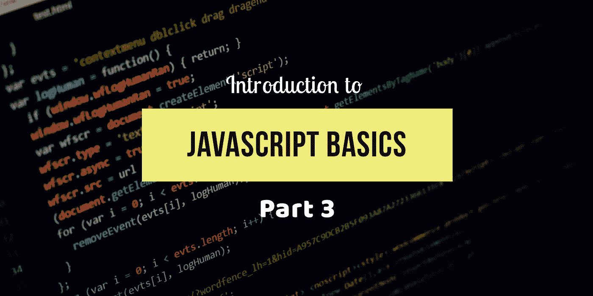

# JavaScript 的第一步—第 3 部分

> 原文：<https://medium.com/swlh/first-step-into-javascript-part-3-e2d778384345>

在这里，我们将学习更多关于 JavaScript 中的条件语句、循环和函数。要查看上一篇文章[，请点击此处](/swlh/first-step-into-javascript-part-2-4bc2fb724644)。



Javascript basics 3 designed by [Vishnu](https://twitter.com/ArchitectUX)

# 条件语句:

从值和类型的角度考虑电话商店的例子。如果商店经理问你是否需要手机屏幕保护，那就是 10.33。对于这一点，店长让你做决定。为此，您可以先查看钱包或银行账户中的现金状况，然后再购买屏幕保护器。但这显然是肯定或否定的答案。

```
var bank_Balance = 400;
var screen_Protector = 245;  
if(screen_Protector <= bank_Balance)      
{
  console.log("Then Purchase the Screen protector")
}
else
{
  console.log("No money so don't buy it");
}
```

`if`语句要求圆括号`( )`之间的表达式可以被视为`true`或`false`。在这个程序中，我们提供了表达式 screen _ Protector<= bank _ Balance，根据`bank_Balance`变量中的数量，它实际上会计算为`true`或`false`。如果条件不成立，您甚至可以提供一个替代选项，称为`else`子句。

正如我们在前面的“值和类型”中所讨论的，不属于预期类型的值通常会被强制转换为该类型。`if`语句需要一个`boolean`，但是如果你传递给它一个还没有的东西，就会发生强制。

# 循环:

当需要从商店员工那里购买手机的顾客有很长的等候名单时。当名单上还有人时，她只需要继续为队列中的下一位顾客服务。

重复某个动作直到某个条件失败是编程循环的工作，循环可以采取不同的方式，但是它们满足基本的行为。

一个循环包括一个测试条件和一个块。每次循环块执行时，这被称为**迭代**。

例如，`while`循环和`do..while`循环说明了重复语句块直到条件不再评估为`true`的概念:

```
while(noOfCustomers > 0)
{
 console.log("Welcome to the Store");
 noOfCustomers = noOfCustomers-1;
}//versusdo
{ 
 console.log("Welcome to the store");
 noOfCustomers = noOfCustomers-1;
}
While(noOfCustomers > 0);
```

这些循环之间唯一的实际区别是条件是在第一次迭代(`while`)之前测试还是在第一次迭代(`do..while`)之后测试。

无论哪种形式，如果条件测试为`false`，下一次迭代将不会运行。这意味着如果条件最初是`false`，一个`while`循环将永远不会运行，但是一个`do..while`循环将只在第一次运行。

我们可以使用 JavaScript 的 **break** 语句来停止循环。此外，我们可以观察到，创建一个没有中断机制就永远运行的循环非常容易。

```
var i = 0;
While(true)     // this while loop will run forever
{
 if((i <=9) === false) // to stop the loop we use condition. 
 {
   break;
 }
 console.log(i);
 i = i + 1;
} 
// 0 1 2 3 4 5 6 7 8 9
```

为了更好地编写上面的代码，尽管 while 和 do while 可以做到这一点，但还有一种称为循环的**的语法形式可以实现这一目的。**

```
for(var i=0; i<=9; i++)
{
console.log(i);
}
// 0 1 2 3 4 5 6 7 8 9
```

循环的**有三个子句，初始化子句(var i = 0)、条件子句(i≤9)和更新子句(i++)。所以如果你打算用循环迭代来计数，For 循环是理解和编写循环概念的更简单的形式。**

# 功能:

手机店的员工可能不会随身携带计算器来计算税金和最终购买金额。这是一个她需要定义一次并反复使用的任务。很可能，该公司有一个收银台(电脑、平板电脑等)。)内置了那些“功能”。

类似地，你的程序几乎肯定会想把代码的任务分解成可重用的部分，而不是一遍又一遍地重复你自己(双关语！).方法是定义一个**函数**。

函数通常是代码的一个命名部分，每次都可以调用它来执行其中的代码。

```
function printPrice()
{
 console.log ("Total is " price.toFixed(2));
}var price = 12500;
printPrice(); //Total is 12500
```

函数可以选择接受实参(也称为参数)，即您传入的值。它们也可以选择返回值。

```
function printPrice(price)
{
  console.log("The total is " price.toFixed(2));
}
function currencyAdder()
{
return "Rs" + amount.toFixed(2);
}printPrice(10);  // The total is 10;
var amount = 20;
amount = currencyAdder();  // Rs 20
```

循环的另一个例子

```
function printPrice(price)
{ 
price = price + 20;
return;
}
printPrice(20);
console.log(The return value is + printprice(20));
```

# 范围:

让我们以手机为例，如果你向商店员工询问某款手机，而她在商店里没有。她可以进入她的商店。你需要去搜索其他商店购买手机。

编程对这个概念有一个术语。这叫范围。在 Js 中，每个函数都有自己的作用域。作用域基本上是变量以及如何通过名称访问这些变量的规则的集合。该函数中唯一的代码可以访问该函数的*范围的*变量。

变量名在同一范围内必须是唯一的——不能有两个不同的**和**变量紧挨着。但是同一个变量名 **a** 可能出现在不同的作用域中。

```
function one()
{
 var a = 10;
 console.log(a);
}
function two()
{
 var a= 20;
 console.log(a);
}
one();             // 10
two();             // 20
```

此外，一个作用域可以嵌套在另一个作用域中

```
function out(){
 var a = 1;
  function in(){
    var b = 2;
    console.log(a + b);  // 3
  }
  in();
  console.log(a);        // 1
}
out();
```

## 编码快乐！

## 如果你喜欢这篇文章，别忘了鼓掌。谢谢你的时间和努力。

*我是* [***毗湿奴***](https://twitter.com/ArchitectUX) *，一名自学成才的开发者/设计师，在一家名为*[***customer labs***](http://www.customerlabs.co)*的产品开发创业公司工作。我们正致力于创建数字营销基础设施，让数字营销人员在旅途中轻松生活。如果你是一名数字营销人员或在创业公司工作，那么请点击* *查看我们的* [***。***](http://www.customerlabs.co)

[](https://medium.com/swlh)

## 这篇文章发表在 [The Startup](https://medium.com/swlh) 上，这是 Medium 最大的创业刊物，拥有+409，714 名读者。

## 在这里订阅接收[我们的头条新闻](http://growthsupply.com/the-startup-newsletter/)。

[](https://medium.com/swlh)