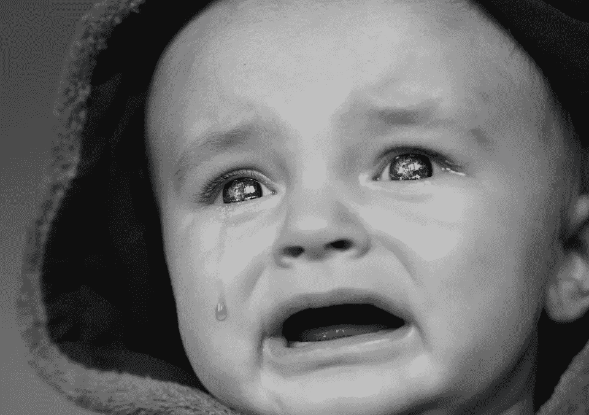
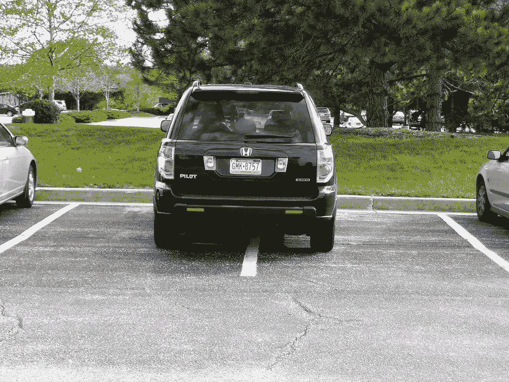

# 第一世界的问题

> 原文：<https://medium.com/swlh/first-world-problems-e4b87f5e0f9f>

今天，西方世界面临着一个前所未有的疫情。它像一场生病的野火一样在全球发达国家蔓延，现在困扰着比疟疾、流感和艾滋病毒加起来还要多的人。

当然，我说的是第一世界的问题。

*大律师烧了我的卡布奇诺#崩溃了*

*6 天前在易趣上买了一件衣服，现在还没到*

我洗完车 10 分钟后，一只鸟在我车上拉屎

我还没有那么幸运逃脱地狱般的感染。和我之前的许多同龄人一样，我也成了可怕的第一世界问题的受害者。

几乎每天，我都发现自己在感叹一些完全不起眼的事情。就像折了角的书页，过度成熟的水果和不经意停放的汽车。

这不好。我们需要解药。我们现在就需要它。

但是，正如任何卑鄙的疾病一样，在我们找到解药之前，我们必须首先确定病源。第一世界问题从何而来？它是如何在如此短暂的时间内变得如此猖獗的？

唉，这不是什么大秘密。

生活变得太美好了。

乍一看，这似乎是一个令人愉快的困境。我的意思是，如果我们必须选择一个困境，生活过于完美将是一个相当不错的选择。

对吗？

问题是这个世界上的一切都是相对的。因此，如果我们的生活有点太舒适——如果事情进展得有点太顺利——小障碍开始变得不那么小了。

琐碎的苦难变得明显小气。微不足道的不便变成了令人恼火的烦恼。

为什么？因为我们人类**需要问题**。我们被设计来侦察它们。在我们的核心，我们需要解决的东西。这是我们赋予生活意义的方式。

如果生活如此美好，以至于真正的问题都不存在，我们会找到古怪而有创意的方法来制造它们。

当我们五星级酒店的泳池边无线网络出现故障时，我们会大发脾气。当我们可爱又体贴的伴侣在下班回家的路上忘记去买喵喵塞勒斯的猫粮时。当我们买一送一的鸡腿券在肯德基被拒绝，因为它昨天过期了。

没错。当我们对青春期的快餐连锁店员工大喊大叫，因为我们不得不为午餐多付 70 美分时，生活显然变得有点太舒适了。

我们显然缺乏真正的问题。具有讽刺意味的是…这是一个真正的问题。

这是一个问题，因为当我们没有机会体验众所周知的 poos 时不时地打球迷，我们没有机会练习当他们不可避免地这样做时没事。

我们变得脆弱。易碎的。依靠物质来帮助我们度过那些完美的世界最终被颠覆的时候。

那么治愈方法是什么？

像许多药物一样，第一世界问题的解药难以下咽。但就像生活中许多令人不快的事情一样，它对我们也非常有益。

我们需要积极地将自己从我们熟悉和喜爱的舒适泡沫中解放出来。寻找困难。给我们的思想和身体施加压力。就一点点。理想情况下是短暂的半规则爆发。

我说的是带着 15 公斤的背包，一大堆虫子，三天不洗澡，爬山。一整天没吃东西。听播客讨论与我们的观点相反的观点。

当我们在生活中注入真正的不适时，我们就给自己披上了一层抗脆弱的盔甲。我们恢复透视。

也许最重要的是，我们记得如何不发牢骚，被称为小屁孩。