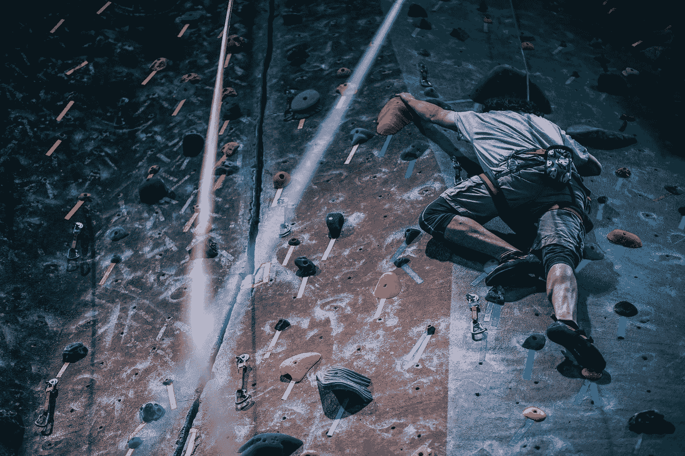

# 攀岩的五堂人生课

> 原文：<https://medium.com/swlh/five-life-lessons-from-climbing-ddd35eadd73e>

Photo by [Fancycrave](https://unsplash.com/@fancycrave?utm_source=medium&utm_medium=referral) on [Unsplash](https://unsplash.com?utm_source=medium&utm_medium=referral)

最近开始抱石。我的健身伙伴拉着我一起去，他坚持说我会喜欢。她声称这在精神和身体上都具有挑战性，但我仍持怀疑态度——怎么会这么难呢？我已经能做 15 个引体向上了，所以我不指望会有身体上的挑战。不会有那么危险，因为有绳子，设施不会冒险让任何人受伤。她傻笑，并建议我不要敲它，直到我尝试…