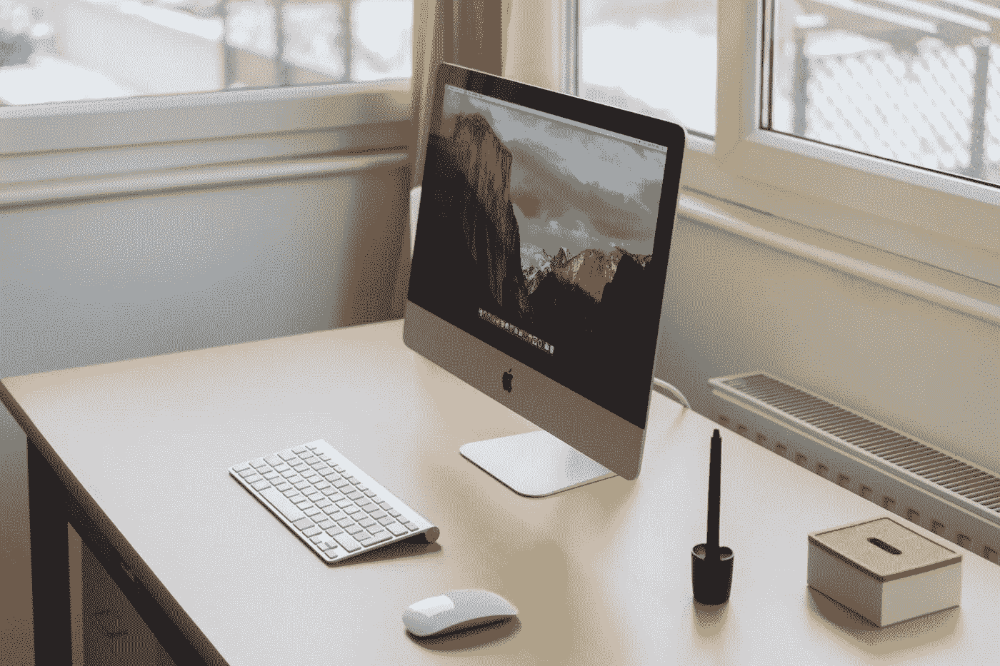

# 不受干扰的工作规则——持续克服阻力的五个积极习惯

> 原文：<https://medium.com/swlh/five-rules-for-distraction-free-work-positive-habits-for-consistently-overcoming-resistance-cd4f60c480a6>

说到做事，“随波逐流”对我来说从来都不起作用。如果我等待灵感的爆发来解决一项重大任务，我永远不会开始。无聊、饥饿、社交分心、娱乐和疲劳等因素总是阻止我迈出第一步。