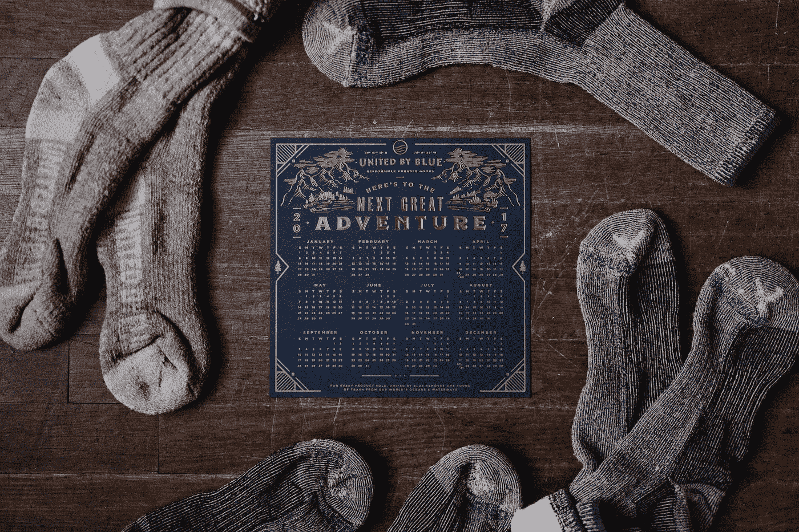

# 你现在可以做的五件事将你的生活质量提高 10 倍

> 原文：<https://medium.com/swlh/five-things-you-can-do-right-now-to-improve-the-quality-of-your-life-10x-2af68e35144d>

确保你从人生目标中获得最大收益的五个简单策略

Photo by [Andrew Neel](https://unsplash.com/@andrewtneel?utm_source=medium&utm_medium=referral) on [Unsplash](https://unsplash.com?utm_source=medium&utm_medium=referral)

我们都生来注定要比别人做得更好。我更喜欢写作。我跑不快，也投不好球。我甚至没有兴趣跑得快或投篮好。我找到了我的使命。这需要一段时间，但它一直存在。一旦我发现…