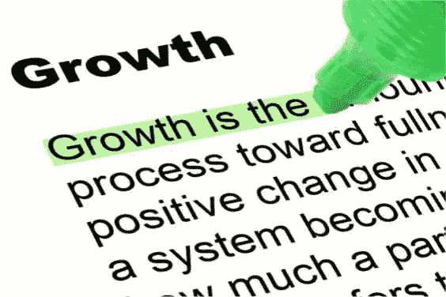

# 下一学年的五种成长方式

> 原文：<https://medium.com/swlh/five-ways-to-grow-next-school-year-a00cf5d5dafb>

随着北美许多教育工作者准备结束另一个学年，这是一个很好的时间来展望未来，思考如何改善我们的教学实践，以及我们可以做些什么来更好地服务于我们的学生和我们支持的学校社区。当我们作为教育工作者能够提高时，我们为我们的教室和学校社区所做的贡献增加了价值。以下是即将到来的新学年的五种成长方式:

**找导师**

也许我们中的一些人认为，找到导师意味着我们需要找到一位能够教给我们智慧之道的古鲁。但是，虽然我们都可以从更有经验的同事那里学到很多东西，但当我们寻找导师时，我们不一定需要找到比我们更有经验的人。今年，找一个拥有你认为对你的实践有帮助的技能或知识基础的人，并允许你向他们学习。更重要的是，找一个能帮助你找到最适合你的学习者的方法和途径的导师。你的学习应该融入到你的教学中，当这发生时，你的学生最终会学到更多。

**做导师**

这一点很容易从之前的想法中引申出来；当然，如果我们都在寻找导师，我们中的一些人也需要成为导师。同样，你不必成为教育界的尤达来指导同事。如果你有很强的技术能力，也许你可以支持一个不如你精通的同事。如果你真正掌握了探究或基于项目的学习，也许你可以和一位同事一起尝试这种方法。当我们考虑成为导师或寻找导师时，我们必须确保学习和成长能够发生。这就是这种安排的美妙之处。我们经常发现，这种关系几乎是偶然变成互惠的。这样，找到一个导师有时也等于成为一个导师；我们都有东西可以提供给对方，这才是合作关系的真谛。

**为你的一些功课重新发明轮子**

这一条对于我们这些在同一个位置上第三年、第四年、第五年或第十五年的人来说尤其重要。也许你觉得你有惊人的单元，涵盖了你的年级水平课程的内容很好。也许你已经收到了关于你的课程和单元有多精彩的赞美。如果是这样，干得好！现在，做一些新的事情。即使你的课程看起来很棒，我们也要记住，每年你都在教一群新的学生，同样重要的是，你接触学生的方式几乎每天都在变化。把那些让你之前的单元令人惊叹的精彩想法、内容和方法用在新的、令人兴奋的方式中，以满足今年学员的需求。技术可能会在你的创新中发挥很大的作用，但也不一定。同样，不要把它看作是“仍然很好”的刮痧课，把它看作是改进你已经很好的材料来满足你的学习者的需要。

**与工作场所之外的教育工作者联系**

导师需要这种面对面的接触，所以当我们谈到寻找导师并成为导师时，我们想到的是你一直可以接触到的同事。然而，我们都能够也应该与和我们不在同一地点教书的教育者联系。董事会内其他学校的教育工作者可能会很有帮助，但要真正获得更广阔的视角并“学习新东西”，我们可能要考虑将我们的专业学习网络(PLN)扩展到董事会、地区甚至国家之外。当我们对广泛的经验、观点和实践敞开心扉时，我们会获得更大的视角感，并且会情不自禁地学到一些值得学习的东西。几个社区已经存在；你可以很容易地在 twitter 和其他社交媒体上找到一些学习社区，帮助你开始开阔视野的旅程。

**阅读与教育无关的书籍**

所以，这一条听起来绝对是反直觉的，但它很有意义。已经写了很多关于“好教学”和相关主题的书。有些很棒，有些没那么棒。不管怎样，我们很多人在阅读时都会陷入一个小陷阱。专业阅读对我们所有希望提高的人来说是必须的，但我们只是必须阅读滋养我们身份其他部分的书籍。当我们忘记满足自己的兴趣和好奇心时，我们就面临着缩小我们创造性视野的风险。讽刺的是，读太多关于教育的书会让我们作为教育者的效率降低(至少在我看来是这样)。我们阅读的每一部小说、每一部传记、每一部短篇小说集或科学理论文本都有可能影响我们个人和教育者。当我们作为真正的“终身学习者”生活时，我们更有可能向学生灌输这种态度。当我们纯粹出于兴趣阅读文本时，我们扩大了我们的知识基础，并建立了我们的观点和批判性思维能力。当我们“做得正确”时，我们的个人阅读可以提高我们作为教育者的能力。

当我们成长为教育工作者时，我们有更大的机会接触我们的学生并帮助他们成长。

展望明年，你对职业和个人发展有什么计划？