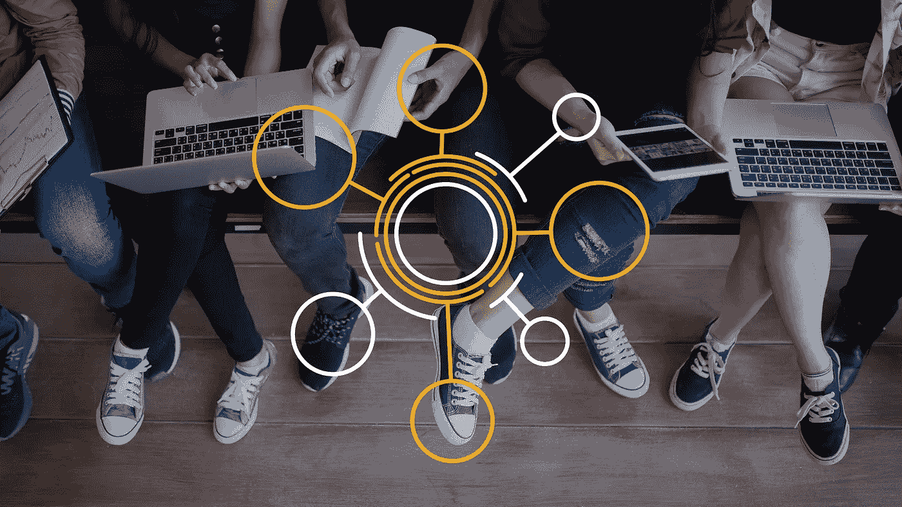

# 在预测分析中记住学生及其隐私的五种方法

> 原文：<https://medium.com/swlh/five-ways-to-remember-students-and-their-privacy-in-predictive-analytics-3729b9aeb53b>

今天，数据是社会的货币，它无处不在，而且非常受欢迎。公司、政治家、甚至高等教育机构收集所有可以想象的数据点，以预测未来的行为和结果。

事实是，我们在社会中采取的每一个行动都会留下数据足迹。谷歌跟踪我们在商店里呆了多长时间，并在我们不知情的情况下报告给我们。我们的信用卡和借记卡创建了消费习惯的档案。而且，你们可能都知道，亚马逊与其他网站合作，吸引你回来完成最近搜索的购买。几乎具有讽刺意味的是，在一个大政府被许多人视为干涉的时代，我们似乎将无数条个人信息交给了非政府行为者。

但是高等教育是通过什么方式利用这场数据革命的呢？全球各地的学院和大学正在努力回答各种问题，包括:哪些学生将按时毕业？哪些学生可能面临留级风险？如果我们想让谁上大学，我们需要给他们更多的经济资助？可以设计什么样的适应性学习课件来成功地实现个性化学习？历史数据可以帮助我们解决所有这些问题，甚至更多。

当我们将决策转化为预测分析中使用的电子表格和基于模型的过程时，这对我们的学生(那些在我们的电子表格上代表各种线条的个人)意味着什么呢？在 EduCon 2.9，一个学生小组表示，他们“担心在他们有机会对老师做出自己的印象之前，这些数据会被用来给他们贴标签。”学生们不倾向于相信这些数据，部分原因是他们无法看到这些数据。学生们还注意到，在评估特定学生的记录时，算法没有能力将外部环境考虑在内。他们不希望数据被用来注销他们的失败或限制所提供的服务；同样，他们不希望自己的学术选择受到限制，或者被视为算法中的一个齿轮。

以限制学生机会或选择的方式使用预测的机构可能未能利用他们真正的机会和力量。整合大数据和预测分析并不意味着失去通常与高等教育相关的个人联系；相反，这意味着能够更快地进行更有意义的对话。这意味着为学生提供我们过去可能会忽略或以前不会考虑的机会，因为可以根据我们自己机构的数据提供额外的个性化解决方案。也许最重要的是，这意味着帮助我们的学生取得成功，我们的项目取得成效，我们的机构取得进步。在设计最好的场景中，这意味着根据我们的经验和直觉来考虑我们的分析能力和洞察力。

那么，我们如何在不失去个人风格的情况下，充分利用预测和大数据呢？我们如何利用数据来帮助学生成功？

# 1.接受关于数据隐私的教育

我们总会在明天比今天收集和知道更多。正因为如此，我们有义务——在道德上，在某些情况下在法律上——在这些问题上尊重学生的隐私。外部供应商应该始终记住，任何可识别的学生数据都应该是机构的财产，或者更好地是学生的财产。随着政府越来越有兴趣帮助公民保护他们的隐私权，这只会变得越来越重要。虽然《家庭教育权利和隐私法案》一直规定了美国校园的数据隐私问题，但与欧盟《一般数据保护条例》中暴露的期望相比，这就相形见绌了。但即使审查越来越严格，我们也必须记住，分析已经在高等教育中变得太根深蒂固，不能简单地停止依赖它。相反，我们必须注意保护学生的隐私。

# 2.使用数据进行整体改进

强大的分析文化旨在确保学生被记住，因为算法的许多部分都是围绕帮助使用数据改善我们生活的愿望而建立的。在高等教育中，这意味着使用数据来帮助学生取得成功，但这并不一定意味着保证他们能够继续学习或毕业，还可能意味着帮助提高学生的成绩，帮助引导学生进入专业或学位课程，为学生匹配课外活动，甚至为学生提供适当的校园附属生活环境。

# 3.利用分析的可用性提出好问题

那么，如果所有这些数据都存在，我们能做些什么来确保这些数据以最符合学生利益的方式使用呢？首先要问正确的问题。当可能性似乎是无限的时候，很难弄清楚我们到底想知道什么——更不用说我们如何找到答案了。但是我们如何学习如何提出正确的问题呢？它始于愿意就我们想要解决的最大问题提出问题。然后，当你思考你试图回答的问题时，就变成了增加必要的细节的问题。问正确的问题是一种日积月累的技能。

# 4.预测应该补充人类的直觉

预测分析和大数据可以为我们这些接受高等教育的人提供很多帮助。但是我们需要现实地看待它的局限性。我们今天可以获得的数据并不完美。有了专门为我们设计的有针对性的信息和体验，我们就不太可能在不做有意识的努力的情况下测试我们自己的界限和体验我们舒适区之外的事情。如果我们过度个性化学习，我们可能无法帮助学生为大学毕业后的生活做好准备。毕竟，雇主可能不会那么通情达理或善解人意。除此之外，我们需要不断地认识到模型只是模型的事实。它们不是为了取代我们自己的直觉或观点而设计的；它们的存在是为了使流程和决策更具可扩展性。

# 5.让学生参与对话

今天的学生习惯于收集、跟踪他们的数据，并将其用于他们生活的各个方面。但不代表他们喜欢。在我自己在校园里使用预测分析的经历中，我在每个新生迎新会上都特意花时间向新生解释我收集了什么，跟踪了什么，运行了什么模型，以及我们对结果做了什么。我邀请学生来看他们自己的结果，并讨论它们的意义以及它们与校园其他方面的比较。虽然不是每个学生都感到满意，但透明的承诺和根深蒂固的意图有助于确保买入和合作。

尽管我希望这不是真的，但预测分析中的模型可能是错误的。它们是随机的，这是有原因的。正因为如此，我们必须记住，算法本身不应该被用来决定学生的成绩。学生相信你的校园可以帮助他们实现目标。因此，当我们忙于构建算法和思考可以帮助我们创建更好模型的最新和最伟大的方法发展时，我们不要忘记这些模型可能对学生产生的影响。

最初发布于:[http://www . campus intelligence . com/2018/11/13/five-ways-to-remember-students-and-their-privacy-in-predictive-analytics/](http://www.campusintelligence.com/2018/11/13/five-ways-to-remember-students-and-their-privacy-in-predictive-analytics/)