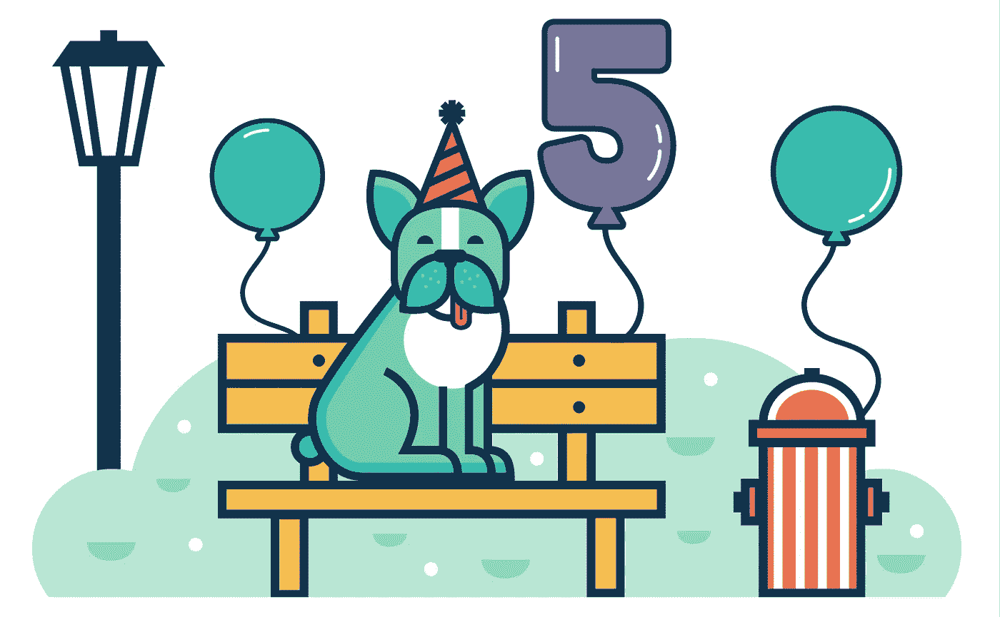
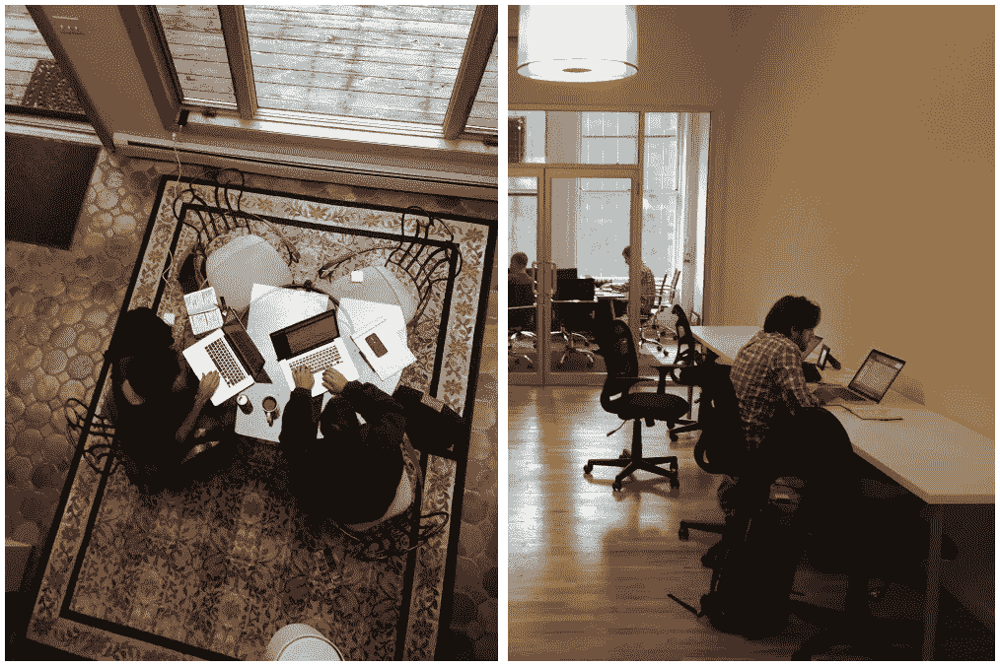
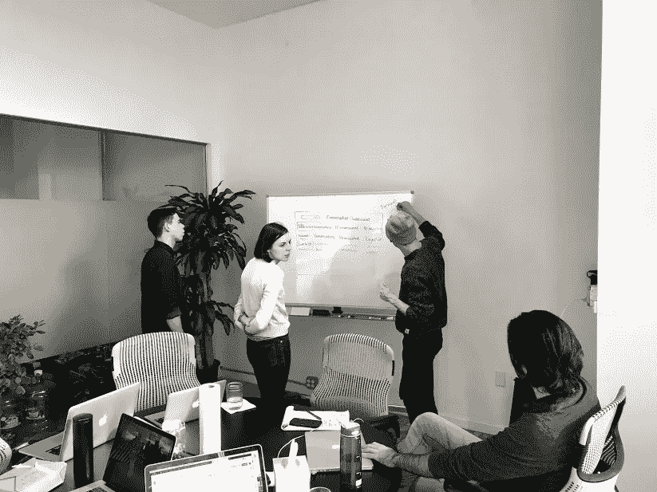
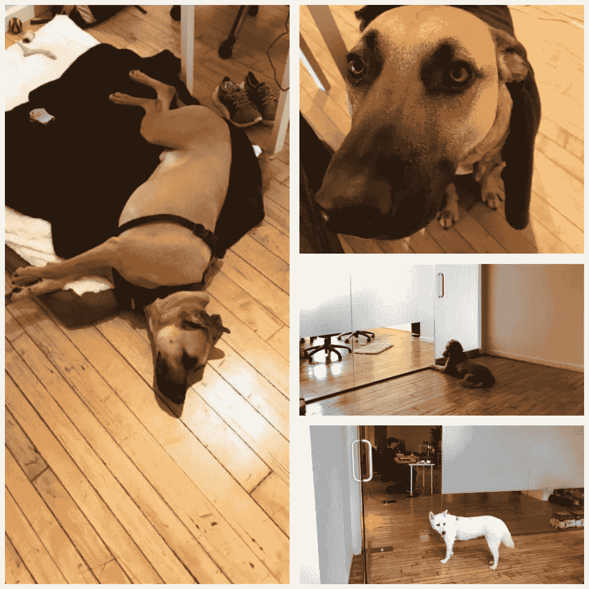
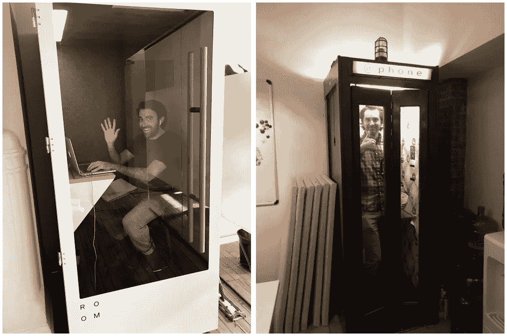

# Underdog.io 五年的收入增长

> 原文：<https://medium.com/swlh/five-years-of-underdogio-ec1124aac4d4>

本周，Underdog.io 正在庆祝其开业五周年。对于乔希和我来说，我们最初设想的人才市场已经成为我们生活中重要的一部分。我在 Underdog.io 上工作的时间比我职业生涯中做的任何事情都长，也更专注。Underdog.io 已经成为我身份的一部分，经常是我见到家人和朋友时问的第一件事，也是我看待工作世界其他部分的视角。

Underdog.io circa May 2014.

从许多方面来说，自公司早期以来，已经发生了很大的变化，当时乔希和我使用谷歌表单作为数据库，在三天内设计并发布了我们的网站，运行谷歌应用套件脚本以 JSON、CSV 和 XLS 格式创建批处理，并每周通过电子邮件手动共享候选人。从那时起，我们已经与数万名求职者和数千家科技公司签约，从我们自己的用户群中雇佣了一个由才华横溢的人组成的小团队，将我们在线市场的核心功能从电子邮件转变为现代网络产品，并在我们位于 SoHo 的办公室中建立了一个有利可图、不断增长的业务。

Partial team brainstorm in early 2019.

在其他方面，大部分还是一样的。我们仍然是 100%的收入来源，没有外部投资者。我们仍然优先考虑质量而不是数量，拒绝不符合我们为平台建立的严格标准的候选人和公司。我们仍然永远处于劣势，与已经雇佣了数百名销售人员并筹集了数千万美元风险资本的大型招聘平台竞争。

更重要的是，我们仍然致力于通过提供工具和信息来支持求职者和公司，帮助他们做出在哪里工作和雇佣谁的明智决定。我们通过实践几个核心原则来专注于这一目标:

1.  把招聘当成一项投资，而不是一笔交易。招聘不是以面试开始，以雇佣结束；这是一个涉及公司组织和生命周期所有方面的过程。
2.  利用技术在求职者和公司之间建立联系，但尽可能地介入和提供支持，使这些联系有意义和人性化。
3.  诚实面对找工作的压力有多大——即使有技术的帮助——并注意那些处于困境中的人的情感体验。
4.  通过避免严厉的销售策略、减少招聘人员垃圾邮件和广泛鼓励最佳实践，改善更广泛的招聘生态系统。

On-brand office visitors over the years.

虽然我们总是发现专注于我们的失败比庆祝我们的成功更容易，但我们也可以承认，2018 年是 Underdog.io 的辉煌一年。以下是一些亮点:

*   与我们的高质量招聘公司网络一起策划和分享了 2000 多名独特的候选人。成千上万不适合加入我们市场的人。
*   我们的客户群和七位数收入同比增长了 50%,员工人数没有变化，也没有销售人员。
*   在竞争异常激烈的环境中，与财力雄厚的竞争对手抗衡，并与百事可乐、WeWork 和优步等企业客户签约。
*   在我们的平台上记录了 150，000 多个公司对候选人的活动。事件是意向驱动的交互，如发送电子邮件、下载简历以及将个人资料导出到 Greenhouse 和 Lever 等申请人跟踪系统。
*   发布了 [Workplaces](https://workplaces.underdog.io/) ，这是一个纪录片系列，通过偷拍照片和长篇内容展示了我们网络中技术公司的文化和价值观。
*   在这些较大的版本之间，对我们的产品和我们公司的运营方式进行了数百次小的改进。

Josh and me hiding out in various phone booths.

我们要感谢这些年来所有注册 Underdog.io 的公司和候选人。虽然我们没有明确的证据证明这一点，但我怀疑许多人使用我们不仅仅是因为我们制造的产品，还因为我们作为一家公司选择的道路。我不会美化它:过去的五年是艰难的，但也是有趣的。鉴于目前的趋势，我们认为未来五年会更好。