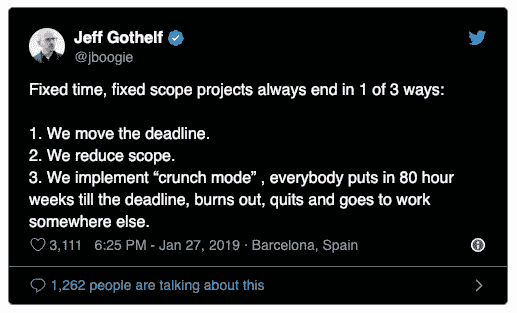

# 固定时间、固定范围的项目总是以三种方式中的一种结束。没有一个是好的。

> 原文：<https://medium.com/swlh/fixed-time-fixed-scope-projects-always-end-in-1-of-3-ways-none-of-them-good-9fa66e7d129e>

上月末，在一次特别令人沮丧的会议后，我发布了以下推文:

不出所料，我不是唯一一个处理这种失败的项目管理方法的人。许多人伸出了虚拟的“击掌”,更重要的是，这些问题为什么对我们这些人来说如此明显…