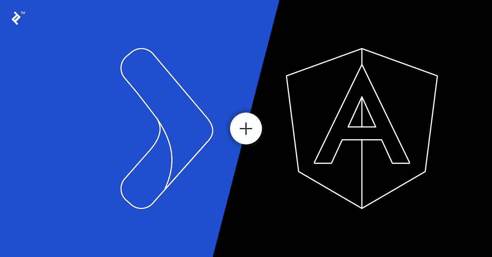

# 修正了整合 Angular 7 和 Play Framework 2.7 时的 CORS 错误

> 原文：<https://medium.com/swlh/fixing-cors-error-when-integrating-angular-7-and-play-framework-2-7-bf8984150fd8>

当使用**作为前端，使用 [**Play Framework**](https://www.playframework.com/) 作为运行在不同服务器上的应用程序的后端/服务时，它们之间的通信会导致**问题。这种方法将有助于解决这个问题。派生或克隆基于 java 的项目并开始开发。****

******项目**:[https://github.com/anjulapaulus/Angular-Java-Play-Example](https://github.com/anjulapaulus/Angular-Java-Play-Example)****

********