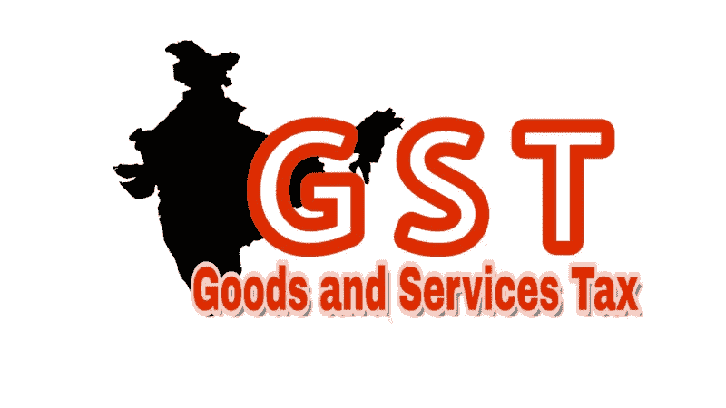

# 修复印度经济:发票门户有帮助吗？

> 原文：<https://medium.com/swlh/fixing-the-indian-economy-will-a-growth-portal-help-f11361b90fa2>

**Can changing the GST payment process help the nation?**

我们印度人刚刚见证了莫迪政府的又一个五年任期。至少在经济领域，前一个术语总是被称为实施去货币化和商品及服务税的双重决策。关于它们对印度经济的影响已经说了很多，有好有坏，我将把宏观分析留给专家。