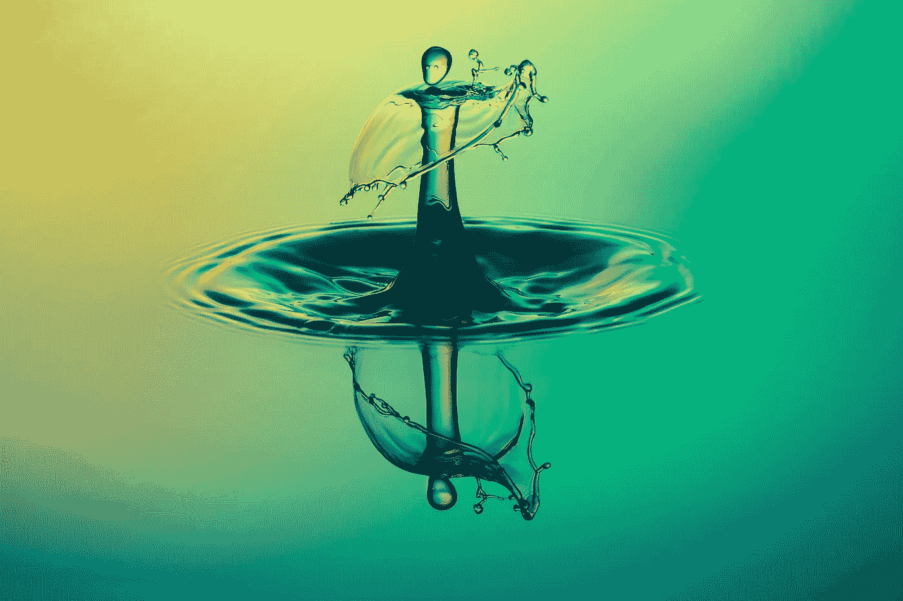
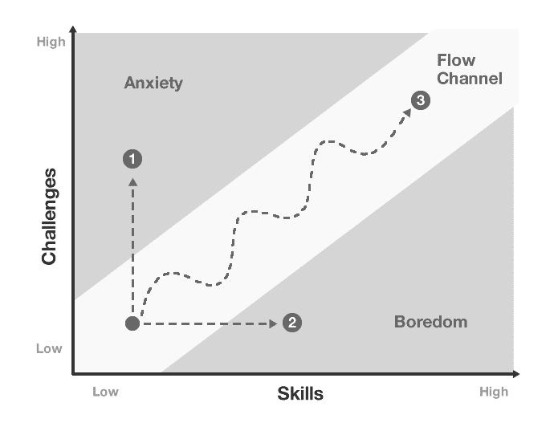
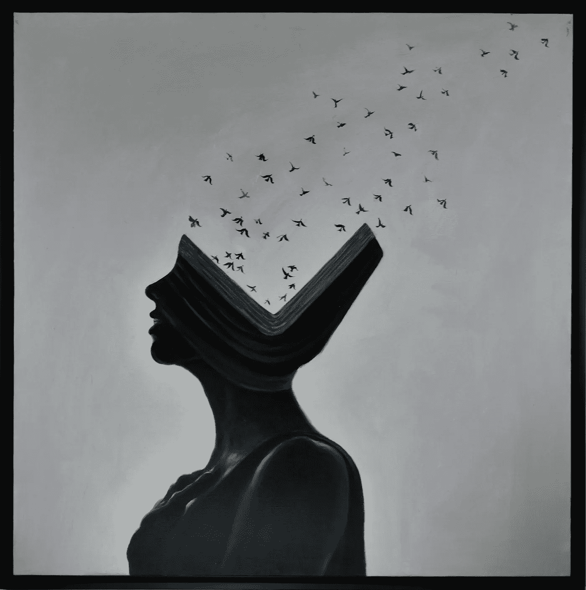

# 心流:焦虑和无聊的有效解毒剂

> 原文：<https://medium.com/swlh/flow-a-productive-antidote-to-anxiety-and-boredom-1b015be966b>

Lost in the flow

在我对生产力的执着追求中，我发现了一块宝石。一个奇妙的概念叫做*心流*，还有*同源*人格。

这个心流的概念，或者更准确地说，这个框架，最终不仅仅是一个生产力工具。它给了我一个框架，让我过上丰富而快乐的生活。如果你进入这个框架，它会带走你所有的焦虑和无聊，用快乐、喜悦和成长来填补空虚。

当谈到心流时，最终的目标是培养一种人格，使你能够在任何你想要的时候进入心流。这样的人叫做 ***autotelic*** *。*

> 自闭者可以享受常人难以忍受的环境。

即使迷失在一个荒凉的小岛上或被关在监狱里，自闭的人也能设法快乐起来。他们将痛苦的状况转化为可控制的，甚至是愉快的斗争，不像其他人，他们不会屈服于苦难。

一个自娱自乐的人可以把一个无聊的聚会变成一个充满活力的聚会，把一个平淡的性生活变成一个充满激情的，把一个枯燥的职业变成一个吸引人的，把一个可怕的处境变成一个宁静的。

作为一个自我陶醉的人，你可以调用心流作为任何可能被无聊或焦虑困扰的环境的解毒剂。

为了培养一个同源人格，你必须首先知道什么是心流，以及组成心流的元素是什么。

# 什么是流量？

心流是一种状态，在这种状态下，你如此投入到一项活动中，以至于其他事情似乎都不重要了；这种专注是如此强烈，以至于没有注意力去思考其他任何事情，或者担心任何问题。

当你在心流中时，自我意识消失了，你失去了时间感，你意识不到任何压力或焦虑，这种体验本身就让你充满了喜悦。

此外，心流活动本质上是有益的，你练习得越多，你就越想复制相似的经历。

Flow — Photo Credit: [Giphy](http://giphy.com)

## 心流，焦虑和无聊的有效解毒剂

我在很长一段时间里经历了各种不舒服的情绪，焦虑是最折磨人的一种。

焦虑背后可能有很多原因。但是，所有这些原因都有一个共同的根源，那就是人类思考未来的能力。心理学家认为，这种对未来的投射会让大脑变得混乱。**减轻焦虑，那么，就是*在意识中建立秩序。***

一个人可以通过遵循三条道路中的一条，在他/她的头脑中建立这种秩序。从长远来看，你选择踏上的道路要么成就你，要么毁掉你。

一般来说，有三条不同的途径可以让你*在你的意识中建立秩序*并驱除焦虑和/或无聊。

*   **破坏性途径:**例子包括使用酒精、雪茄或毒品。沉迷于这样的活动会在头脑中暂时建立一种秩序，使焦虑变得麻木，不用说，代价是极其高昂的。
*   **退化之路:**缓解焦虑的第二种方式是通过破坏性较小的活动，如看电视、网飞、玩电子游戏等。不，这些活动不是良性的。如果你考虑一下你在这些活动上投入了多少时间，如果你评估一下长期的后果，你就会意识到你正在缓慢而稳定地退化。正如鲍勃·迪伦所说:

> "如果你不忙着出生，你就忙着死亡。"

*   第三种消除焦虑或无聊的方法是让自己沉浸在心流活动中。这样的活动除了缓解你的焦虑和无聊，还会培养和丰富你的个性和品格。

几乎每个人都可以通过不同的活动体验心流。例如，我在解决编程问题时最容易进入流程。跳舞、攀岩、下棋、做音乐、读一本有趣的书等等。还有一些心流活动的例子。

现在的问题是，是什么使得这样的活动是心流友好的，条件是什么，你如何设计一个你自己的心流活动？

# 流动的要素

一个活动必须有三个要素来为流动提供空间。这些要素是:

1.  **生动的目标或挑战——如果你想通过一项活动进入心流，它必须有一个具体而生动的目标。如果你正试着弹钢琴，你知道目标是掌握一个特定的音符。或者当你在练习射击时，你知道最终的成功是击中靶心。但是，仅仅有一个目标并不能保证你能到达把我们带到第二个元素的心流。**
2.  **反馈和衡量—** 对于你选择的目标，你必须指定一种方法来衡量你向该目标前进的进度。拥有这种反馈对于创造流动是必不可少的。在拍摄的情况下，获得反馈就像看乐谱面板一样简单。在弹钢琴的情况下，你会不断地注意到你离理解音符有多近。
3.  **让挑战与技能相匹配—** 如果达到你所选择的目标的挑战远远超出了你目前的技能，就会引起你的焦虑。例如，如果作为一个业余爱好者，你选择演奏一个复杂的钢琴音符，而不是进入心流，你会被焦虑和沮丧所排斥。另一方面，如果实现目标的挑战远低于你的技能，这会让你感到厌倦。举例来说，如果你选择和孩子一起踢足球，缺乏挑战性会很快让你厌倦。

> “我们生活中最美好的时刻并不是被动的、接受的、放松的时刻……最美好的时刻通常发生在一个人自愿努力去完成一些困难而有价值的事情的时候。”

The flow channel

# 心流和自体人格

我前面提到过，这里的终极目标一定是达到随意进入心流的能力。能够实现随需应变的人培养了*自动型*人格。自我陶醉的人过着最幸福的生活。

在我详细说明什么构成了一个同源异型人格之前，我必须指出一些可能会阻止一些人培养同源异型人格的警告。

## 内部流动障碍

有些人可能天生没有体验心流的能力。例如，精神分裂症患者患有*快感缺失*，字面意思是“缺乏快乐”精神病学家认为，这种症状似乎是“刺激过度包容”的产物。这意味着精神分裂症患者注定要注意不相关的刺激并处理信息，不管他们喜欢与否。

上面有一个深刻的含义，如果我们不能引导我们的注意力，我们也可能遭受快感缺失或“缺乏快乐”

对心流的一个不太严重的阻碍是过度的自我意识。一个关心别人如何看待他的人。一个担心制造错误印象或沉溺于不恰当事物的人注定会和精神分裂症患者有着同样的信念:冷漠和无趣的生活。

除了精神分裂症患者和过度自我意识的人，还有第三种阻碍心流的属性:*以自我为中心*。这种人仅仅从对他们有什么好处的角度来评价一切。一朵花，除非能用，否则不值得多看一眼；任何不能提升自己欲望和兴趣的人都不值得进一步关注。

以自我为中心和自我意识的人都无法将精神能量导向实现心流。

## 走向自动化:如何进入心流

理查德·洛根研究了许多处于极端困境的人的叙述，得出结论:

> 在恶劣条件下的人，通过想办法把惨淡的客观条件转化为主观可控的体验，生存了下来。他们遵循心流活动的蓝图。

根据《心流》一书的作者米哈里·契克森米哈的说法，这是同源人的行为:

1.  首先，他们密切关注周围环境中最细微的细节，从中发现与他们的能力和处境相匹配的潜在行动机会。
2.  **其次，**他们设定适合他们不稳定情况的目标，并通过他们收到的反馈密切监控进展。
3.  **第三，每当他们达到目标时，他们就会加大赌注，给自己设置越来越复杂的挑战。**

二战期间被长期单独监禁的纳粹囚犯克里斯托弗·伯尼(Christopher Burney)讲述了一段相当类似的经历:

> 如果经验的范围突然受到限制，我们只剩下一点点思考或感觉的食粮，我们会倾向于拿起自己提供的那几样东西，问一大堆常常是荒谬的问题。有用吗？怎么会？谁做的，什么做的？与此同时，我最后一次看到类似的东西是在何时何地，它还让我想起了什么？… 因此，我们在头脑中开始了一系列奇妙的组合和联想*，其长度和复杂性很快就掩盖了它卑微的起点…例如，我的床可以被测量并大致分为学校用床和军用床。当我处理完那张简单得不能引起我长久兴趣的床时，我摸了摸毯子，估计了它们的温度，检查了窗户的精确结构，厕所的不舒服……计算了牢房的长度和宽度，方向和高度。*

在寻找精神挑战和设定目标方面，同样的独创性与其他痛苦环境幸存者讲述的经历相似，从被恐怖分子抓获的外交官到被中国人监禁的老人。

Freedom of thought

斯大林统治时期被囚禁在莫斯科的伊娃·蔡塞尔(Eva Zeisel)试图用手头的材料制作胸罩，在脑海中与自己下棋，用法语进行想象中的对话，并记住自己创作的诗歌，以此来保持自己的理智。

希特勒珍爱的建筑师阿尔贝特·施佩尔在斯潘道监狱里保持了几个月的平静，他假装从柏林步行到耶路撒冷，试图想象尽可能多的事件和场景。

当逆境袭来，打破了我们的宁静，或者当厌倦悄悄潜入并侵蚀我们的灵魂时，我们必须找到新的方法来投入精神能量。否则，我们混乱的头脑将成为我们生活的地狱。

> 即使客观上我们可能是奴隶，但主观上我们可以是自由的。

理查德·洛根根据包括维克多·弗兰克尔和布鲁诺·贝特尔海姆在内的许多幸存者的著作，对构成自动人格的其他因素提供了进一步的见解。他总结道:

> 幸存者最重要的特征是一种“无意识的个人主义”，或者说是一种不追求自我的强烈目标。拥有这种品质的人会在任何情况下都尽力而为，但他们并不主要关心提升自己的利益。因为他们的行动有内在的动机，所以他们不容易受到外部威胁的干扰。有了足够的精神能量自由客观地观察和分析他们的周围环境，他们就有更好的机会从中发现新的行动机会

到目前为止，我们可以得出结论，培养自我型人格的关键因素是摆脱过度的自我意识和个人主义。这是本世纪最伟大的哲学家之一伯特兰·罗素对他实现个人幸福之路的描述:

> 渐渐地我学会了对自己和自己的不足漠不关心；我开始越来越多地把注意力集中在外部事物上:世界的状态，各种知识分支，我所喜爱的个人。"

围绕着心流的概念，我的底线是我必须学会如何在每一种情况下创造心流。无论是在街区里走来走去，还是被堵在路上，都要由我来掌控，让我的想法有条理。

现在，多亏了心流的框架，我知道了如何在我的头脑中建立秩序，享受当下，不管情况如何。

# 总而言之:

*   进入心流需要三个要素:明确的目标，对实现目标的进展有反馈，实现目标的挑战必须超过我们的技能，以保持我们的兴趣。
*   如果我们控制我们的注意力，使用心流的框架，在给定的情况下给我们的头脑提供结构，我们就可以在任何情况下都达到心流。
*   即使在像纳粹集中营这样可怕的环境中，自闭的人也能很容易地达到心流。
*   三类人很难培养出同源人格:精神分裂症患者、过度自我意识的人(他们沉迷于他人对他们的看法)和以自我为中心的人。

## 这篇文章发表在[《创业](https://medium.com/swlh)》上，这是 Medium 最大的创业刊物，有+432，678 人关注。

## 订阅接收[我们的头条新闻](https://growthsupply.com/the-startup-newsletter/)。

