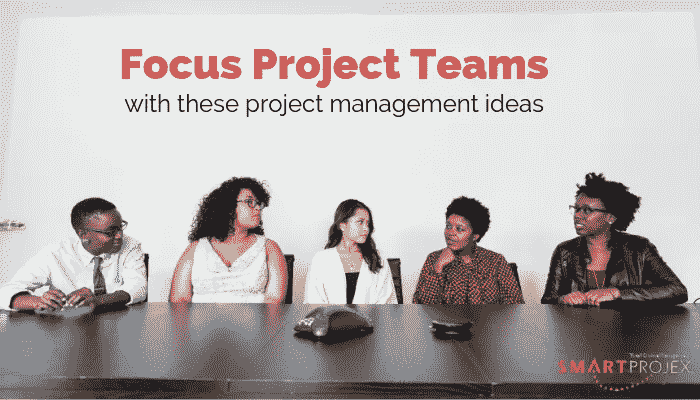

# 让您的项目团队专注于这些项目管理理念

> 原文：<https://medium.com/swlh/focus-your-project-teams-with-these-project-management-ideas-f0262a002b20>

组织需要保持专注，以达到最佳状态。为了实现这一点，个人需要专注于重要的事情。根据您的团队是否致力于一个项目和/或位于同一地点，以及分散的团队(有时是志愿者)可能从事多个项目，挑战会有所不同。

几年前，我在为一个非盈利项目工作，我注意到事情进展缓慢。事情就是做不完。同样的事情发生在一个大项目上，在一个重要的截止日期到来后，压力减轻了。在某些情况下，项目可能会有一定的起伏，这使得每个人都崩溃的时期变得可以忍受。

在敏捷世界中，scrum masters 跟踪速度——团队在一次冲刺中完成的工作量的度量。当你有一个固定规模的专门团队时，这种方法是有价值的。但是当你在 sprint 中需要的工作量频繁波动，团队的规模改变，或者人们没有在项目中全职工作时，会发生什么呢？这里有一些有用的提示。

# 对低价值的项目说不。

我之前已经在这里写了这方面的文章，所以我不再赘述。我会说团队知道他们什么时候在做无关紧要的事情。他们会不由自主地失去动力。

# 根据明确的成功标准，将较长的项目分成多个项目。

我喜欢从事大项目。我喜欢为重要的项目工作。但是当项目是如此巨大，以至于在你的团队的一半成员经历一个改变生活的转变之前不能完成时，你的项目团队就有可能在项目的生命周期中经历多次转变。有些人就是不能承诺持续五年或十年的项目。

我明白有时候这没用。很难将一个在密西西比河上建造桥梁的项目分成两个提供独立价值的项目。但涉及到技术项目，往往可以做到。你的项目越不可预测，就越有必要把它分成更小的项目，每个项目都能带来价值。

那么，你能把你的项目分成更小的项目，然后按顺序实现它们吗？还是想把它们当做一个程序来管理？

# 过度传达愿景。

这是我最喜欢的口头禅之一，然而，我仍然看到团队在活动中工作，但并不真正理解他们为什么要做这项工作。不要假设你的团队和你想的一样。项目团队成员可能太专注于工作的细节，而忽略了愿景。

你可能会问“为什么？”停留在你的脑海中，并认为这对其他人来说是显而易见的，但事实可能并非如此。要理解这是怎么回事，试着为一首众所周知的歌曲鼓掌，比如《生日快乐》,看看有多少你的朋友在没有旋律的情况下也能识别出节奏。当我们对某件事了如指掌时，我们会认为别人也知道。这可能是一个大错误。确保每个人都专注于愿景。

# 分解你的项目，这样你就可以在一次冲刺中完成所有的活动。

有时候，团队可以在项目上非常努力地工作，但似乎从来没有把事情做完。最终，它可能会走到一起，但保持动力是很难的，因为似乎没有什么事情是完全完成的。

这就像试图彻底打扫你的整个房子，而不把它分解成实际上可以完成的大块。结果是你的房子在很长一段时间内都是灾难性的凌乱。

完成活动是激励。庆祝这些小小的胜利。它从你如何分解项目开始。我已经在这里写了如何做到这一点。目标是能够在每次冲刺中完成一些重要的事情。这不仅会激励你的团队，而且你的客户也会对支付账单感觉更好。

# 有效利用团队会议。

我听说过我们应该停止开会的所有理由，相信我，我已经多次因开会而沮丧。我认为问题在于糟糕的会议。

如果做得好，常务会议可以建立承诺并保持团队参与。检查点会议是团队聚集在一起庆祝成就、确定已吸取的教训、审查客户的成本以及确定和分析项目风险的时候。此外，团队计划下一个 sprint 的工作。可以把它看作是回顾和冲刺计划会议的结合。

虽然有许多建议有助于确保会议有效，但这里有三条:

*   准时开始和结束会议。
*   创建一个计划来确保你的会议成功。
*   坚持让参与者参与进来。(把不必要的设备收起来。)

如果你有分散的项目团队，这些都没有帮助，给我打电话，我看看我是否能找到解决方案。

## 这篇文章发表在[《创业](https://medium.com/swlh)》上，这是 Medium 最大的创业刊物，有+436，678 人关注。

## 订阅接收[我们的头条新闻](https://growthsupply.com/the-startup-newsletter/)。

