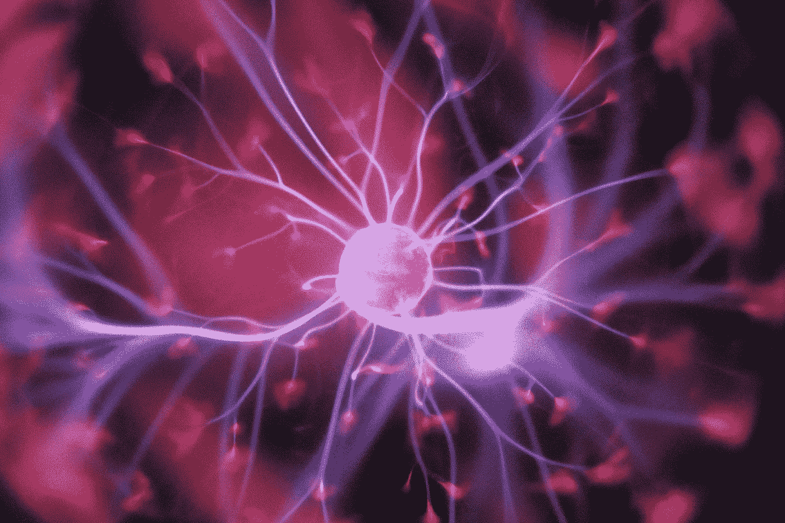

# 对于具有社会意义的心理学来说

> 原文：<https://medium.com/swlh/for-a-psychology-of-social-significance-d1997205bedc>

当一门社会科学是“价值中立的”时，它是对现状的尊重。

Photo by [Daniil Kuželev](https://unsplash.com/photos/QRawWgV6gmo?utm_source=unsplash&utm_medium=referral&utm_content=creditCopyText) on [Unsplash](https://unsplash.com/search/photos/psychology?utm_source=unsplash&utm_medium=referral&utm_content=creditCopyText)

心理学作为一个全球性的研究和实践领域，其重心是美国心理学。美国心理协会是世界上最大的心理学家组织，无论美国发生什么样的心理发展，都经常被输出到国际上。

然而，尽管[知道](https://www.psychologytoday.com/us/blog/am-i-right/201210/the-effects-poverty-the-brain)贫困的[心理影响](https://science.sciencemag.org/content/341/6149/976)，心理学家们已经远离公共政策。当谈到社会贫困问题时，他们似乎只是嘴上说说，但以前在战争期间，在国家的命令下，他们可以毫无困难地扮演积极的角色，违反他们自己的道德准则。

让我们这样说:心理学家能够并且确实帮助了无数的个人。严重的精神疾病，即使控制了特定的社会背景，也是真实的。

但是，尽管有许多精神病理学的社会基础的证据，为什么心理学从根本上被限制在实验室、大学院系、健康中心和(通常非常昂贵的)治疗师办公室？学科的历史可以照亮道路。

现代心理学在 19 世纪发展成为一门实验室专用的科学。它的早期实践者阐明了他们的分析单位(个人)和偏好的方法论(通过实验室的自然科学)，渴望物理学作为一个理想的、值得尊敬的科学模型。这一决定在本质上是政治性的:将心理现象分解成离散的元素，并在实验室中控制外部影响，这被证明有助于确立心理学的科学地位。

社会科学的学术组织分成不同的部门，造成了学科之间不可逾越的鸿沟。例如，心理学家、社会学家、人类学家和经济学家看待世界的各种方式的不同，部分是由于这些领域是如何组织和专业化的，而不是由于研究的主体/客体所要求的。它们的共同点比看起来要多得多，但它们的分裂主要是因为社会原因(这导致了描述类似现象的特定学科词汇),而不是认识论原因。考虑心理学在多大程度上也是社会学、历史人类学和政治经济学是有趣的，反之亦然(以及结合)。

心理学历史学家 Thomas Teo (2005) 指出，精神生活的特殊化在历史上与现代资本主义社会巩固过程中的制度发展相平行。如果是这样的话，我们应该问的问题是:**心理学在多大程度上是一种社会和历史定位的——而不是一种普遍的、价值中立的、自然科学的——事业？**

# 积极实证主义者

心理学的众多分支学科提出了不同的研究问题。**他们大多数人的统一因素是方法。**一般来说，心理学内部的认识论是通过定量方法论产生的。目标是发现客观的、可预测的和可概括的知识。这样，美国心理学——也就是广义的西方主流心理学——就是*实证主义者*:它旨在将复杂的过程简化为其组成部分，剥离背景，揭示它们如何客观地运作。通过*达到*终点*意味着*的定量方法，包括基于实验室的经验研究，类似于生物学和物理学等自然科学领域——根据心理学的历史起源和确定其作为一门新科学的地位所涉及的决策。

在以数量为主的方法论取向中，有哪些内在的认识论含义？量化人类行为——行动、意图、动机、思想、感知、解释、反应等。—允许将结果转化为数据点，作为一种呈现方式，数据点暗示着某种类似法律、公正且可预测的东西。考虑到心理学更多的是将方法置于理论之上，研究已经有效地被方法学所指导。结果，主流心理学被指责为*方法论*或*方法论*，积累了大量缺乏理论连贯性的数据。如果没有理论上的澄清，心理学有可能成为一门漫无目的的科学，为了研究而研究。这样，心理学就缺乏了社会意义。

Photo by [Hal Gatewood](https://unsplash.com/photos/OgvqXGL7XO4?utm_source=unsplash&utm_medium=referral&utm_content=creditCopyText) on [Unsplash](https://unsplash.com/search/photos/psychology?utm_source=unsplash&utm_medium=referral&utm_content=creditCopyText)

# 神经中枢转向

1990 年，美国启动了[“大脑十年”这是一个标志性的时刻，标志着长达数十年的深刻的社会文化转型的高潮。变化发生在两个层面上。正如社会学家尼古拉·罗斯](https://www.loc.gov/loc/brain/)所描述的，首先是

> 健康对富裕的西方人的愿望和伦理的重要性日益突出，生活在这种文化中的人愿意从健康和疾病的角度来定义他们的问题和解决方案，以及当代对健康和疾病的理解主要是从可治疗的身体机能障碍的角度来理解的趋势。

第二，这是一个转变

> “我们作为‘心理’个体的意识在整个二十世纪得到了发展——居住在由传记和经验塑造的深层内部空间中的生物，我们个性的来源和我们不满的所在……被补充或取代…[通过]用身体术语定义一个人个性的关键方面的趋势……认为自己是‘被体现的’,并在当代生物医学的语言中理解身体。”

在某种程度上，我们不是通过社会、政治或经济范畴或理论，而是通过心理范畴或理论来理解我们自己和人类的问题，可以说社会已经心理化了。无论哪个分支——认知神经科学、发展、异常、临床、社会等等。—心理学始于个人，也止于大脑。

在一次[最近关于他的新书*成瘾时代*的采访](https://player.fm/series/new-books-in-critical-theory-2508295/david-courtwright-the-age-of-addiction-how-bad-habits-became-big-business-harvard-up-2019)中，历史学家大卫·考特赖特讨论了“全球工业，经常在串通一气的政府的帮助下……鼓励了过度消费和成瘾。”他将影响边缘系统的成瘾与“大脑中负责快乐、动机、长期记忆和其他与情绪相关的生存功能的部分”如何被大商业利益集团“扩大[和]武器化”联系起来。考特赖特在他的“边缘资本主义”概念中整合了成瘾的大生意。

可悲的是，数百万人将继续遭受毒瘾带来的毁灭性后果，因为根据考特赖特的说法，

> “事实是，在屏幕的另一边，有一千个人……试图让你的眼球粘在屏幕上。你可能认为你可以把它们寄出去……祝你好运。”

上瘾在很大程度上是由资金充足的工程师和营销专业人员团队维持的，他们致力于扩大商业化的恶习。成瘾的社会根源的神秘化部分是由当代生活的两个特征维持的:第一个是“神经中心主义”，或者说主要是西方偏向于对病理学的个性化、心理化和医学化的理解。其次是新自由主义的持久意识形态遗产:将“自由”与不受监管的资本主义混为一谈。

A system at failure, or a system at work? | Photo by [John Moeses Bauan](https://unsplash.com/photos/6ner152Cc6c?utm_source=unsplash&utm_medium=referral&utm_content=creditCopyText) on [Unsplash](https://unsplash.com/search/photos/homeless?utm_source=unsplash&utm_medium=referral&utm_content=creditCopyText)

# 中立的政治

人们依赖于我们对人类科学中对还原论和定量方法论的偏好的质疑。问一些基本的问题，例如，**“人类的行为是可以量化的吗？”**具有重要的社会意义。实验性的定量研究——它必然会使研究对象脱离语境——在产生有意义的心理学知识方面有多大用处？心理科学的主流方法论声称能产生客观的结果。因此，它坚持价值中立的科学概念，就像在真空中一样暴露其发现。事实上，行为科学不可能真正做到价值中立和非政治化，因为这些立场本身就是政治性的。

> 通过致力于价值中立和客观，心理学天生就是保守的。关注个人可以减轻建设性公共政策和社会变革的负担。

心理学充其量帮助了无数人。另一方面，心理学使让无数人失望的社会现状合法化。美国是世界历史上最富有的国家，然而它正遭受其他国家更成功解决的问题。

联合国极端贫困和人权问题特别报告员菲利普·奥尔斯顿发现，在美国 4000 万贫困人口中，“美国贫困儿童的数量高得惊人。2016 年，18%的儿童——约 1330 万——生活在贫困中，儿童占贫困人口的 32.6%。”在经合组织的 36 个发达国家中，美国在 2016 年的贫困排名中垫底，[而且情况还会变得更糟。](https://www.democracynow.org/2018/6/15/blistering_un_report_trump_administrations_policies)

精神疾病与贫困和资源获取不足同时存在。反之亦然:当金钱和稳定的就业不再是永远的烦恼，社区得到投资，教育有足够的资金，新鲜的食物和干净的水可以获得，基础设施得到维护等等，人们会做得更好。

如果心理学的目标仍然局限于修正个人行为，那么很好地适应一个疯狂的社会意味着什么？