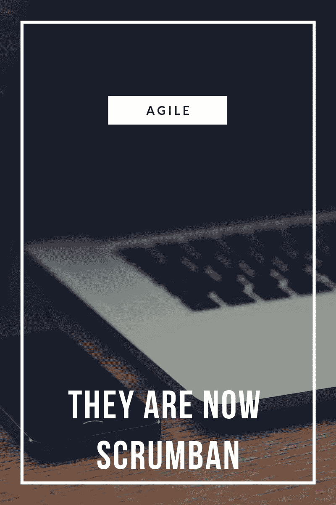

# 他们现在是 scrumban

> 原文：<https://medium.com/swlh/for-a-while-there-existed-a-scrum-team-working-on-a-cloud-based-software-product-9e636314d6b>

有一段时间，有一个 scrum 团队在开发一个基于云的软件产品。这个团队致力于应用程序的 API 和后端更改。团队通常每个月发布一次。对于同一产品上的一个新程序，团队被要求在它的交互式前端工作，API 和 go 在一个连续的交付模型中。该团队决定像以前一样继续两周的冲刺，并使用更多的自动化测试来实现持续的…