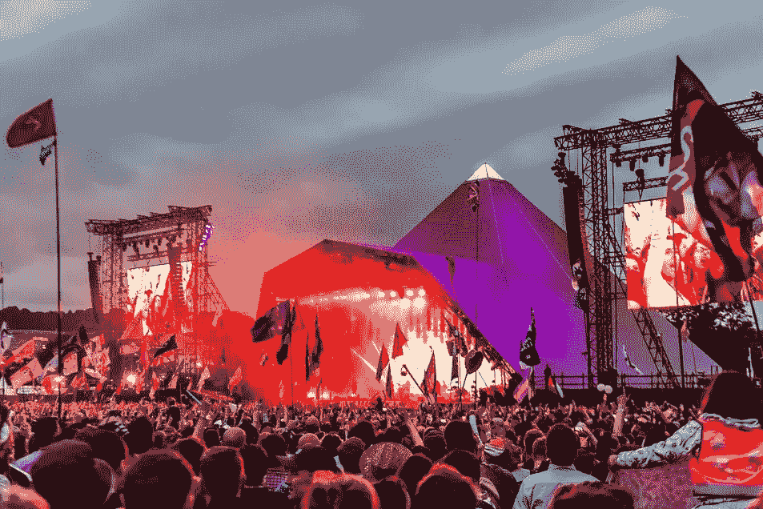

# 任何试图转售格拉斯顿伯里音乐节门票的人

> 原文：<https://medium.com/swlh/for-anyone-attempting-to-buy-tickets-for-glastonbury-festival-in-the-resale-3597c4d20643>

# **需要牢记的一些事情……**

Glastonbury 2017 (Photo Credit: [Andrew Allcock](https://www.glastonburyfestivals.co.uk/friday-in-pictures-5/))

对于英国大约 20 万人(以及全球数百万电视观众)来说，今年 6 月的亮点将是格拉斯顿伯里音乐节。这是世界上最大、最著名、历史最悠久的音乐和当代艺术节。