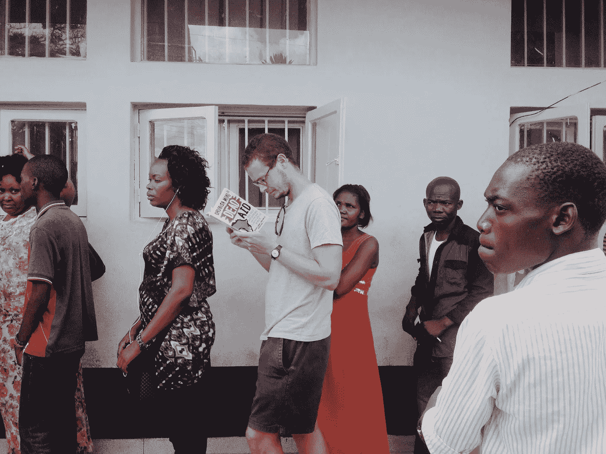

# 对于创意人员来说，有没有出差太多这种事？

> 原文：<https://medium.com/swlh/for-creatives-is-there-such-a-thing-as-too-much-travel-5447fa2182e6>

## 遭遇“颠峰游牧民”——以及如何克服它。

Reading in the queue at a Malawian border post, while on a 34-hour bus journey.

2015 年，我搬出了合租的公寓。我灵光一现:我意识到——多亏了互联网——我实际上不需要一直待在我最大的客户所在的地区。我的家乡，南非的开普敦，是一个非常美丽的居住地，但我有强烈的欲望去探索其他地方，在遥远的土地上度过时光。

这种旅行癖助长了将近四年的游牧生活。我坐过数百次飞机，到过每个大洲(除了南美和南极洲)。对于一些朝九晚五的上班族来说，这看起来就像是生活在梦里。

当然，我很感激作为一名自由职业者所拥有的灵活性——在决定“何时”和“何地”时拥有如此多选择的令人兴奋的自由。有很多好处:我旅行的越多，就有越多的东西可以写(除了文案，我还为杂志和报纸写稿——通常是关于我去过的地方)。我遇到了很棒的人，品尝了很棒的食物。

但事情并不都是美好的:我经历了惨痛的教训才明白，一件好东西可以拥有太多。不断的旅行开始消耗我的创造力——当你依靠旅行赚钱时，这并不理想！适应新的地方和新的人一直让我精疲力尽——就像持续的、令人不安的流动:飞机、火车和公共汽车。我不得不努力寻找能量和动力去写尽可能多的东西。我的精神健康受到了影响——我的强迫症发作了，在陌生环境中航行的压力加剧了这种强迫症。有时，我发现自己在努力欣赏自己所处的位置——惊奇感已经消退。在应对感官超负荷时，我变得有点麻木；我的前景有点模糊。我开始思考——如果你不能充分利用你所在的地方，那么旅行有什么意义呢？

我知道事情必须改变。因此，我决定，尽管旅行的色彩明亮无比美妙，但我需要用“留白”来平衡这种美妙——阅读、思考和写作的休闲时间；熟悉的地方，让我感到舒适、安全、自在。鉴于注意力是有限的(也是宝贵的！)，我也不得不更有选择地使用媒体。

总而言之，这是关于在新旧之间寻找平衡；运动与静止。我并不总是做对，但自从我开始融入更多的空白空间，我发现自己更快乐、更健康、更有效率。在路上(或空中)的间隙，在新的地方之间，我试着重访旧的地方。我和朋友住在一起，去我熟悉的咖啡馆。在这段时间里，我尽量少使用交通工具。我已经离开了社交媒体，并减少了每天阅读的电子邮件简讯的数量(我尝试改为每周一次——这样我就可以保持消息灵通，但不会被无情的新闻和浏览周期消耗掉)。

我发现无论我在哪里，都有一些东西可以让我安心。用我的气压机煮咖啡。清晨安静地写日记。出去跑步或散步。做 40 分钟的身体扫描或呼吸冥想。这些都不是灵丹妙药，而且，有时旅行仍然会让人感到疲惫不堪，不知所措。但总的来说，当我在旅途中时，他们已经为创造有利于产生有意义的创造性工作的条件做了很大的努力。我就是这样把面包放在桌子上的，对此我很感激。