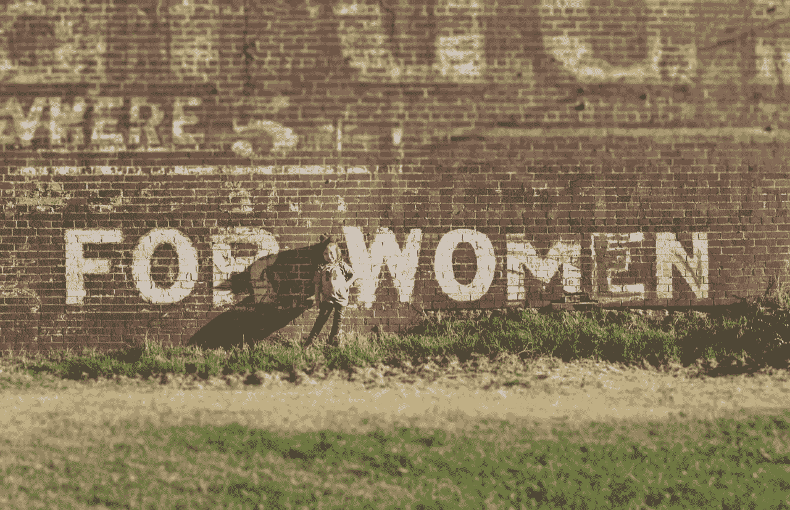

# 对于男性创始人来说，IWD19 是一种选择

> 原文：<https://medium.com/swlh/for-male-founders-iwd19-is-about-a-choice-e933ba215450>

## 选择学习

Photo by [Katherine Hanlon](https://unsplash.com/photos/bHhEJAXyFOg?utm_source=unsplash&utm_medium=referral&utm_content=creditCopyText) on [Unsplash](https://unsplash.com/search/photos/international-women's-day?utm_source=unsplash&utm_medium=referral&utm_content=creditCopyText)

今天是国际妇女节。事实上，我喜欢这个场合有两个不同的原因。

我认同自己是女权主义者，就像我认同父亲、丈夫和商业领袖一样。

我为尽自己的一份力量来增加妇女和女孩的机会感到非常自豪。这包括消除过时的陈规定型观念，妇女和女孩长期以来一直受到这些观念的影响。

事实上，与我的妻子和乔·伯斯顿、T2、朗达·布赖顿-霍尔和朱莉·毕晓普(仅举几个例子)并肩站在一起，每天为妇女和女孩创造平等的地位，是令人振奋的。

因为我们在执行任务。一起。

IWD 提醒我们我们的集体贡献，以及我们对有一天宣布我们庆祝的这个日子是多余的信念。

IWD 还提供了一个平台，提醒人们在他们控制范围内的选择。

# 选择

当人们通过社交媒体或工作场所的庆祝活动想起 IWD 时，他们要么欣然接受，要么(打个比方)翻白眼。

隐喻性的翻白眼很容易被发现，我从那些这样做的人身上学到了很多。虽然我们的日历上充斥着越来越多的庆祝场合，但在大多数情况下，这种翻白眼的人不会有这种感觉，因为他们是性别歧视者。他们的反应是不知道如何参与的结果。

我一直记得的一个解释是将妇女和女孩的不平等与气候变化相提并论。争论的关键在于这两者都是大问题。他们都生活在我们的意识中，但由于问题的严重性，很难知道如何开始发挥有意义的作用。

你可能会认为这是合法的或借口。

我赞同这样一种观点，即如果一个人致力于理解挑战，他就能采取行动。理解得越高，一个人可以行动的机会就越多。

想要改变生活、环境或世界的人也会做出同样的选择。

学习或停留在你感知的现实中。

很简单的选择。

# 选择学习

每当我选择学习，我就选择进入一个自我强化的循环。这个循环从吸收多种观点开始。随之而来的是一种健康的不安全感，尽管这种不安全感越来越强，我可能会错过一些东西。

我非常清楚这种不安全感的作用。

我建立旨在改变世界的公司。在这个旅程中，很明显你的学习速度是秘密武器。随着这种情况的增加,“遗漏某些东西”的风险也在增加。

在我创办的每一家企业中，能力惊人、充满好奇心且脾气很好的男女员工不仅加快了公司的学习速度，还降低了错过某些东西的风险。

一起。女人和男人。在他们游戏的顶端。

# 配额不起作用，有灵感的领导者起作用

让我们实际一点。花点时间想想你的目标客户。

女性在购买决策中起什么作用？他们可能不是决策者，但他们很有可能影响购买。

现在，看看你的团队。

有足够多的女性来平衡你们产品中的男性自我和偏见吗？

假设答案是否定的，并且你想利用 IWD 作为改变的催化剂，那么开始考虑你如何[雇佣](https://philhsc.com/how-to-write-a-hiring-plan-that-you-and-investors-believe/)。

我知道招聘是人才等式的一部分，人们可能会突然想到建立配额制度。

声明一下，我不相信在组织的任何级别雇佣女性的配额。我努力成为一名领导者，带领团队以高质量的决策、高学习率和不遗漏任何事情的能力而闻名。

这种混合的结果只能来自于雇佣你能负担得起的最有能力的人。当你读到这里的时候，你可能会点头，同时你意识到你不知道从哪里开始。

# 屡试不爽

试试 [Textio](https://medium.com/u/eb5f5bb298c6?source=post_page-----e933ba215450--------------------------------) 。这个在线平台，你可以开始免费使用，分析你当前职位描述的性别偏见和全面性。

一旦你克服了职位描述中隐含的(意想不到的)性别偏见， [Textio](https://medium.com/u/eb5f5bb298c6?source=post_page-----e933ba215450--------------------------------) 会一步一步地指导你如何平衡或更直接地与潜在的女性候选人说话。

[Kieran Snyder](https://medium.com/u/73d96e5a686b?source=post_page-----e933ba215450--------------------------------) 和 [Textio](https://medium.com/u/eb5f5bb298c6?source=post_page-----e933ba215450--------------------------------) 的团队在产品方面做得非常出色，这样做降低了雇用更多性别平衡团队的障碍。唯一缺少的是小公司定价层。但我肯定他们正在考虑。

# 最后一件事…

在这一点上，2019 年 IWD，以及此后的每一天，都要把性别平衡视为一种加速学习和减少错过必要内容的机会的能力。这对建筑公司和公民社会的所有部分都同样重要。

作为一名丈夫、女孩的父亲和商业领袖，我对未来持乐观态度。

感谢每一个支持妇女和女孩的人。

任务仍在继续。

*原载于 2019 年 3 月 8 日*[*【philhsc.com】*](https://philhsc.com/iwd-is-about-a-choice/)*。*

## 这篇文章发表在 [The Startup](https://medium.com/swlh) 上，这是 Medium 最大的创业刊物，拥有+432，678 名读者。

## 在这里订阅接收[我们的头条新闻](https://growthsupply.com/the-startup-newsletter/)。

