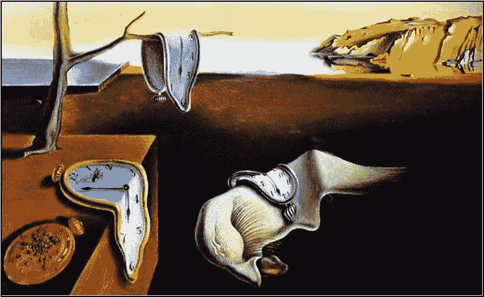

# 看在时间的份上！

> 原文：<https://medium.com/swlh/for-the-love-of-time-bbc138aedd69>

## 哦，看在时间的份上！我们能停止对时间的痴迷吗？

The Persistence of Memory by Salvador Dali

**我们痴迷于时间**，你注意到了吗，或者是午餐时间到了，你已经“超时”了一段时间？

**我们痴迷于时间**。该吃早餐了。该起床了！该睡觉了。时间不够了。我们有太多的时间。我希望有更多的时间。时间是…