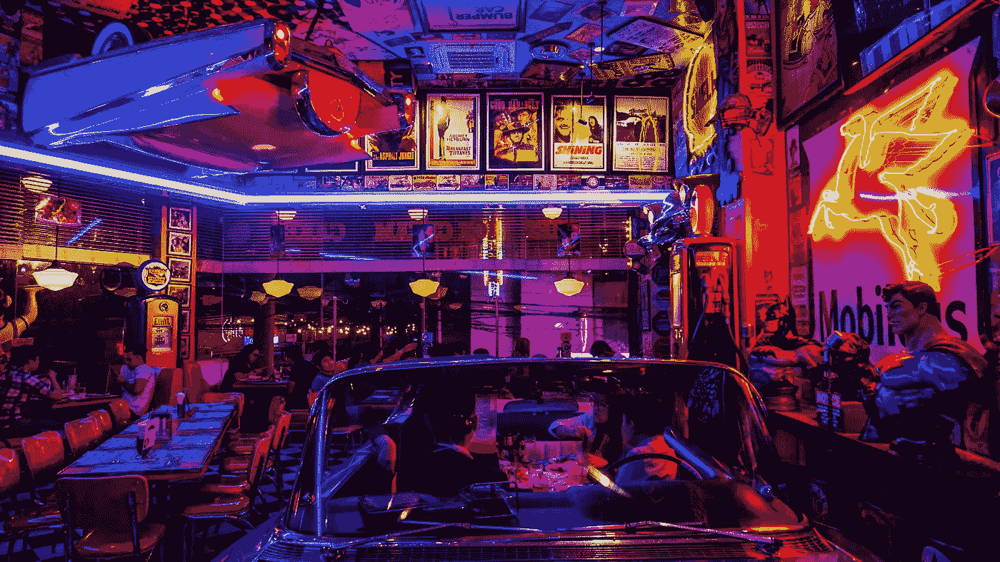

# 对你来说，你觉得这个世界扼杀了你的梦想

> 原文：<https://medium.com/swlh/for-you-who-feels-the-world-suffocating-your-dream-4cd716fbe146>

Photo by [Mikechie Esparagoza](https://www.pexels.com/@mikechie-esparagoza-749296?utm_content=attributionCopyText&utm_medium=referral&utm_source=pexels) from [Pexels](https://www.pexels.com/photo/people-sitting-near-tables-1601775/?utm_content=attributionCopyText&utm_medium=referral&utm_source=pexels)

> *“不要理会别人在做什么。忽略你周围发生的事情。没有竞争。没有客观的基准可以衡量。你只能尽力而为，这才是最重要的。”*
> ——[**瑞安假期**](https://medium.com/u/2e2701ae378f?source=post_page-----4cd716fbe146--------------------------------)