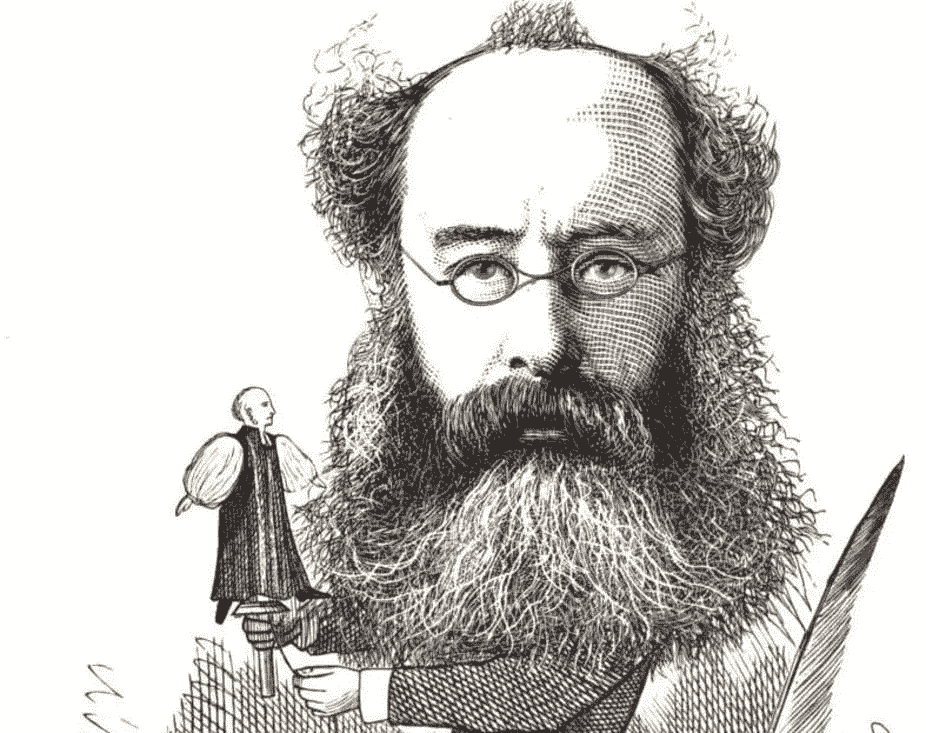

# 打造这些[2+3]习惯来保证巨大的生产力

> 原文：<https://medium.com/swlh/forge-these-2-3-habits-to-guarantee-massive-productivity-d11815a855de>

Productivity — Photo Credit: [Cathryn Lavery](https://unsplash.com/@cathrynlavery)

> 一天中没有足够的时间来完成所有的事情！

我经常发现自己很沮丧，偶尔，这种沮丧会升级为愤怒。

我不停地告诉自己，又一个宝贵的日子毫无收获地过去了。

幸运的是，我研究并效仿了大有成就者的工作习惯( [*蒂姆·费里斯*](https://medium.com/u/56d3bc91794f?source=post_page-----d11815a855de--------------------------------) 、*克里斯·贝利、大卫·艾伦等)。现在，我每天都充满了巨大生产力带来的快乐。*

这里有 5 个习惯，通过它们你可以保证你的日子和生活富有成效。

# I .巨大的生产力:两个核心习惯

我把下面两个习惯叫做 ***海量*** ***生产力的核心习惯。这两个习惯不仅保证了富有成效的一天，也保证了富有成效和充实的生活。***

## 1.决定一个高价值的生产系统

> 如果你每天都做一件事，那就是一个系统。如果你在等待未来的某一天去实现它，它就是一个目标。—斯科特·亚当斯

我经常注意到这种模式，几乎所有非凡的成就者都有一个包含这三个要素的 ***系统*** :

1.  关于他们的核心高价值任务的生动想法。
2.  一个健壮 ***调度*** 用于定期练习核心高价值任务 ***。***
3.  一个有形的 ***自我监控系统*** 能够跟踪和监控自己的 ***系统。***

取决于你长期想要完成什么，在其他事情之前，你必须确定你的 ***核心高价值任务*。**

然后，你必须设计一个系统，让**持续支持**，保证你的 ***核心高价值任务*** 的执行。否则，你将成为琐碎的清单和任务清单的牺牲品。

例如…

如果你是一名博士生，你的核心高价值任务可能是阅读和综合有价值的学术论文。

所以在你的系统中，你必须指定 ***固定而具体的时间*** 来定期完成这个任务 ***。***

如果你是一个博客写手，你的核心高价值任务必须是每天花特定的时间写作。这是标志性人物的主要[习惯之一。](https://livelikepros.com/high-value-productivity/)

*Anthony Trollope — Photo Credit T*[heConversation](http://theconversation.com)

历史上最多产的小说家之一，*安东尼·特罗洛普*养成了每天清晨 3 小时写作的习惯**。**

至于自我监控，对于他的每一部小说，他都会制定一个工作计划，一般每周计划一万字， ***然后记日记:***

> “在这我已经进入，每天，我写的页数，所以如果在任何时候我滑入闲置一两天，闲置的记录一直在那里，盯着我的脸，并要求我增加劳动，以便不足可能被供应。我面前有记录，一个星期过去了，不足的页数一直是我眼睛的水泡，一个月如此丢脸会是我心中的悲伤。”

***我眼睛里起了一个水泡。你在心理学文献中找不到任何东西能如此恰当地概括自我监控的功效。***

我自己每天练习的高价值任务是练习编程或阅读相关教程，这是我如何进行自我监控的部分:

My Daily Self-Monitoring Sheet

他这张简单的表格极大地激励我每天与自己竞争，努力拓展我的能力和工作时间。

你可能会想，既然有如此严格的系统性职业道德，创造力会发生什么变化？

当我读村上的书时，我也有同样的想法*当我谈论跑步时，我谈论的是:*

> 如果有人问我，对于一个小说家来说，下一个最重要的品质是什么，这很简单:**专注**——将你有限的才华集中在当下最重要的事情上的能力。没有它，你无法完成任何有价值的事情。— 村上春树

## 2.对你的高价值任务进行时间划分

> 把你所有的思想集中在手头的工作上。阳光在聚焦前不会燃烧。—亚历山大·格雷厄姆·贝尔

你的头脑能够创造奇迹。但是，只有在一个条件下: ***如果配备了激光——聚焦手头的材料或任务。***

例如，专家程序员之间都知道，在你能够 ***到达你的头脑正在以**最高性能**工作的区域*** 之前，你需要至少 30 分钟的全神贯注。

即使是短暂的片刻(1-2 分钟)，你也会从你正在做的事情跳到一些不相关的事情上(社交网络、电子邮件、接电话等)。)，你会失去最佳性能，不得不重新开始。

所以，封锁你的时间( ***绝对*** 没有电话，没有社交网络，没有电子邮件等等。). ***守护你的时间块，就像它是神圣的一样*** ，你将收获你一心一意的甜蜜回报。

如果你想看到真正的魔术，只需指定 **2 块**(每块 2 小时)的**专注**于一项任务，你一定会对你将取得的巨大进步感到惊讶。

# 二。巨大的生产力:三个支撑习惯

养成这两个核心习惯可能并不容易。但是，我们可以使它们变得更容易。

我发现，遵循简单得多的习惯能极大地帮助你形成两个核心习惯。

## 1.建立你的签名程序

有很多书专门讨论这个主题，比如*日常仪式:艺术家如何工作；如果你挖掘得足够深入，你会发现所有伟大的成就者都有某种仪式。*

那么，为什么会如此强调套路和仪式呢？

想象你醒来，洗个冷水澡，然后继续煮咖啡，然后开始工作(假设你在家工作)。

如果你连续几天重复同样的过程，你的仪式(淋浴、喝咖啡)会和紧随其后的*联系起来，那就是你的工作。*

*下一次，当你洗澡并开始啜饮咖啡时，你的大脑会进入工作模式。这叫做 ***启动效应*** ，你可以充分利用它。*

**

*Federer Serving Routine*

*为了达到最佳表现，像罗杰·费德勒这样的职业运动员会进行特定的训练:*

*这个程序很快让他们进入最佳状态。*

*在我的编程冲刺中，我总是在 repeat 上听同一个单一的音乐。*

*因此，我的大脑已经将我大脑的深层编程状态与那首音乐联系起来。*

*结果，我不再需要工作 30 分钟来让*进入状态，而是一播放*的音乐，我的大脑就把档位调到我想要的高性能水平。这是马特·莫楞威格在创建 WordPress 时使用的技术之一。***

***作为旁注:***

> ****对于音乐仪式，你不应该在任何其他场合听它。否则，您将面临中断其与高性能区域的关联的风险。****

## ***2.利用你的环境为你工作，而不是与你作对***

***遵循时间段(第二个核心习惯)并不容易。***

***你会被众多的刺激(电话、同事等)分散注意力。)***

***你会被无数的冲动所诱惑(查看邮件、facebook、twitter 等。)***

***我发现了一个简单的方法，可以让我坚持我的时间段，那就是首先把所有的干扰都驱逐出去。***

***养成这个习惯的关键是: ***让自己尽可能地不沉迷于或接近那些令人分心的事物。******

**肖恩·阿克尔在他的《快乐的优势》一书中建议:**

> **我们更有可能拖延去做那些需要 20 秒以上才能开始的事情。**

**所以，你可以有效地拖延。**

**如果您的工作不涉及互联网，请关闭您的 WiFi 调制解调器和网卡。**

**如果你不得不使用互联网，使用免费扩展如 *StayFocused* 列出你可能需要的网站，并使其难以禁用。**

**不必处理分心和诱惑还有另一个重要的价值。你将保存你宝贵的和有限的意志力 **，你将需要它们来处理需要脑力的任务。****

## **3.整合和缩减维护任务**

**甚至在我还是大学生的时候，我就习惯于写一长串非学术任务。洗衣服、做饭、付帐单、还书等等。**

**这些会增加无限的压力。**

**它们还会迫使你继续浪费时间思考未完成的任务，从而分散你的注意力。根据蔡加尼克效应:**

> **未解决的和被打断的任务会偷走你大脑的注意力，直到你有一个清晰的——如果是潜意识的——关于你将如何处理它们的建议。**

**我所做的就是在周末指定一天来处理这样的维护任务。**

**但不是这样。我给他们指定了非常有限的时间，以免我成为帕金森定律的牺牲品:**

> **工作扩大以填补完成工作的时间。**

**因此，为了避开帕金森定律的恶性陷阱，我分配了一个有限的预定时间来完成这些必要但低价值的任务。**

## **最终想法**

**我相信努力成为一个有生产力的人是一个人能做的最好的投资之一。**

**为了获得巨大的生产力，你需要加强你的自律，明确你想要什么，开创一种系统的生活方式，最终，这些都会在生活的各个领域为你服务。**

**生产力是我的激情所在，因为没有什么比富有成效的一天和生活更让我满足和快乐。**

**快乐成长**

# **概括起来**

1.  **思考并找出你的高价值任务。 ***什么活动在你投资的时间里产生最高的回报。*****
2.  **给你的高价值任务分配特定的和**有规律的**时间段。**
3.  **建立一个监控系统来跟踪你在高价值的核心任务上投入了多少**
4.  **在开始你的一天之前，在着手你的高价值任务之前，建立常规，以便更快地进入状态，避免被岔开。**
5.  **放逐所有分心的事物，更好地坚持你的时间段。记住，激光传播得远是因为光子聚焦在同一个方向。**
6.  **在一周内，收集所有你必须采取行动的维护任务(购物、洗衣服、支付账单等)。).然后在周末指定一段有限的时间，一次性把它们全部清除掉。**

****

***原载于*[*livelikepros.com*](https://livelikepros.com/massive-productivity/)*。***

****

## **这篇文章发表在 [The Startup](https://medium.com/swlh) 上，这是 Medium 最大的创业刊物，拥有+419，678 名读者。**

## **在这里订阅接收[我们的头条新闻](http://growthsupply.com/the-startup-newsletter/)。**

****