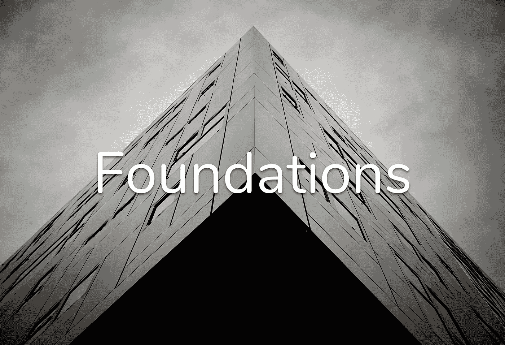

# 解决感知的基础

> 原文：<https://medium.com/swlh/foundations-for-solving-perception-dad910f98344>

最初发布:[https://stevenjenkins . io/essays/foundations-for-solution-perception/](https://stevenjenkins.io/essays/foundations-for-solving-perception/)

一个婴儿出生时有两个高分辨率摄像头，每秒向大脑传输[1000 万比特](https://www.sciencedaily.com/releases/2006/07/060726180933.htm)，还有一个类似 LSTM 的循环神经网络。以世界为数据集，它学会感知深度、形状、材料和纹理。**这里有解决也许是最重要的** …