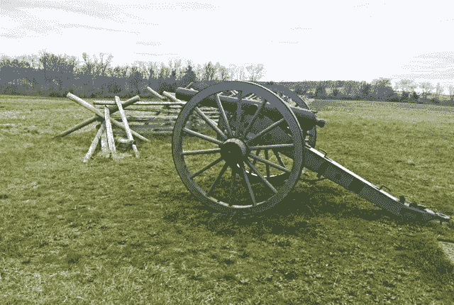

# 维克斯堡战役的四个营销教训

> 原文：<https://medium.com/swlh/four-marketing-lessons-from-the-battle-of-vicksburg-b3d828369bf>

*“谋事在人，成事在天。”
—美国格兰特自传的开场白*

Photo by the author.

葛底斯堡被频繁地引用为战争的决定性转折点，这似乎是众所周知的。1993 年关于这场重要战役的电影的口号是这样的:1863 年，南北军队在葛底斯堡*战斗，这是美国内战*的决定性战役。

詹姆斯·阿诺德在他颇有见地的书《格兰特赢得战争》中开篇就认为维克斯堡战役是击溃南方的决定性胜利。当联邦军占领维克斯堡时，他们有效地控制了密西西比河，切断了来自西部的所有供应，因此封锁只是时间问题，北弗吉尼亚的军队将被耗尽并被击败。

阿诺德的介绍指出，在军事史上最辉煌的 20 次战役中，超过一半是由拿破仑发起的。只有两个是由美国内战中的将军们构想并执行的。第一次是斯通沃尔·杰克逊将军的谢南多厄战役。第二，格兰特在维克斯堡的胜利。

以下是从这场战斗中脱颖而出的四条重要的营销和领导力经验。每一个都可以用当今商业中的插图来详细说明。

National Archives, Library of Congress

## **1。打正确的仗**

詹姆斯·阿诺德以介绍维克斯堡战役的重要性开始了这本书。无论是在战争中还是在商业中，成功的关键不仅仅是赢得战斗，而是打正确的战斗。促使格兰特成名的不仅仅是赢得胜利，而是认识到他所追求的目标的重要性。据阿诺德估计，维克斯堡在平定南方方面比葛底斯堡更为重要。

## **2。当你的计划不起作用时，改变你的策略**

在评估形势时，格兰特将军注意到维克斯堡控制的俯瞰密西西比河的火力和高地使其在来自河边的攻击中固若金汤。经过深思熟虑，第一个计划是改变河道。目标很重要，时间没有速度重要。1863 年 5 月开始挖掘。过了一会儿，很明显这是一个考虑不周的计划，不会成功。格兰特将军放弃了这个想法，提出了一个更好的战略计划。

## **3。吸取以往的经验**

像内战中的许多将军一样，美国格兰特在几年前参加了墨西哥战争。他手下有两位将军，他从每一位将军身上学到了宝贵的东西。从泰勒将军那里，他学会了如何管理一次大规模行动，如何维护包括食物和弹药在内的补给线，以及如何协调行动。从温菲尔德·司各特将军那里，他学会了采取主动，以及速度和意外的力量。他的数百名手下带着一支小部队突然出现在墨西哥城，吓坏了数万名墨西哥士兵。

维克斯堡的情况是这样的。格兰特决定放弃他的补给线，把他的部队带到下游进行类似的突袭演习。在一系列的小冲突中，格兰特的军队保持机动，不能被邦联军队发现，因为他们靠觅食生存。他还派了一支小型突袭队南下作为诱饵，制造谣言让敌人感到困惑和恐惧。他们似乎无处不在。

## **4。了解你的部队状况**

格兰特将军不仅要保证士兵们有饭吃，还要保证他们休息。此外，他非常了解他的部队的士气。例如，在战争开始时，他希望他的未经考验的部队在第一次战斗中充满信心。他知道，从墨西哥战争的日子里，胡德将军有点急于逃离战场，以保持他指挥下的人数。格兰特用 1000 人攻克了一座驻扎着 500 名胡德士兵的堡垒。胡德果然逃跑了。格兰特告诉他的士兵，他们刚刚以最小的损失击败了一支 2000 人的军队。他的目标——在不损害信心的情况下给士兵们战斗经验——达到了。

这里有一个来自维克斯堡的故事也说明了这一点。军队不得不在某处穿过一座狭窄的木桥。他先走，把他的马停在另一边，面对他的人，当他们过来。当他们行进经过时，他问候每一个人，看着他们的眼睛，评估他们的士气和他们对未来的准备。

关于朝鲜的这一重大胜利，还可以说得更多，但我在这里的目的是引起人们对几个特征的注意，这些特征使它成为今天商业课程的有用模式，特别是在营销方面。

欲知更多，这里有 [**四本书介绍美国格兰特**](https://pioneerproductions.blogspot.com/2009/09/four-books-on-us-grant.html)相关: [**沙漠风暴的教训**](/swlh/lessons-from-desert-storm-f3a95960e775?source=friends_link&sk=77bfb1425b37f218e7ee0a26f73719aa)

[*原载于恩尼曼领地*](https://pioneerproductions.blogspot.com/2019/04/four-marketing-lessons-from-battle-of.html) *，2019 年 4 月 17 日。*

## 这篇文章发表在 [The Startup](https://medium.com/swlh) 上，这是 Medium 最大的创业刊物，拥有+443，678 读者。

## 订阅接收[我们的头条新闻](https://growthsupply.com/the-startup-newsletter/)。

