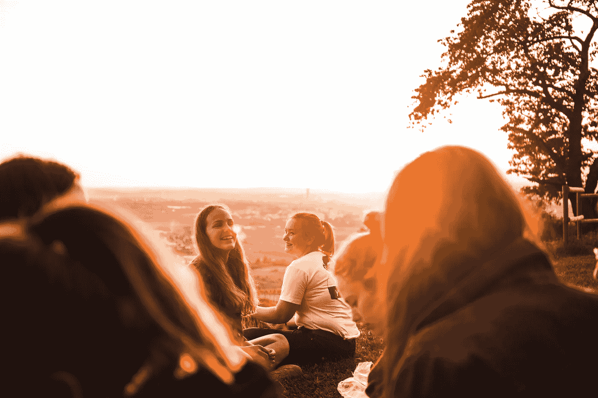

# 变得与众不同的四个简单方法

> 原文：<https://medium.com/swlh/four-simple-ways-to-be-extraordinary-17a7da66e62b>

## 在工作中，在家里，或者在娱乐中，小小的行动会产生巨大的影响。

Photo by [Noah Benjamin](https://unsplash.com/photos/F4sfBneAKiM?utm_source=unsplash&utm_medium=referral&utm_content=creditCopyText) on [Unsplash](https://unsplash.com/search/photos/slight-smile?utm_source=unsplash&utm_medium=referral&utm_content=creditCopyText)

史蒂夫·乔布斯、比尔和梅林达·盖茨、甘地、纳尔逊·曼德拉、玛娅·安杰洛、阿玛(the[‘拥抱圣人’](https://amma.org/about/how-she-began))以及小马丁·路德·金以他们在商业、社会公正、人权和艺术方面的卓越成就影响了数百万人。他们的努力很有意义。每个都代表一个扩展…