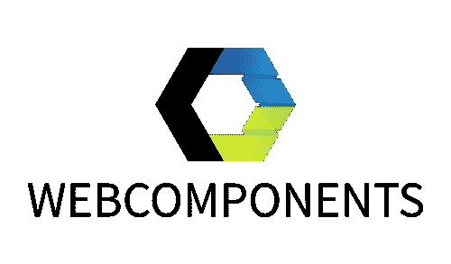

# 框架疲劳？Webcomponents 来拯救我们！

> 原文：<https://medium.com/swlh/framework-fatigue-webcomponents-to-the-rescue-5e36869a1bc0>



只需前往 npm，输入类似“datepicker”的内容。您将看到类似这样的内容:

```
react-datepicker
angular-datepicker
vue-datepicker
vue-**the-very-last**-datepicker
vue-**the-very-last**-datepicker-**v2
...**
```

从 Vue 到 Angular 到 React 的每个框架都有一个日期选择器…这是 Javascript 世界中一个非常普遍的问题。

拥有一个**单独的**日期选择器，可以用于所有的库或框架，这不是很好吗？

## Web 组件拯救世界！

web 组件背后的技术允许您在不使用任何框架(！)，并在您的文档中使用它，就像任何其他 HTML 元素一样，如`<input>`或`<button>`

这是一个很大的优势，特别是对于创建应该在使用不同框架的项目之间共享的元素，或者在不需要复杂框架的项目上，但是您仍然希望有一些结构。

## web 组件的 4 个构造块

Web 组件是以下四种技术的组合:

1.  HTML `<template>`标签
2.  自定义元素 API
3.  阴影 Dom
4.  ES 模块

让我们通过创建自己的 web 组件按钮来解释这四个构件。

**> >此处查看出处和例子>>**[**https://playcode.io/347575?tabs=my-button.js，预览，控制台**](https://playcode.io/347575?tabs=my-button.js,preview,console)

[**1。模板**](https://developer.mozilla.org/en-US/docs/Web/Web_Components/Using_templates_and_slots) **:** 一个`<template>`的内容是浏览器渲染的*而不是*，但是你仍然可以在 Javascript 中引用它。这非常适合您希望在不同位置多次使用的内容，并且非常适合在 web 组件中使用。

让我们用下面的模板创建一个简单的 HTML 文档`index.html`，里面有一个简单的按钮:

```
<html>
<head></head>
<body>**<template id="myButton">
 <style>
      div {  
           background: red; 
           color: white; 
           padding: 1em; 
           text-align: center; 
     } 
</style>
 <div>Click me</div>
</template>**</body>
</html>
```

如果您在浏览器中打开该文件，应该不会像预期的那样呈现任何内容。

[2**2。自定义元素 API:**](https://developer.mozilla.org/en-US/docs/Web/Web_Components/Using_custom_elements) 自定义元素 API 允许您将 web 组件所需的所有代码捆绑在一个类中，并为您的元素定义一个标记名。

```
class **MyButton** **extends HTMLElement** {constructor() {
   super.constructor();
}}
**customElements.define('my-button', MyButton);**
```

用`customElements.define`我们定义元素的名称和相应的类。该名称需要有一个`-`符号，并且该类必须从 HTMLElement 扩展。

现在，我们不是将模板标签直接放在主文档中，而是将它添加到新创建的 javascript 文件中，如下所示:

```
**const template = document.createElement('template'); 
template.innerHTML = `
** **<style>
     div {  
           background: red; 
           color: white; 
           padding: 1em; 
           text-align: center; 
     }
 </style>
 <div>Click me</div>** **`;**class MyButton extends HTMLElement {constructor() {
   super.constructor();
}}
customElements.define('my-button', MyButton);
```

这样，我们可以在一个模块中拥有一切。下一步，我们将模板的内容添加到元素中。为此，我们先来看看影子 dom。

[**3。阴影 Dom**](https://developer.mozilla.org/en-US/docs/Web/Web_Components/Using_shadow_DOM) 阴影 Dom 允许你封装你的样式和标记结构。这使得 web 组件的代码与文档的其余部分分离开来。没有框架。只是纯原生浏览器技术。

这太棒了。

你需要显式地给你的元素附加一个阴影 dom，如下所示:

```
const template = document.createElement('template'); 
template.innerHTML = `
 <style>
div {  
           background: red; 
           color: white; 
           padding: 1em; 
           text-align: center; 
     }
 </style>
 <div>Click me</div>
`;class MyButton extends HTMLElement {constructor() {
   super.constructor();
   **this.attachShadow({mode: 'open'}); // <--- attaching shadow dom!**
}}
customElements.define('my-button', MyButton);
```

现在，我们将模板内容添加到我们的影子 dom 中:

```
const template = document.createElement('template'); 
template.innerHTML = `
 <style>
div {  
           background: red; 
           color: white; 
           padding: 1em; 
           text-align: center; 
     }
 </style>
 <div>Click me</div>
`;class MyButton extends HTMLElement {constructor() {
   super.constructor();
   this.attachShadow({mode: 'open'}); **this.shadowRoot.appendChild(template.content.cloneNode(true));**
}}
customElements.define('my-button', MyButton);
```

如你所见，我们使用`template.content.cloneNode(true)`来克隆模板的内容，然后将它附加到我们的影子 dom。

标记和样式只在我们的组件中可用。

我们来谈谈如何在主文档中使用 web 组件按钮。

**4。ES 模块**您可以导入您的 web 组件以在其他 web 组件中使用它，或者通过使用`<script src="my-button.js type="module"></script>`简单地从上面导入它到您的主文档`index.html`中:

```
<html>
  <head>
    **<script src="my-button.js" type="module"></script>**
  </head>
<body>**<my-button onclick="alert('hi')"></mybutton>**</body>
</html>
```

## 狭槽

如果我们想让用户在按钮上添加自己的自定义文本，而不是固定的文本“点击我”呢？如下例所示:

`<my-button>You can click me, sir.</my-button>`

这就是老虎机的用武之地:

> **HTML** `***<slot>***` **元素**—[Web 组件](https://developer.mozilla.org/en-US/docs/Web/Web_Components)技术套件的一部分——是 Web 组件内的占位符，您可以用自己的标记填充它[…]
> 
> [https://developer . Mozilla . org/en-US/docs/Web/HTML/Element/slot](https://developer.mozilla.org/en-US/docs/Web/HTML/Element/slot)

所以基本上我们可以将`<slot></slot>`添加到模板中我们希望自定义文本出现的位置。

在我们的例子中，我们用`<slot></slot>`替换“点击我”文本:

```
const template = document.createElement('template'); 
template.innerHTML = `
 <style>
div {  
           background: red; 
           color: white; 
           padding: 1em; 
           text-align: center; 
     }
 </style>**<!-- we've replaced the text with <slot>-->
<div><slot></slot></div>** `;class MyButton extends HTMLElement {constructor() {
   super.constructor();
   this.attachShadow({mode: 'open'});this.shadowRoot.appendChild(template.content.cloneNode(true));
}}
customElements.define('my-button', MyButton);
```

现在我们可以向按钮添加一些自定义文本:

```
<html>
  <head>
    <script src="my-button.js" type="module"></script>
    <style>my-button { margin: 1em; }</style>
  </head>
<body>

**<my-button onclick="alert('hi');">You can click me, sir</my-button>
<my-button onclick="alert('hello');">Banana</my-button>
<my-button onclick="alert('hey');">Okaaay!</my-button>**</body>
</html>
```

我还添加了一些按钮，并点击带有警告框的事件来测试这些按钮。

您已经创建了自己的第一个 web 组件按钮！

我为你骄傲，儿子。

在这里看看完整的源代码和演示:[https://playcode.io/347575?tabs=my-button.js，预览，控制台](https://playcode.io/347575?tabs=my-button.js,preview,console)