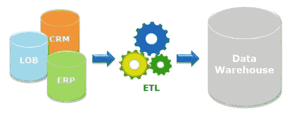

# 注册参加关于使用 Python 和 SQL 进行 ETL 开发的免费网络研讨会

> 原文：<https://medium.com/swlh/free-webinar-on-etl-development-with-python-and-sql-e974f388051c>

本杰明·罗戈扬

你的团队需要自动化 ETL 的帮助吗？也许你是一名数据工程师的新手？无论如何，我们想邀请您参加我们关于 ETL 开发的网络研讨会。我们将讨论您的团队如何自动化他们的 ETL 以及最佳实践。

我们的团队将于太平洋时间 2019 年 2 月 23 日上午 10 点主持开发 ETL 的演练流程。请在下面报名。

**演讲者**

**本·罗戈扬**

Ben 的职业生涯专注于所有形式的数据。他专注于开发算法来检测欺诈，减少患者再次入院，并重新设计保险提供商的政策，以帮助降低医疗保健的整体成本。他还帮助开发了营销和 IT 运营分析，以优化有限的资源，如员工和预算。Ben 私下为数据科学和工程问题提供咨询，既有个人咨询，也有一家名为 Acheron Analytics 的公司咨询。他既有亲自解决技术问题的经验，也有帮助领导团队制定策略以最大限度地利用数据的经验。

*   我们将接受多达 100 名申请人参加本次网络研讨会。如果我们有溢出，我们将为那些超过原来的 100 人设置第二个日期。

以下是我们可能涉及的一些内容的示例:

## 这篇文章发表在 [The Startup](https://medium.com/swlh) 上，这是 Medium 最大的创业刊物，拥有+420，678 名读者。

## 订阅接收[我们的头条新闻](http://growthsupply.com/the-startup-newsletter/)。

