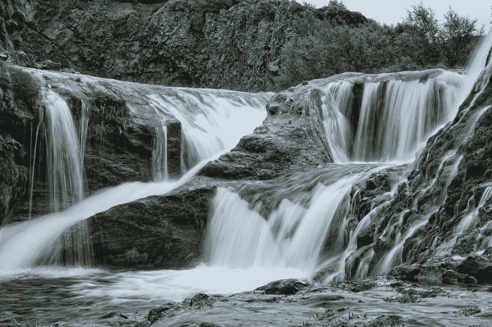

# 自由职业者到企业家:森林、山和水

> 原文：<https://medium.com/swlh/freelancer-to-entrepreneur-the-forest-the-mountains-and-the-water-60c904d3352>

image via [https://unsplash.com/@plivesey](https://unsplash.com/@plivesey)

想象一幅风景。

它的一边是森林，另一边是山脉。

两者之间隔着一些水。

这片森林由甘美的绿色组成，浓密得几乎像一片丛林。这片绿色的海洋中点缀着奇妙花朵的红色、蓝色、橙色和黄色…