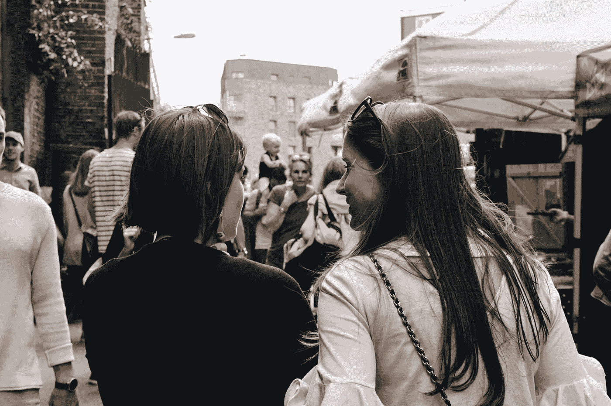

# 友谊不应该是一项竞技运动

> 原文：<https://medium.com/swlh/friendship-shouldnt-be-a-competitive-sport-1e0422e1cf7c>

## 远离那些试图贬低你抱负的人。小个子总是这样。

Photo by [Alicia Steels](https://unsplash.com/@aliciasteels?utm_source=unsplash&utm_medium=referral&utm_content=creditCopyText) on [Unsplash](https://unsplash.com/?utm_source=unsplash&utm_medium=referral&utm_content=creditCopyText)

你有没有这样的朋友，一想到要和他们见面、共度时光，你就会感到精力突然流失？因为你知道你必须装出一副游戏的样子，和他们一起谦卑地度过每一秒钟——吹嘘你的…