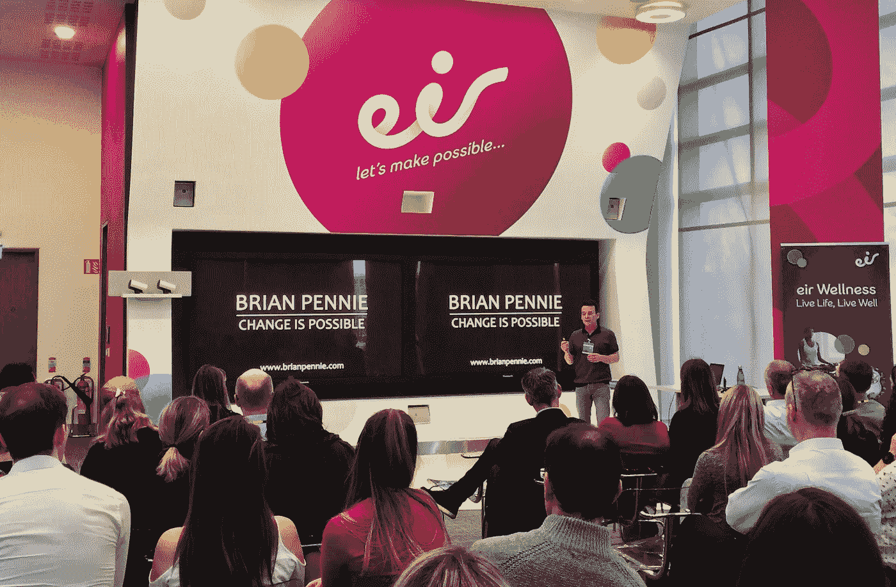

# 从 15 年的海洛因成瘾到作家、演说家和博士

> 原文：<https://medium.com/swlh/from-15-years-of-heroin-addiction-to-author-speaker-and-phd-32ecc78c64dd>

Source: That’s me talking about “tactics for life” in Eir, Ireland’s largest telecommunications company

## 改变是可能的，下面是方法

> “总有一天，回想起来，奋斗的岁月会让你觉得最美。” ***—弗洛伊德***

我曾经认为我知道很多。我没有。我相信了自己的谎言，编织了一个充满妄想、否认和欺骗的虚构世界。加上长期的焦虑和过度活跃的思维…