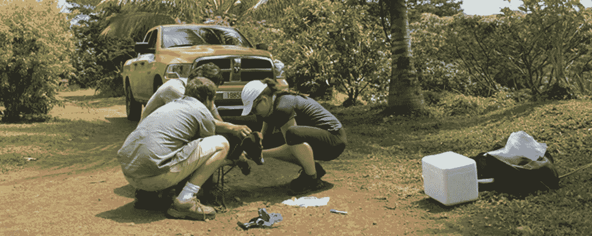

# 从捕捉野狗，到价值 630 万美元的种子——Embark Vet 的资助故事。

> 原文：<https://medium.com/swlh/from-catching-feral-dogs-to-a-6-3m-seed-embark-vets-funding-story-6ef8d27d7370>

Testing “village dogs” around the world

当像 [23andMe](https://www.23andme.com/) 和 [AncestryDNA](https://www.ancestry.com/dna/) 这样的消费者基因测试产品开始流行时，生物学家和爱狗人士瑞安·鲍伊科看到了一个机会:利用类似的技术来帮助消费者研究他们毛茸茸的家庭成员。2015 年，他和身为兽医科学教授的哥哥亚当创立了 [Embark Vet](https://embarkvet.com/) 。

使用该公司的工具包，用户可以用棉签擦拭他们狗狗的脸颊，寄出去，然后等待结果:品种识别、血统和健康状况的遗传风险。受宠物主人和专业饲养者的欢迎，它现在是威斯敏斯特养狗俱乐部狗展的官方狗 DNA 测试。

在一次采访中，Ryan 分享了 Embark 的起源故事，以及他对如何获得可靠投资者的见解——而不是追着你的尾巴。

**跟我们说说 Embark Vet 吧。你们是做什么的？**

我们做全面的狗基因测试——我们告诉人们他们的狗有什么品种。显然，人们对此很感兴趣。此外，我们报告了 160 多种犬类健康状况的特征。在许多方面，它在概念上类似于你可能听说过的人类基因检测公司。

我们还有一大部分饲养者客户。他们有很大的兴趣实际上能够利用这一点来培育一个更健康的狗。

我们养了 13 年的切萨皮克海湾寻回犬。他是最棒的。但是现在我的家人决心要得到一个“涂鸦”。你觉得狮子狗混搭怎么样？

在我现在所处的圈子里，这是一个充满政治意味的问题。我对所有的狗都很温柔，所以把一只狗放在我面前，我会很开心。我自己的狗是杂种狗。我不是任何繁殖者的纯粹主义者。各有各的——有许多不同类型的家庭和需求。

**先说起源故事。你是怎么想出这个主意的？你有没有看到 23andMe 说，“嘿，我可以为狗做这个？”**

除了从小爱狗，大学的时候还想做生物。我高三的时候参加了一个关于狗的进化和认知的研讨会。最大的收获是，到目前为止，研究人员主要关注一小部分纯种狗的遗传学，大多数是欧洲狗，现在他们正在进行所有这些关于狗的健康和进化的辩论。

这就像你采样了欧洲的皇室，然后说，“我们已经得到了了解人类所需的所有基因样本。我们只需要用不同的方式来分析它们。”那显然不是真的。但是这个想法并没有被犬类研究团体真正接受。

当时我 21 岁，热爱野外工作，所以我想我们应该在世界各地测试乡村狗。我说服了我的哥哥，他为一位遗传学教授工作，他说服了教授这是一个好主意。教授转向他说:“我们到哪里去找一个足够疯狂的人去环游世界，捕捉野狗并取它们的血？”

我哥哥说:“我认识那个人。”

你被咬了几次？

我只被适度咬过一次，真的。那是几年后的事了。这只是由于整天工作带来的粗心大意。

**所以你去世界各地采集所有这些野狗的样本，这就是数据库的基础？**

是的。公司的第一个夏天非常成功。我们让《纽约时报》报道了《T4 》,这个项目有了自己的生命。

当时，我在公共卫生和大数据领域工作。但是我每年夏天都会花一两个月的时间来研究这个。我哥真的是把它往前推了。他在 2011 年被聘为康奈尔大学的教授，我们一直在谈论没有人建立这个可以帮助狗健康的数据库是多么可悲。

直到我们生命中的正确时刻。我们决定在 2015 年实现飞跃。

我们去筹款部分吧。你们最近筹集了一轮资金，对吧？早期是如何融资的？你在早期是引导它还是得到资助？

我们花了一些时间研究我们是否应该试着制造一个产品，然后卖给另一家公司。但后来我们说服自己，我们实际上可以建立一个真正的企业。

做出这个决定不到一周，我就在哈佛举行了 10 周年同学会。我和几个大学时认识的人聊了聊，其中一个人碰巧是蓝色围裙的创始人兼首席执行官马特·萨尔茨堡。

他自己也刚买了一只狗，对我关于 Embark Vet 的想法非常感兴趣。那天晚上，他把我介绍给了几个他认识的人。

通过他的关系，我筹到了第一笔真正的资金。这并不像一个晚上和几个人交谈那么简单，但毫无疑问，第一轮就是因为这样才走到了一起。

Matt 后来是 Embark 的创始董事会成员，所以他非常投入。不幸的是——或者说幸运的是，对我来说——我没有在荒野中奋斗多年获得第一笔钱的故事。不过，我要说的是，提高首轮融资的价格相当困难。

**给我们介绍一下。我假设你用种子期来建立一个产品，并获得一些市场证据。你是如何运行流程的？你是如何建立漏斗的？所有好东西，请。**

我们运行了一个过程，这是一个普遍适用的建议:如果你有好的天使投资者，希望你的漏斗主要由喜欢你和相信你的直觉的人组成。

我的背景不是金融，这是我的第一家公司。因此，得到热情的介绍对我来说非常有帮助，同时也能得到当前投资者的观点。如果你只是代表自己做介绍，这将是一场艰难的争吵。

你有没有先确定一份投资者的目标名单，然后分发给你的天使投资人？或者你问过你的天使你应该和谁说话？

我两样都做了。我环顾了一下[和几个不同的地方。当然，我查看了谁投资了](https://pitchbook.com/)[罗孚](https://www.rover.com/)以及宠物保险公司之类的公司。

我还调查了谁投资了 Ancestry 和 23andMe。我在我的投资者中传阅了这份名单，看看他们是否有任何关系。然后我可以挑选最好的人把我介绍给他们。

你认为那份名单有多长？

我们想采访的第一批人中大约有七个人。我没有想要一个。当我打电话的时候，有些人在名单上上下移动。有点像速配。这些介绍意味着我有很高的成功率进行第一次、第二次、第三次甚至第四次对话。

我有过的令人沮丧的经历是，虽然许多人对这个想法很感兴趣，但我采访过的风投公司中没有人有狗遗传学方面的专业知识。他们也不是兽医行业的专家。

我认为一开始他们很难理解这个故事，所以这个过程拖了很长时间。很难在进行融资的同时经营一家企业。

一条建议是:要么找一个能让一切向前发展的真正优秀的联合创始人，要么雇一个能做到的人。在我忙于筹款的时候，我们失去了发展和招聘人才的机会，

在此期间，你几乎全职工作吗？我认为很多创始人都低估了这一点。你的经历是怎样的？

我可能会说这是我三个月努力的 75 %,我的全部努力是每周 40 多个小时。首先，有很多旅行。如果你与人面对面，你总是会提高你的胜算。我和几乎所有人的第一次互动都是一个电话。如果他们对第二次会面感兴趣，我会和他们面谈。

**我注意到** [**SV 天使**](https://svangel.com/) **在 Pitchbook 上被列为你的投资人之一。他们是在第一轮 150 万美元，还是第二轮？**

他们进入了第二轮。我们最终由[创始人集体](http://www.foundercollective.com/)领导。埃里克·佩利是这次投资的幕后推手，他现在是我们的董事会成员。他们真是太棒了。我不能更高度地推荐他们。

基本上，我们最终从他们那里得到了一份条款清单，并进行了一些谈判。他们最初打算投入一小部分投资。但是在接下来的两个星期里，一部分是通过他们的介绍，一部分是在我们交谈过的其他人的帮助下，我们最终筹集到了四倍于我们所能筹集到的资金。我不得不回去把人削掉。

太令人兴奋了。那么你是如何决定关注谁的呢？

我们和三种投资者谈过。首先，规模较小、专注于种子期的基金，比如方正集体(Founder Collective)。然后，有些人可能会以特定的方式提供帮助，比如那些从事直接面向消费者的测试业务的人。然后，更大的基金。本质上，第三组，我们没有谈过。

给我的建议是他们有的是钱。如果他们觉得自己错过了，他们可以在下一轮领先。如果他们觉得自己已经在游戏中有所建树，你就不太可能让他们在下一轮中领先。我们真的没有再和他们谈过，但是我们回去找了另外两类中的几个人。

你已经开始准备下一轮了吗？

我非常关注如何让这项业务非常成功，有正的边际贡献。从理论上讲，如果我能卖出足够多的套件，我就再也不用投资了。所以我的第一、第二和第三个目标是找出如何让更多的人购买我们的产品。我至少花了 80%的时间在这上面。我可能自己完成了 95%或更多的筹资，这样团队的其他人就可以专注于产品。

也就是说，当我说我们目前没有盈利时，我并没有放弃任何东西。我的首要任务是确保我们不会缺钱。如果发生这种情况，其他人都会失业。理论上，作为一家公司，你可以克服任何困难——除了没钱。

有什么最后的建议吗？如果你为下一次创业重新筹资，你会做些什么不同的事情吗？

最终，我唯一能改变的是我自己。如果我没有得到我想要的结果，无论是销售增长还是投资者，我总是问自己，“对此我能做些什么？”

责怪别人真的很容易让人变得沮丧。你必须放手。它只会吞噬你。专注于你*做的*有影响力的事情已经够难了。

*这个 Q & A 是根据*[*Foundersuite.com*](https://foundersuite.com/)*的* [*我是如何筹集到它的播客*](https://soundcloud.com/user-2586856/ep-58-how-i-raised-it-with-ryan-boyko-of-embark-vet-on-7312018) *中的一集改编的，讲述了那些已经筹集到资本的创业公司创始人的幕后故事。*

作者:内森·贝克德，CFA

内森·贝克德是 Foundersuite.com 的首席执行官，这是一家风险投资公司，为初创公司提供领先的投资者 CRM 和投资者更新工具。自 2016 年推出 CRM 以来，用户已经筹集了超过 10 亿美元的种子和风险资本。

在创办 Foundersuite 之前，Beckord 在初创公司工作了十年，担任临时首席财务官、业务开发人员和顾问。Beckord 拥有企业家工商管理硕士学位、金融学士学位和特许金融分析师(CFA)资格。闲暇时，他喜欢航海、旅游和爬山。

## 这篇文章发表在 [The Startup](https://medium.com/swlh) 上，这是 Medium 最大的创业刊物，拥有+423，678 读者。

## 在这里订阅接收[我们的头条新闻](https://growthsupply.com/the-startup-newsletter/)。

