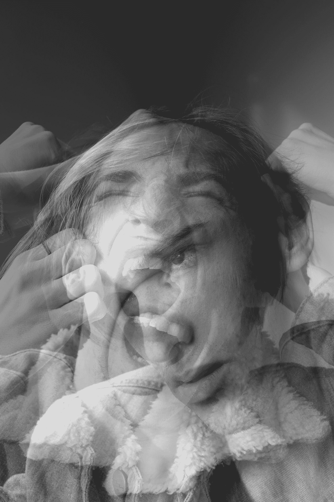

# 从混乱到有序，再回到混乱

> 原文：<https://medium.com/swlh/from-chaos-to-order-and-back-again-to-chaos-4dd0088c908>

## 苦难从未停止

## 我的地下日记笔记

Photo by [Callum Skelton](https://unsplash.com/@callumskelton?utm_source=medium&utm_medium=referral) on [Unsplash](https://unsplash.com?utm_source=medium&utm_medium=referral)

突然间，我们又回到了那里。几个星期没有冲突，几天没有争执，这种情况又发生了。

她的脸上有一种封闭和敌意的表情。她的身体，她的整个身体都僵硬了。她难以接近。我跟她说话的时候，是沉默的。

我们在一个派对上。有家庭成员，大人，孩子，我们的孩子和孙子，还有主人的朋友和他们的孩子。友好的游园会。儿童游戏、烧烤、香肠和柠檬水。为成人提供烤香肠和其他食物、啤酒和饮料。

她很难容忍我喝含酒精的饮料，尽管我没有爬到桌子上大喊大叫，跳起舞来，尽管我没有像僵尸一样东倒西歪，但我没有给她感到羞愧的理由。

她不允许我喝啤酒。是的，我以前就知道了。我早就知道了。她这样已经有一年了。多年以前，当我在周五和周六晚上喝几杯啤酒或葡萄酒时，她似乎并不在意。

## 我是谁，我和酒精有什么关系？

当我喝酒时，我不生气也不暴力。我只是微笑。我说得更多。我放任自己，我与人交流。

我与人交往，我与人对话，我喜欢交谈和微笑，享受美好时光。

她和我——我们已经试着谈过了。派对后的第二天，我们清醒的时候。

*   她再次告诉我，她不能容忍我喝酒。
*   她说她感到被轻视，她讨厌我喝酒。
*   她讨厌我笑的时候，讨厌我开心的时候，讨厌我酗酒的时候。

我从她的反应中了解到，她不喜欢我表现出感情，比平时说得更多。她不喜欢我和日常生活中的我不一样。尤其是当我们的孩子在场的时候。

我没有过度饮酒。我不认为认识我的人和能在聚会上看到我的人会说我是个酒鬼。

当我们在一个聚会上，我说话，喝酒，微笑。我没有生气。我不和其他客人发生争执。我没有攻击他人，我没有暴力倾向。我不会在其他客人面前嘲笑或批评我的妻子。

Photo by [Yung Chang](https://unsplash.com/@yungnoma?utm_source=medium&utm_medium=referral) on [Unsplash](https://unsplash.com?utm_source=medium&utm_medium=referral)

她要求我和她在一起时不要喝酒。她对此非常认真。她不会接受我和她在一起时喝啤酒、葡萄酒或其他酒精饮料。

我明白她在说什么，当我和她在一起的大部分时间里，我不喝任何含酒精的东西。这是我去年在生活中实施的重要改变。

## 互相迁就

看得出来，我一喝酒，她就不好过。所以我下定决心要见她。我想和她折中一下。

在我看来，这是一个给予和索取的问题。我必须付出很多。拿走她给我的东西。

我很久以前就开始意识到喝太多酒是不明智的，不管是啤酒、葡萄酒还是烈性酒。

饮酒过量既不明智也不有益于身体和精神。我知道。

我不喜欢烈性酒，我从不喝威士忌、杜松子酒、白兰地、伏特加、烈性酒或其他什么。我就是不喜欢！

但是我有时喝啤酒。有时，也许一个月一次，红酒。在我看来，不算太多。有时候我会一两个月不喝任何含酒精的东西。

那时我感觉很好。我不怀念酒精的影响。

当我们，她和我，关系很好很平和的时候，就没问题了。

大多数时候就是这样。但显然不总是这样。

由于这些原因，我已经不再在周五和周六晚上喝啤酒了。这是一个巨大的成功和惊喜。至少暂时如此。停下来太容易了！

我觉得我们彼此更加亲近了。她变了，她愿意在之前拒绝我的地方见我。这是双赢。

然后一切都崩溃了。突然发现自己又在自由落体了！

## 我正从混沌滑向有序，又滑回混沌！

像以前那么多次一样，我正盲目地坠入内心空间的深渊。

坠落，坠落。

坠入黑，
黑，
空的空间！

## 我决定了什么？

嗯，那很简单。

我不会让自己失望的。
我不会再失败了。
我不会埋没自己。

我会继续下去。我会得到我想要的。

我会放手该走的。

事情就是这样。

不容易。

但这是必须的。

Photo by [Everton Vila](https://unsplash.com/@evertonvila?utm_source=medium&utm_medium=referral) on [Unsplash](https://unsplash.com?utm_source=medium&utm_medium=referral)

从她的角度来看，没有讨论这个的余地。她不会容忍我在聚会上一起喝啤酒。这是我不能接受的。我们必须进行对话。

在这些对我来说非常重要的事情上，她没有付出 100%的努力。她退缩了，她大部分时间都和我保持距离，所以我为什么要付出更多呢？

关于她的要求，她没有讨价还价的余地。要么全有，要么全无。

对我来说，这是完全不能接受的。在基于平等的伙伴关系中，人们不能这样做。

我不能接受她独自决定我们关系的规则！

对我来说，这是完全不能接受的。在基于平等的伙伴关系中，人们不能这样做。

她对我喝啤酒这件事缺乏包容的确切原因是什么？

—我激怒她了吗？
——是恐惧，还是焦虑？
—是别的吗？
—羞耻？

这个问题我该不该让她替我决定？

不应该有对话的空间吗？

合伙关系中的一方应该决定另一方吗？

## 写这篇文章时，我发现自己处于紧急状态。

我被剥夺了日常生活，我生命的安全。

感觉不安全。好像我平衡了，好像我活得更坚强了。我认为围绕这个问题有很多想法。

当然，在夫妻生活中，没有什么是无条件付出的。关系中的任何东西都是有代价的。

但是什么是好的关系呢？—一定要这样有挑战性吗？

谁有权决定？

我能从她那里期待什么？

我必须做些什么？

什么叫合理？

什么叫不合理？

我应该放弃吗？
该不该去？
我应该叫她走吗？