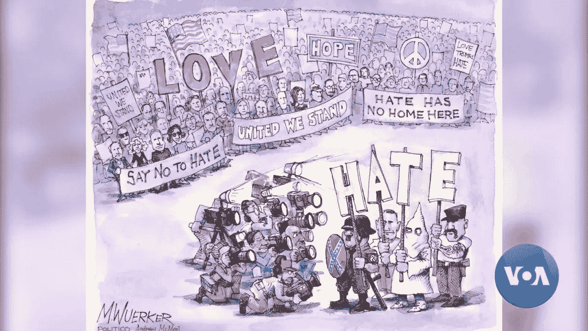

# 从查理到克赖斯特彻奇:自由民主中“绝对言论自由”的危险

> 原文：<https://medium.com/swlh/from-charlie-to-christchurch-the-dangers-of-absolute-freedom-of-expression-in-liberal-4699481e337b>

Courtesy of M.Wuerker, Andrews McMeal and POLITICO

这是 28 岁的澳大利亚公民布伦顿·塔兰特(Brenton Tarrant)在他的宣言上发表的令人难忘的话——“伟大的替代者”，之后不久，他对新西兰克赖斯特彻奇的两座清真寺进行了 17 分钟的恐怖袭击，导致 51 名穆斯林死亡。塔兰特的攻击被视为大约…