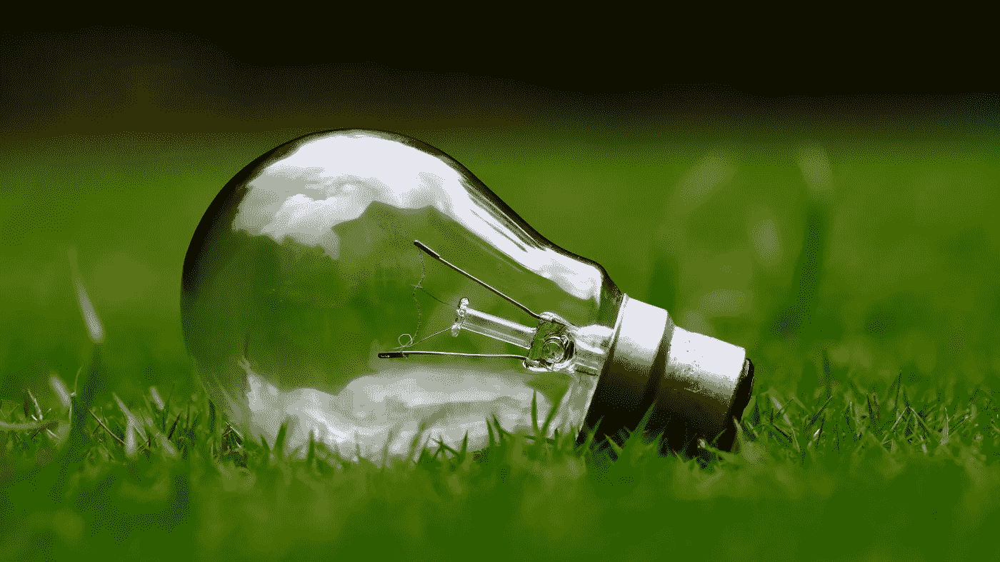

# 从茫然到清晰——我如何利用我的能量来提高我的生产力

> 原文：<https://medium.com/swlh/from-clueless-to-clarity-how-i-use-my-energy-to-turbocharge-my-productivity-bee958237fe8>

Photo by [Ashes Sitoula](https://unsplash.com/photos/UfEyDdXlRp8?utm_source=unsplash&utm_medium=referral&utm_content=creditCopyText) on [Unsplash](https://unsplash.com/search/photos/energy?utm_source=unsplash&utm_medium=referral&utm_content=creditCopyText)

## 最大化我每天的精力来完成困难的工作。

有时候我觉得自己是个十足的傻瓜。

我特别有这种感觉，当灯泡在被一个想法或概念完全包围了几年后还亮着，但却完全忘记了它。我肯定在…