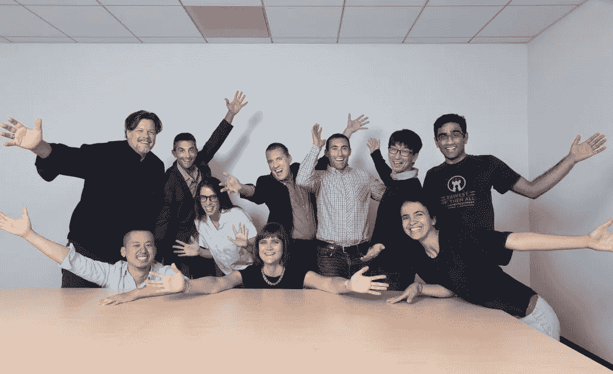

# 从混乱到异常:从数据驱动型 CEO 那里找到合适投资者的 6 个技巧

> 原文：<https://medium.com/swlh/from-flurry-to-outlier-6-tips-for-finding-the-right-investors-from-a-data-driven-ceo-11f080a1129a>

你可能认为创建并出售一家公司会让你在融资方面有很大的提升，但 Outlier AI 的肖恩·伯恩斯说，你只能依靠你的简历来达到这一步。

“我不在乎你以前做过多少次，有多少成功，”肖恩说，“筹款总是很困难。与投资者的第一次会面更容易，但也就到此为止了。”

肖恩的第一家创业公司 [Flurry](http://www.flurry.com/) ，帮助客户收集有用的数据。(Ed。注:Flurry 于 2014 年 8 月被雅虎以 3 亿美元收购。他目前的公司 Outlier AI 帮助客户找出如何处理数据，利用人工智能分析可能揭示大机会的小变化。

“今天，一切都会产生如此多的数据:销售流程、营销、支付系统、会计系统，”肖恩说。“很多公司都不知道该去哪里寻找。”

肖恩和他的联合创始人想出了如何让分析变得简单快捷，但随后他们不得不开始为他们羽翼未丰的公司筹集资金。他们在六个月内达到了一百万美元的目标。一年多一点后，他们继续筹集 640 万美元的 A 轮风险投资，由 [Ridge Ventures](http://ridge.vc) 领投，还有[首轮资本](http://www.firstround.com)、[家酿](http://www.homebrew.co)、[苏萨风险投资](http://www.susaventures.com)、 [11.2 资本](http://www.112capital.com)和 [SV 天使](http://www.svangel.com)。

对我们来说幸运的是，肖恩不认为他在筹款方面的经历使他成为一个局外人。以下是他在“我是如何养大的”播客中的一些智慧:

**1。兼容性屏幕**

十年前，当肖恩为他的第一家公司筹集资金时，有一条非常明确的道路——你带着你的商业计划在沙丘路走来走去，直到你找到一个感兴趣的投资者。现在吗？这有点像速配。

“这曾经是一个千篇一律的过程，非常令人沮丧，”肖恩说。“现在你可以走一条‘选择自己的冒险’之路，因为有更多的资金来源，但这需要你做更多的工作来找到合适的投资者。”

肖恩的标准非常简单:行业知识、经验和参与度。他寻找那些准备好建立长期关系的投资者。

他避开那些投身人工智能的投资者，因为它似乎是下一个大事件，也避开那些可能太急于“快速退出，以便筹集下一只基金”的投资者，他说。

“有很多基金只是向你扔钱，祝你好运，并希望你以回报的形式带着更多的钱回来，”肖恩说。“所以找到一个真正想参与其中的人很重要。”

**2。探针与间距**

“如果你是第一次创业，你就处于销售模式。肖恩说:“你就像在卖，卖，卖。”。“深呼吸，问投资者几个问题。他们投资了多少资金？他们今年打算再投资多少？他们做决定需要多长时间，他们的流程是怎样的？”

肖恩认为，基金本身的生命周期与投资者的经历同样重要，而弄清这一点的唯一方法就是问正确的问题。

“也许你找到了一家真正感兴趣的公司，但他们已经完成了对上一只基金的投资，实际上他们没有任何资金，”他说。“所以它最终就像客户开发一样——反复试验。我不相信有一个快速或容易的路径。”

**3。现金很酷，但条款才是王道**

“条款总是比金额或估价更重要，”肖恩说。"作为创始人，我们对纸上的美元符号有点着迷."

在他通过滑铁卢大学加速器项目[Velocity](http://velocity.uwaterloo.ca/)辅导企业家的工作中，他说他能够帮助避免一些恐怖故事。

“我在那些条款清单中看到了令我震惊的东西，比如对公司任何重大决策的否决权，”肖恩说。"有许多术语是不标准的，有些吓人."

肖恩说，在拿到条款清单之前，要确保你们已经就界限进行了对话，否则你可能别无选择。今天对投资者来说，好消息是这一过程正朝着增加透明度的方向发展。

肖恩说:“在这个‘天使投资人’盛行的时代，拥有‘标准条款’有很大的动力，所以试图引入这些疯狂的东西的投资者将会很少。”。

**4。你喷的古龙水是什么……是绝望吗？**

当你在寻找你的完美伴侣时，重要的是不要太贪心。

“当你不需要钱的时候，最好去筹集，”肖恩建议道。“因为如果你真的需要它，你就会陷入困境，投资者会直觉地感觉到这一点，并利用这一点来对付你。”

肖恩还主张尽可能保持独立。

“我相信养得越少越好，因为我认为这是你掌控自己命运的方式，”他说。“我认为，很多人会因为获得巨额估值并筹集大量资金而变得非常兴奋，因为说‘我刚刚筹集了 1000 万美元’是一种自我提升。”但实际上你所做的一切都是在约束自己，减少未来的选择。"

**5。风投摇滚——让他们发挥作用**

肖恩说:“就像生活中的一般规则一样，除非你要求，否则人们很少会做事情，风险投资者也是如此。”。

他像对待董事会成员一样对待他的投资者，每月向[发送更新](/foundersuite/maximizing-the-roi-of-your-investor-updates-3aa8bbb53670)，这样他们就能参与到他公司的日常运营中。他确保他们的关系中没有太多的权力不平衡。

肖恩说:“说‘我不是想赢得你的认可’需要很大的自信。”。“最好的首席执行官和最好的创始人会做出这种转变，因为他们必须这样做。”

**6。筹集资本和发展创业公司比看起来更难**

“如果有困难，那不是你的问题，”肖恩说。“就是难。”

*内森·贝克德是*[*Foundersuite.com*](http://foundersuite.com/)*的首席执行官，这是一个软件平台，自 2016 年以来，已经帮助初创公司筹集了超过 12 亿美元的种子和风险投资。本文基于 Foundersuite 的* [*我是如何筹集资金的播客*](https://soundcloud.com/user-2586856/how-i-raised-it-with-sean-byrnes-of-outlierai-on-8142018) *中的一集，来看看创业公司创始人是如何筹集资金的幕后故事。*

## 这篇文章发表在 [The Startup](https://medium.com/swlh) 上，这是 Medium 最大的创业刊物，拥有+440，678 读者。

## 在这里订阅接收[我们的头条新闻](https://growthsupply.com/the-startup-newsletter/)。

