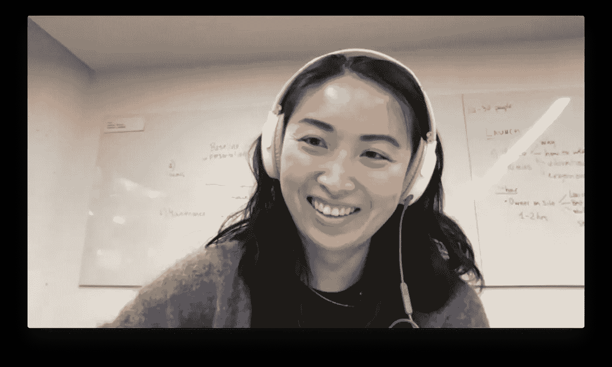

# 从出局超过 80 次，到 400 万美元的种子期:旅游初创公司 Journy 如何筹集资金

> 原文：<https://medium.com/swlh/from-striking-out-over-80-times-to-a-4m-seed-round-how-travel-startup-journy-raised-capital-70a0a303000d>

在苏珊·何(Susan Ho)出去筹集资金之前，风投们对她的公司[Journy(T3)表现出了浓厚的兴趣，这家公司为消费者和私人旅行设计师牵线搭桥。](https://www.gojourny.com/)

这听起来像是不可抗拒地受到追捧，但 Journy 的创始人兼首席执行官苏珊却不这么认为。

“我认为这是企业家需要非常努力地说不的事情——让一个单独的风投抢占你的过程，”苏珊在我们为“我如何提高它”播客发言时告诉我。相反，你想同时给你的公司引入几个风投。“所以这是一种竞争的感觉。”

但是在 Journy 有像 Caviar 创始人王凯峰和其他人这样的[投资者排队](https://www.alleywatch.com/2018/11/the-alleywatch-nyc-startup-daily-funding-report-11-6-18/)之前，它经历了它的股票跌宕起伏。

该公司提供定制旅行计划，起价为每天 25 美元，已经筹集了近 400 万美元。“我们做了一轮大约 60 万美元的种子前期投资。然后我们对 335，000 美元进行了扩展，”Susan 说。"我们刚刚筹集了 315 万美元的全部种子资金."

Susan 资助之旅的亮点(忍不住！)跟随。

**出局，一次 80 个投资者**

苏珊在进入创业公司之前，在波士顿咨询集团开始了她的职业生涯，当该产品于 2016 年 6 月推出时，她为该公司寻求资金。

“我走出去，试图筹集一轮资金，[运行了一个流程](/foundersuite/how-to-raise-capital-building-a-funnel-running-a-process-6739ac219ded)，并让我们种子期前的一位主要投资者——他人脉很广——把我介绍给大约 80 位投资者，我曾与他们交谈过，”她说。“我们每次都只是三振出局。”

一个问题是:风投在旅游初创企业上已经筋疲力尽了。

“过去有很多旅游宠儿，比如 Hipmunk 和 HotelTonight，在这些地方，消费单位经济并不成功，获得客户变得越来越昂贵，”Susan 回忆道。

“因此，作为一家消费者创业公司，我们没有太多优势。”

Journy 也缺乏数据来为投资者建立一个令人信服的案例。“我们没有证据，”她说。“我们的客户一次又一次地回来和我们预订，”Susan 说。在那个时间点，他们甚至有一个客户在六个月内使用了该服务 18 次。

“但这仍然不够。”

由于从机构风投那里筹集资金毫无进展，她转向了天使投资人。由于她的联合创始人的关系，他们从旅游频道的奇异食物主持人安德鲁·齐默恩那里筹集了资金。

他们没有将这笔资金称为前期种子资金的延伸，而是在前一轮文件中增加了更多的投资者。后来，当 Journy 开始赚钱时，他们为扩建找到了新的投资者。

“我们的早期投资者对此并不介意，因为坦率地说，他们对我们还在这里感到震惊，”苏珊说。

**风险和意外收获**

苏珊在 Fab.com 全盛时期努力成为最年轻的副总裁，她坚持不懈。

她得到了一个在苹果的[应用星球](https://www.planetoftheapps.com/en-us)拍摄的机会(尽管这一集最终没有播出)，并且不得不飞往洛杉矶的片场。她的一个投资者在拍摄前一天邀请她参加一个派对。

随着银行账户的枯竭，又没有新的资金，参加聚会变成了一种紧张的局面。

“我很早就飞到那里，我记得我意识到，*天哪，我的银行账户里有 50 美元，我不知道今晚我会住在哪里，因为演出支付了我第二天的酒店费用，但不是今天的*。”

但正是在那次聚会上，她遇到了 500 家创业公司的创始人之一，这为其 A 轮项目打开了大门。

这有助于苏珊尝试商业模式并优化定价。在一个月的时间里，他们进行了 70 到 90 次实验，以了解什么会释放增长。

“我们想到的是将我们的定价分层，并将我们的定价模式从每天 25 美元的统一费率拆分为每天 25 美元和 50 美元，”她说。

提供更高的价位，“以更清晰的方式向客户阐述了价值主张。”苏珊说，在实施价格变化和后来出去筹集资金之间，业务增长了 5 倍，“单位经济变得非常健康。”

仅旅行规划费一项，Journy 就有 55%的毛利润。“因为我们能够从中赚钱，所以我们实际上并不在乎游客是否与我们一起预订了任何活动。我们只是关心他们是否玩得开心，”她说。

**profit、margin 和 data FTW**

有了这些指标，下一轮种子期的尝试就顺利多了。

尽管苏珊最初与 80 名投资者的谈话没有给她留下关于哪些增长指标对投资者最有吸引力的可靠答案，但她说 10 万美元 MRR 是她脑海中的数字。

“我们已经非常接近这个数字了，”苏珊说，她指出，当她再次寻求资助时，每月的收入约为 8 万至 9 万美元。

“我们公布了本季度 35，000 美元的净收入……我们也证明了我们可以盈利。所以这是同时发生的很多很多事情。”

苏珊和那些拒绝她的投资者保持联系。她拿起电话，不时口头向他们介绍业务的最新情况。

她说，有几个人真的很期待见面，这有助于她优先考虑与谁联系。

“我从纽约出去到 SF。她说:“周四和周五，我参加了两天的会议——总共九场会议——最后在周一收到了一家公司的投资意向书，这家公司最终领投了我们的这轮融资。

为什么是门罗？

与其他甚至没有下载该应用的投资者不同，门洛的一位负责人使用过 Journy 几次，了解其潜力。

“我只是觉得很合适，”苏珊说。

*本文根据*[*Foundersuite.com*](https://foundersuite.com/)*的* [*我是如何筹集到资金的播客*](https://soundcloud.com/user-2586856) *中的一集改编，讲述了筹集到资金的创业公司创始人的幕后故事。*

作者:内森·贝克德，CFA

内森·贝克德是 Foundersuite.com 的首席执行官，这是一家风险投资公司，为初创公司提供领先的投资者 CRM 和投资者更新工具。自 2016 年推出 CRM 以来，用户已经筹集了超过 10 亿美元的种子和风险资本。

在创办 Foundersuite 之前，Beckord 在初创公司工作了十年，担任临时首席财务官、业务开发人员和顾问。Beckord 拥有企业家工商管理硕士学位、金融学士学位和特许金融分析师(CFA)资格。闲暇时，他喜欢航海、旅游和爬山。

## 这篇文章发表在 [The Startup](https://medium.com/swlh) 上，这是 Medium 最大的创业刊物，拥有+423，678 名读者。

## 在这里订阅接收[我们的头条新闻](https://growthsupply.com/the-startup-newsletter/)。

