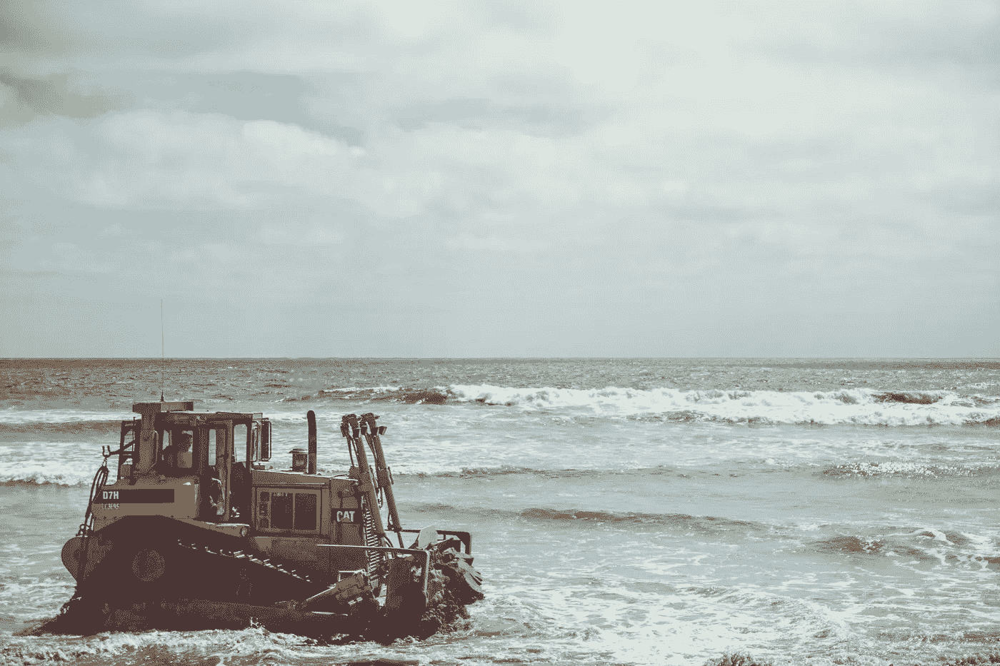

# “去他妈的穷人！”—为什么我们并不真正关心气候变化

> 原文：<https://medium.com/swlh/fuck-the-poor-why-we-dont-really-care-about-climate-change-1c56b0579724>

Photo by [NeONBRAND](https://unsplash.com/@neonbrand?utm_source=unsplash&utm_medium=referral&utm_content=creditCopyText) on [Unsplash](https://unsplash.com/search/photos/climate-change?utm_source=unsplash&utm_medium=referral&utm_content=creditCopyText)

气候变化已经来了，坦率地说，我们阻止它已经太晚了。巨石在移动，我们能做的就是让它慢下来。

美国、中国和印度在这个后期阶段几乎无所作为，我对奇迹不抱太大希望。所以是时候开始考虑未来了。