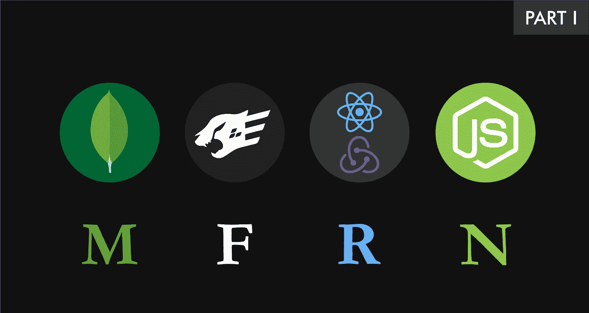

# 使用 Fastify、React、Redux 和 MongoDB Part-1 的全栈 CRUD 应用程序

> 原文：<https://medium.com/swlh/fullstack-crud-application-using-fastify-react-redux-mongodb-part-1-9e8df39c6fff>

## 让我们创造一些有趣的东西

嗨，你好。我希望你过得愉快。现在让我们做得更好。在今天的教程中，我们将使用 **Fastify** 、 **React** 、 **Redux** 和 **MongoDB** 构建一个**全栈应用**，它将支持所有 **CRUD** 功能。我们将要构建的应用程序是一个简单的…