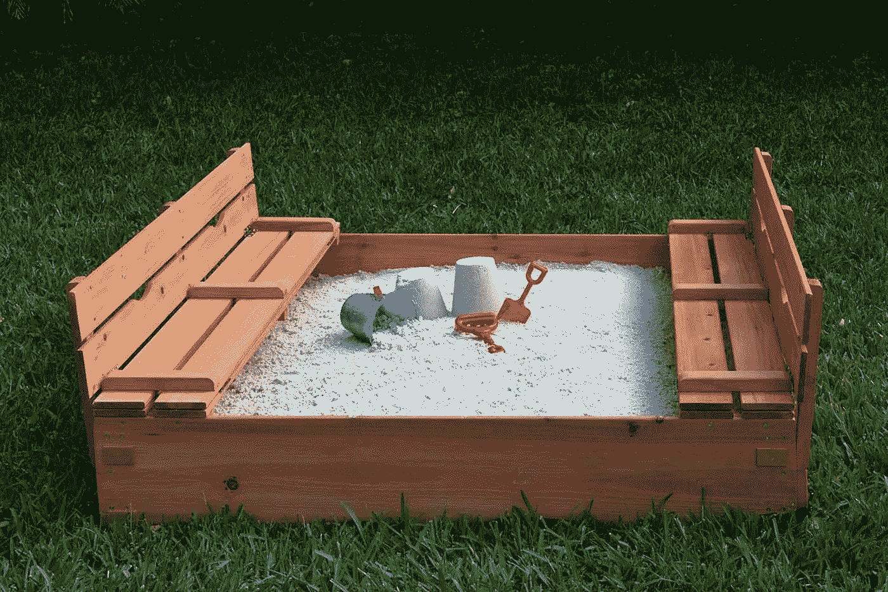
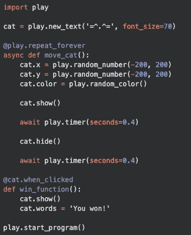

# Python 游戏的乐趣

> 原文：<https://medium.com/swlh/fun-with-python-play-dcb4e449a38e>

Source: Google Images

如果你是一个 Python 爱好者，那么你可能会很兴奋地听说一个名为 [Python Pla](https://github.com/replit/play) y 的可用库。Repl.it 有一个时事通讯，在本周的版本中有一个关于几个工程师使用 Python Play 领导一个研讨会的故事(其中一个工程师 Timmy Chen 制作了一个很酷的游戏，你可以在这里查看)。文档显示了用 Python Play 构建一个严肃的游戏是多么简单和容易。对于年轻的或者没有经验的程序员来说，这个库是深入 Python 并开始构建的绝佳选择。

在 Python Play 库中，图像和文本被称为*精灵*，它们有一些功能，你可以通过它们来制作简单而容易的移动和旋转等动画。也有各种各样的属性可以被定义，以使游戏的共同方面易于实现；对于更高级的实现 [Pymunk](http://www.pymunk.org/en/latest/) 被用来给物体添加物理特性，允许碰撞和其他体验。

在 Python Play 的 README 中有一个示例游戏，展示了如何使用该库构建游戏的基本知识。

Example Game from Python Play README

在这个例子中，你可以看到,`cat`对象被创建为一个文本对象，并被设置为游戏的动画对象。调用`cat.show()`函数使其可见，然后程序暂停一段时间，然后调用`cat.hide()`函数。`cat`对象只有在`cat.show()`被调用时才能被点击。

如果用户能够在`cat`可见时点击它，那么`win.function()`将被调用，创建的看起来像猫的文本对象将被胜利消息`'You won!'`替换。这个游戏很简单，很容易建立。文本和设置易于操作，这是对库功能的一个很好的介绍。

对于鼠标事件，Python Play 也很直观。这个库包含了你使用鼠标作为游戏主要组件所需要的大部分功能。键盘事件也是如此。Python Play 以一种易于理解的方式处理键盘事件，允许组合键事件用一个函数`play.key_is_pressed(*'key')`在一行中实现，其中`key`将被定义为键盘上的一个键；多个键也可以作为参数在函数中传递。

# 摘要

Python Play 库允许使用该库轻松构建大型游戏。我鼓励每个人都尝试一下，尤其是如果你曾经用 Pygame 编程的话。

在下面的回复中查看示例游戏。调整设置，看看如果`cat`显示少于 0.6 秒，你是否还能赢过游戏。如果你真的尝试了，在评论里贴一个链接到你的回复。

Repl of the Example Game Python Play