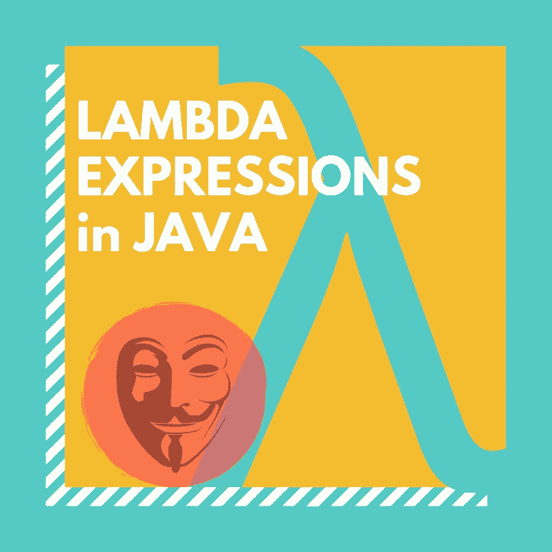

# 函数匿名:Java 中的 Lambda 表达式

> 原文：<https://medium.com/swlh/functionally-anonymous-lambda-expression-in-java-62a9f616b753>

Lambda 函数在编程世界中已经不是什么新鲜事了，多年前它第一次被引入 LISP。然而，对于 Java 生态系统来说，它们是(相对)新的，是随着 2014 年 Java 8 的发布而引入的。

它们并不真的允许你做 Java 8 之前不能做的任何事情，而是给你一个新的(有些人会说更干净、更有表现力)…