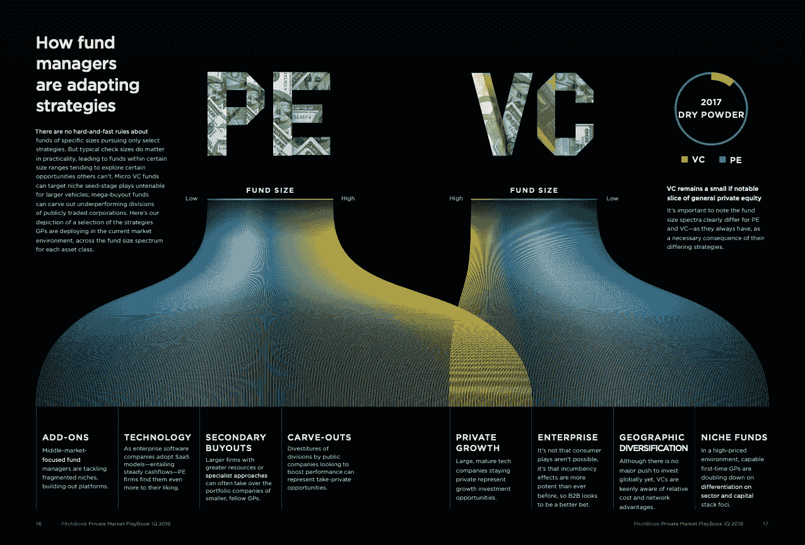

# 融资失败

> 原文：<https://medium.com/swlh/funding-failure-8a9999eed511>

Capital, capital everywhere. Photo by [Mean Shadows](https://unsplash.com/@meanxshadows?utm_source=medium&utm_medium=referral)

## 故事如何推动对创新的信心？

颠覆性创新的经验法则是——比现有技术好十倍*和*。

那太多了。非常罕见。然而，我们所有人都在暗暗努力。我们都想成为大卫对抗歌利亚。

市场也希望如此。它仍然非常稀有，但是市场非常想要它。所以市场使得资源丰富。再加上恐慌媒体的点击诱饵标题，这个循环就结束了。

> 美国每天有 2.7 亿美元的风险投资。大约 90%的企业都失败了。截至 2017 年，超过 1450 亿美元用于投资高风险技术。

我们都暗暗相信颠覆性创新。

还是很少见的。然而，它并不觉得稀有。

在美国，每天有超过 2.7 亿美元投资于高风险、高潜力的企业。近 90%的科技企业在头 18 个月失败了。然而，每个月都有新的风险基金诞生。每一个都与上一个有一点点不同。他们会告诉你，差异化是他们找到并抓住独角兽的门票。

Source: [Pitchbook](https://files.pitchbook.com/website/files/pdf/Datagraphic_PE_VC_Fund_Managers_Adapting.pdf)

2017 年年中，市场上有超过 1450 亿美元的“干粉”。这是投入基金的资金，等待被分配到股票头寸。

这些钱正等着被投资到不成熟的高风险企业。让我们颠倒一下。投资机会严重不足。有人说过多的资本正在损害风险投资。但那是后话了。

这种热情意味着什么？这对文化有什么影响？

> 创业不是致富之路。大多数时候。

离群值本身会在事后告诉你一个故事。我们喜欢好故事。你会在对成功的研究中找到模式。成功者的美德。但是获得这些美德并不意味着你也是其中之一。你仍然处于不利地位。

他们甚至在斯坦福教授这是[而不是](https://www.youtube.com/watch?v=ii1jcLg-eIQ)致富之道。10 个创业公司中有 9 个会失败。这就是几率。

然后是条件。文化、环境、遗产、世代。每个维度的特性都会随机影响结果。引人注目的成功并不常见。

你感觉如何？是不是感觉创业成功不多见？

不。因为创业失败不是一个故事。没有什么戏剧性。因为这是意料之中的，所以我们不去关注。他们关闭，每个人都削减他们的损失，或者他们找到一个追求者。

那么，为什么我们相信成为*的*故事呢？

下行空间有限，上行空间无限。损失永远不会超过投资的 100%。增益可以到达任何地方。

创新带来更多创新。廉价的服务器使云服务成为可能。广泛的联系使人们能够获得商品化的解决方案。

曾经的特权现在变成了商品。

商品使几乎任何人都能制造几乎任何东西。更多的人制造东西并不意味着更好的机会。意味着更多的故事。

这是在 martinuhnak.com 时间[发表在我的博客上的。感谢阅读。](https://martinuhnak.com/blog/)

*如果你喜欢这篇文章，请点击下面的链接，加入我的圈子。我喜欢听取别人的意见，我会回复所有人。*

[**报名信→**](https://mailchi.mp/a7d6819a370d/signupforletters)

## 这篇文章发表在 [The Startup](https://medium.com/swlh) 上，这是 Medium 最大的创业刊物，拥有+426，678 名读者。

## 在这里订阅接收[我们的头条新闻](https://growthsupply.com/the-startup-newsletter/)。

