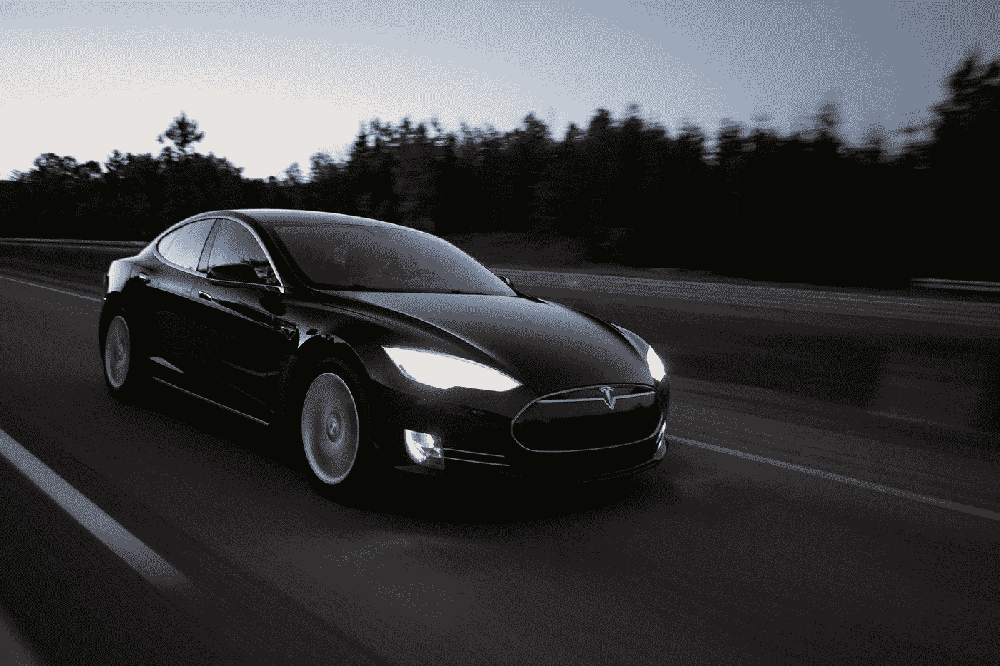

# 自动驾驶汽车的未来和对世界的影响(一)

> 原文：<https://medium.com/swlh/future-and-impact-of-autonomous-automobiles-on-the-world-part-1-3f098bd5da7f>

## 探索其对能源、金融、电子商务、司法系统和公共基础设施的影响

Photo by [Jp Valery](https://unsplash.com/@jpvalery?utm_source=medium&utm_medium=referral) on [Unsplash](https://unsplash.com?utm_source=medium&utm_medium=referral)