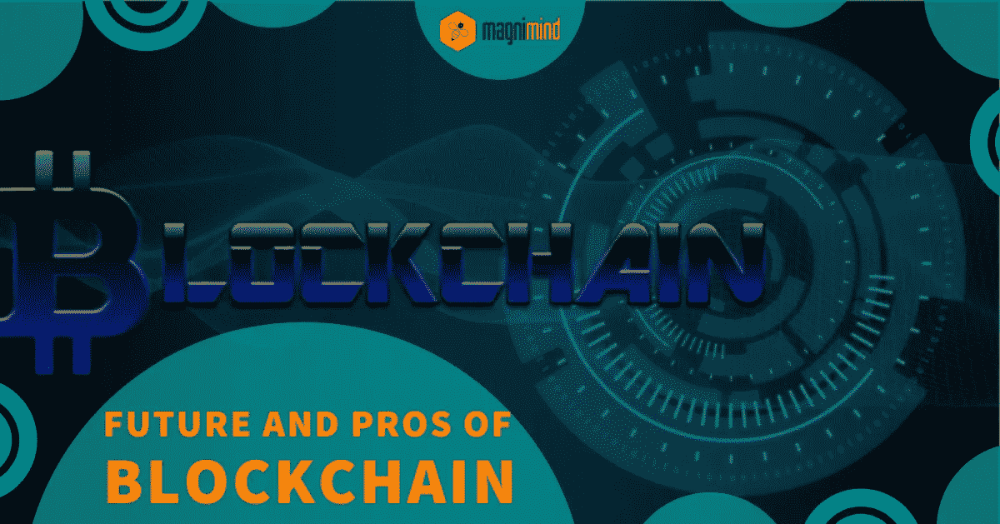
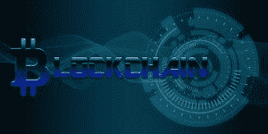

# 区块链的未来和优势

> 原文：<https://medium.com/swlh/future-and-pros-of-blockchain-5f60855d9a99>

T *hese* days， [***区块链***](https://www.blockchain.com/) 技术是全球科技巨头和大型组织研究、辩论和宣传的最热门话题之一。

> 越来越多的行业正在采用这项技术，这被认为是信息技术最大的革命之一。

重要的是要明白，尽管有些人经常互换使用比特币和区块链，但实际上，它们是完全不同的。

> 简单来说， [***比特币***](https://www.bitcoin.com/) 是虚拟货币的一种形式，*是使其成为可能的底层技术。*

*如果你有兴趣购买任何加密货币，包括**比特币**，那么很好地理解**区块链**技术，为什么它被广泛使用，以及它的未来是什么，这很重要。*

# *1-什么是区块链？*

**

> *简单地说，**区块链**指的是一个虚拟的公共账本，它以透明和安全的方式记录一切。*

*在这里，所有的数据都保存在一个互联的计算机网络中，只由用户自己拥有和运行。*

*虽然这项技术最初只在金融领域使用，但它已经通过其巨大的潜力开始接管其他行业，并慢慢成为绝对的游戏规则改变者。*

*据一些专家称，**区块链**技术比其设计支持的加密货币更有前途。随着它的实施，更有价值的使用机会几乎定期出现。*

# *2-使用区块链的主要优势*

**

*以下是区块链的主要优点，这项技术正被各行各业广泛采用。*

## *2.1-权力下放*

**

*世界上最大的公司使用中央数据系统和服务器。尽管这些公司实施并维护了最佳网络实践，但它们的数据系统和服务器仍是黑客的诱人目标，运营可能会受到影响。*

*区块链**提供的去中心化解决了这个问题，这也是这项技术被多个行业采用的原因。在这里，网络上的每个节点都保存着与其他节点相同的数据。因此，在任何节点发生故障的情况下，都不会影响整个网络。***

## *2.2-透明度*

**

*区块链最大的**优势之一是该技术本质上是开源的。这意味着开发者和其他用户有能力在他们认为合适的时候修改它。***

> *但是关于**区块链**的开源更重要的是，它使得修改记录数据变得非常困难。*

*在任何给定的时间点，由于网络上有许多眼睛，有人最有可能看到记录的数据已被修改。*

## *2.3-安全性*

**

**正如*我们之前讨论过的，没有一个演员可以操纵 [***区块链网络***](https://hyperledger-fabric.readthedocs.io/en/release-1.3/network/network.html) ，它有助于将安全性提升到一个新的水平。在这里，在一个节点上执行的任何操作都必须被复制，并且在动作被激活之前得到其他节点的同意。这意味着像雇员被黑的电脑或被入侵的雇员这样的单个行为者无法让整个区块链网络瘫痪。*

## *2.4-成本效益*

**

**降低*交易成本是区块链的另一大**优势。***

> *该技术允许企业对企业和个人对个人的交易在没有任何第三方(如银行)参与的情况下完成。*

*随着时间的推移，消除中间人的介入导致企业或用户的成本降低。*

## *2.5-快速交易结算*

**

*众所周知，对于传统银行来说，交易需要几天才能完全结算。。这种延迟主要是由于软件协议、固定工作时间和时区差异等原因造成的。*

> *另一方面， [***区块链技术***](https://blockgeeks.com/.../what-is-blockchain-technology/) 全天候工作，这意味着基于它的交易流程相对更快地完成。*

## *2.6-保留当前和历史记录的能力*

**

*当使用常规数据库时，很难检查历史交易。在 ***区块链*** 中，所有历史和当前交易都被安全地记录在一个地方。所以，如果你愿意的话，你可以回去检查第一个积木来了解它是从哪里开始的。在这里，每一个信息块都包含在内，从它的最开始一直到几分钟前。*

## *2.7-用户控制*

**

**加密货币投资者特别鼓励**区块链**的*原因是其控制方面。在这里，用户和开发者控制他们所有的事务和信息，而不是让第三方来执行。换句话说，你可以认为**区块链**是民有、民享的东西。*

*因此，你可以看到区块链技术提供了一系列革命性的好处。总之，它们提供了这种技术最深刻的品质——它不需要信任就能安全地交互和交易。*

> *在区块链技术的帮助下，传统系统可以转变为动态系统，在这种系统中，信任不再重要，因为不再需要信任。*

*毫无疑问，这有助于建立任何东西的所有权，而不需要一个中央权威。*

* [## 加密货币的灵魂之战

### 在“保护消费者”的幌子下，秘密监管可能会毁掉一切有益的东西

hackernoon.com](https://hackernoon.com/the-war-for-bitcoins-soul-b81d5c87aa3c) 

# 3-广泛使用区块链技术的行业

***区块链*** 技术正在被一些特定行业稳步采用，享受上述好处。让我们来看看它们。

## 3.1-质量保证

*如果*在链条的某处观察到不规则情况，一个**区块链**使能系统可以引导用户到达其起点。这使得用户更容易进行调查和执行必要的操作。例如，您可以考虑食品行业，其中追踪来源、批次信息等对于保持质量和安全至关重要。

## 3.2-供应链管理

> *在*这个行业里，**区块链**提供了性价比和可追溯性的优势。

例如，企业可以使用**区块链**来跟踪商品的来源、流动和数量等。这提高了透明度，同时简化了生产流程保证、所有权转移、支付等流程。

## 3.3-会计

***区块链*** 技术可以被会计师用来记录交易，最大限度地减少人为错误，增加准确性。 [***基于区块链的会计系统***](https://hackernoon.com/how-blockchain-will-write-a-new-era-for-accounting-industry-f8832bf24167) 也能够保护敏感数据免受欺诈或非法操纵。

这里，记账变化需要由节点网络来验证。简而言之，会计大量围绕审计线索，区块链有助于开发一个安全的审计线索。

## 3.4-全球支付

*这个*是能够从**区块链**技术的实施中受益的最显著的行业之一。有一些服务可以有效地在全球范围内转移资金。它们的一些主要问题是费用高、运行慢、在一些国家不存在等。当涉及到以区块链为基础的货币时，费用要低得多。

> 此外，基于区块链的支付网络也提高了速度和安全性。

还有很多其他行业在很大程度上依赖于区块链。然而，有一件事是由这项技术促成的，它可以使各种类型的企业受益。您可能意识到，耗时的合同交易会降低任何业务的增长，尤其是对于持续处理大量通信的组织。有了智能合同，协议可以通过**区块链**结构自动验证、签署和执行，从而帮助企业节省时间和金钱。

# 4-区块链的未来

***区块链*** 技术以巨大的力量影响着几乎每个行业。基于该领域的最新发展，以下是区块链的未来。

## 4.1-区块链即服务

*就像其他平台帮助组织管理运营一样，我们可以期待看到新平台的增长，这些平台具有为企业实现**区块链**网络的良好特性。**区块链**即服务或[***Baas***](https://www.investopedia.com/terms/b/blockchainasaservice-baas.asp)是一种基于云的服务，公司无需设置和基础设施即可利用。*

## 4.2-混合动力区块链

*一个*混血儿**区块链**是私人和公共**区块链**的结合体。

> 混合区块链的主要优点是网络的特定部分可以保持私有，特定部分可以公开。

这将比公共**区块链**更快更便宜，同时允许获得与**区块链**相同的优势。

## 4.3-在大数据中实施区块链

*凭借*去中心化、不变性等特性，**区块链**可以应对处理大数据的两大挑战——真实性和受限访问，以保持数据质量和控制。数据安全和隐私无疑是企业最关心的两个问题。集中式数据在很大程度上是不安全的。

> 但是有了**区块链**，数据可以由生成数据的用户管理，从而带来更多的数据安全和隐私。

此外，通过**区块链**生成的数据需要更少的审查，因为操纵此类数据的可能性极低。它结合了密码术和散列法来开发存储在一系列几乎不可变的块中的数据。

因此，拥有大数据的 ***区块链*** 有望成为小型和大型企业的强大工具，重新定义处理数据的方式。

# 最终外卖

和任何技术一样，**区块链**也有一些缺点，比如复杂性、缺乏足够的资源、人为错误的可能性等等。

> 然而，考虑到**区块链**符合成为未来技术的所有条件，有很多理由去学习它，如果可能的话，获得它的认证。

虽然这项技术仍然局限于有限的几个行业，但它很有可能很快扩展到其他各个领域。尽管可能还需要几年时间，区块链肯定会再次改变科技领域。

 [## 马格尼明德学院

### 欢迎来到机器学习的世界！详情请见 https://buff.ly/2R6QY2B #机器学习# python #程序#AI…

www.facebook.com](https://www.facebook.com/magnimindacademy/photos/a.256868294982447/308086736527269/?type=3&theater)  [## 区块链的未来和优势——Magnimind 学院

### 这些天来，区块链技术是科技巨头们研究、辩论和炒作的最热门话题之一…

magnimindacademy.com](https://magnimindacademy.com/future-and-pros-of-blockchain/) 

> 在此订阅接收[我们的头条新闻。](http://eepurl.com/gjDwwP)

## 这篇文章发表在 [The Startup](https://medium.com/swlh) 上，这是 Medium 最大的创业刊物，拥有+443，678 名读者。

## 在这里订阅接收[我们的头条新闻](https://growthsupply.com/the-startup-newsletter/)。

*