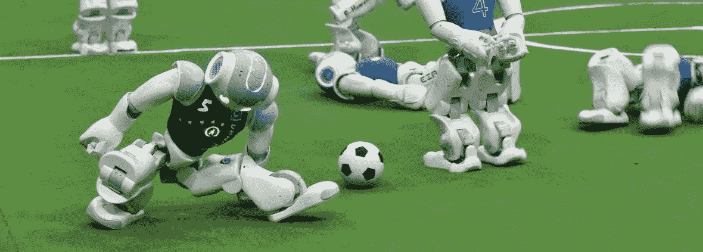

# 未来体育:人工智能的下一步

> 原文：<https://medium.com/swlh/future-sports-ais-next-step-e94e32819bde>

## 艾成为我们下一个最伟大的运动员

A snapshot of the tense match in RoboCup 2017\. Photo Credit: Kazuhiro Nogi, Getty Images.

他看到左翼有一个漏洞，立即惩罚了他们。在冲向边路后，他在中心寻找队友，并迅速传中完成任务！打开任何一个体育频道，你都会听到类似的声音。你很可能会想象罗纳尔多或者其他明星球员在新的草地上奔跑。事实上，这…