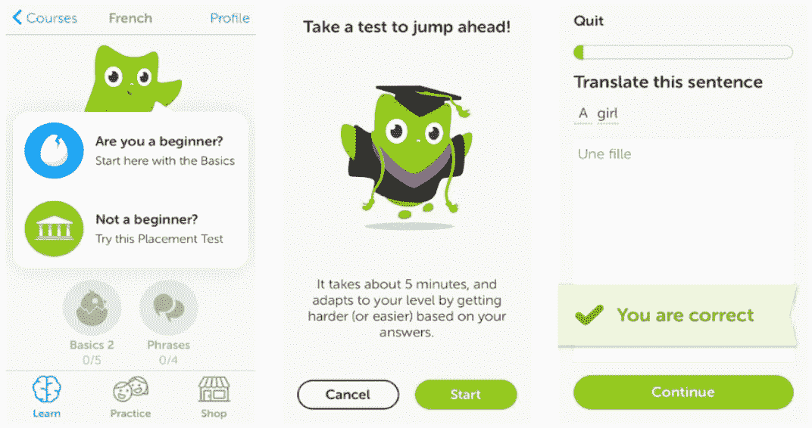
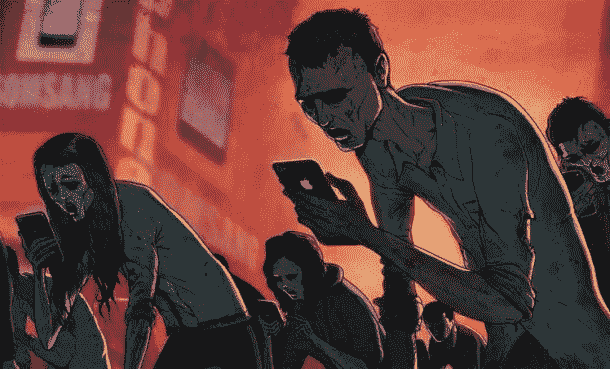

# 游戏化和开发者道德

> 原文：<https://medium.com/swlh/gamification-and-developer-ethics-f35a3ce6fbf9>

即使你没有听说过这个术语，如果你是互联网用户或者拥有一部智能手机，你可能会非常熟悉游戏化的概念。从约会应用到语言学习软件，游戏机制在网络开发中已经变得司空见惯。看到你的喜欢在 Instagram 或 Twitter 帖子上增加，或者让你的手机提醒你已经实现了当天的步骤目标，这是一种内在的回报。这是将游戏机制应用于我们技术的企业的最终目标:用户参与。

## 好的一面

游戏和玩耍在我们的天性中根深蒂固，自古以来就是人类社会交往的重要组成部分。他们成为我们文化的一部分是很自然的，随着我们越来越多的互动发生在网上，游戏机制自然会延续到我们的网络生活中。有些领域，比如教育，是“游戏化”设计的必然受益者。作为熨斗学校的学生，学习平台及其实验室和课程结构是我们日常生活的一部分，有助于构建我们的教育，并鼓励通过课程。语言学习应用多林果采用等级和徽章来激励进步和奖励坚持。

A typical Learn.co homepage, showing completed challenges, consecutive days, and velocity.

Duolinguo breaks learning into levels and rewards users with badges.

甚至有公司使用游戏化策略试图改善世界，例如 [RecycleBank](https://www.recyclebank.com/) ，它以折扣和交易奖励采取环保行动的用户。很明显，游戏化的设计可以让用户满意，甚至给人们和社区带来积极的影响，但重要的是要记住一件事:这不是游戏。

## 不是游戏

游戏化的系统掩盖了这些应用和实用程序根本不是游戏的事实。虽然我们从这种系统中获得的乐趣可以帮助我们学习或改善我们的健康，但它们也可以作为社会控制系统。教育和工作领域采用游戏化策略的一个原因是，它们没有像我们的娱乐和休闲一样以同样的速度发展。电影是巨大的奇观，视频游戏是数十亿美元的产业，像增强和虚拟现实这样的未来技术正在进入主流。所有这些都给已经在争夺我们的企业带来了危机。

在传统的广告模式中，通过各种渠道(如电视、广播和杂志)向消费者销售产品。在脸书和谷歌等基于广告的数字商业模式中，用户就是产品，你的数据被卖回给广告商。脸书的早期投资者罗杰·麦克纳米最近对这种商业模式敲响了警钟，在这种模式中，参与是最重要的衡量标准。

因此，游戏化策略被用来人为地推动用户参与，导致不健康的行为。即使是苹果公司，其产品套件旨在让你留在他们的生态系统中，也引入了 screen time——一种报告你盯着他们的屏幕花了多长时间的工具——因为担心过度参与技术的*的影响。*

## 开发软件

游戏化的系统是全球性的，而且通常是可怕的。迪士尼和亚马逊都有工人控制系统，使用游戏策略——在仓库和洗衣房显示记分牌，显示工人的信息——以精神和身体健康为代价提高生产力(跳过洗手间休息，怀孕的工人落后，等等)。).中国已经推出了一个社会信用体系，该体系将对公民进行排名，并根据违规行为(如不良驾驶或在禁烟区吸烟)调整他们的分数，惩罚措施包括禁止旅行、互联网甚至高等教育。无人机技术将战争的恐怖抽象到视频游戏领域，消除了现实生活中暴力对屏幕上目标(或“头奖”)的直接影响。

“技术冲击”是伦理学家托马斯·唐纳森(Thomas Donaldson)创造的一个术语，用来描述新技术的发展与评估它们引发的伦理问题所需的框架之间的滞后时间。鉴于游戏化是商业中传播最快的行为工具之一，开发者需要对他们设计和使用的策略保持警惕。至少，我们应该思考我们在做什么，为什么要做。

*   [IEEE 计算机协会道德准则](https://www.computer.org/education/code-of-ethics)
*   Aeon.co: [《游戏化工作的阴暗面》](https://aeon.co/essays/how-employers-have-gamified-work-for-maximum-profit)
*   TechCrunch: [罗杰·麦克纳米谈脸书](https://techcrunch.com/2019/02/05/famed-investor-roger-mcnamee-once-advised-facebook-now-hes-certain-its-destroying-our-democracy/)
*   伊恩·波哥大:[“游戏化是扯淡”](http://bogost.com/writing/blog/gamification_is_bullshit/)