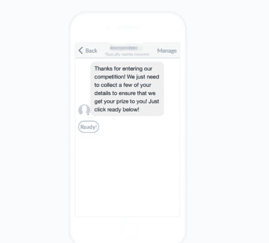
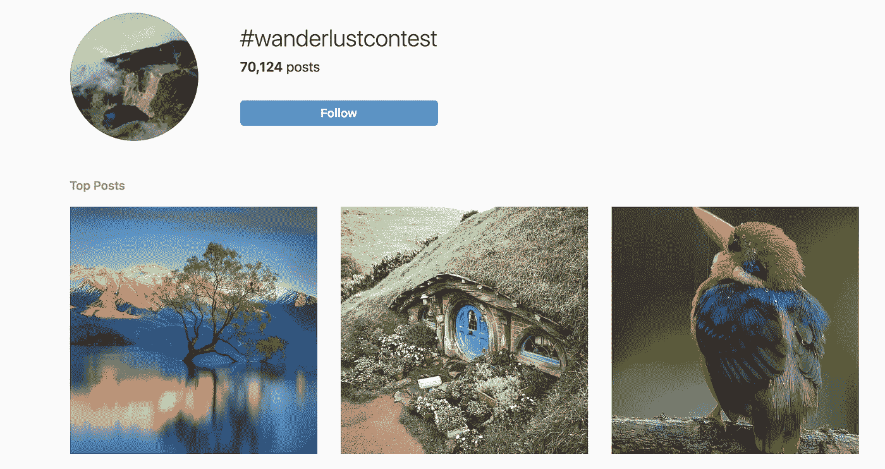
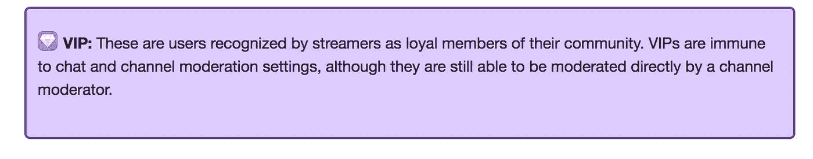
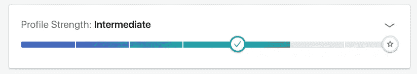

# 营销中的游戏化:吸引、娱乐和创造回头客的 5 种策略

> 原文：<https://medium.com/swlh/gamification-in-marketing-5-strategies-to-engage-entertain-and-create-return-custom-cccd4066143a>

游戏和营销是天作之合…

…但是，找到一个吸引人、娱乐人并远离危险的“太难了”标签的最佳点，是许多企业都在努力解决的问题。

然而，当游戏化起作用时，它为企业做了疯狂的事情，这篇文章背后的灵感证明了这一点。

当要写一篇新文章的时候(本周)，我钻研了我的内容库，通读了来自读者的最新消息，并分析了过去几个月我们的分类统计数据(一如既往)…

……但是一周内第三次在我们办公室吃午饭时发生了一些事情……(至少)我们团队中的 4 个人去了*麦当劳*。

为什么？麦当劳又在玩垄断游戏了！

对于任何不知道的人来说，麦当劳经常在他们的食品盒上贴上标签，上面有专卖街(或奖品)。如果你收集了一整条街，你就赢了一个奖！

换句话说，在麦当劳吃饭变成了一种游戏，鼓励顾客一次又一次地回来(在这个过程中可能会增加几磅体重)。

在看到它对我们一些团队的影响后，我认为是时候做一些研究了，看看我们自己的客户工作，并为您提供 5 个对您的业务有同样吸引力的策略。

让我们深入了解一下:

# 营销中的游戏化

# #1:竞争

这是我的最爱之一。作为一家代理公司，我们过去曾用这种策略制作出 ***和*** 这样令人难以置信的投资回报率(我们有一种非常独特的方式)。

竞争建立名单，创造销售，并创造一个围绕你的生意。他们显示出你是一个关心客户的人，并准备好奖励他们与你的互动。

竞赛最大的好处(在我看来)是它在你的追随者中创造的兴奋感。在公布结果和获奖者的过程中，许多参赛者会不断查看自己的状态，参与您的业务，并及时了解您的最新社交帖子。

我建议提供一些免费或大折扣的东西(虽然这也没用)，并要求潜在客户的联系方式作为交换。然后，如果你超级聪明(像我们一样)，请你的参赛者在社交网站上分享比赛，以获得额外的参赛资格！

在比赛结束时，你将会建立一个对你的产品感兴趣的人的名单，你可以向他们推销。专业建议是告诉每一个没有获胜的人，他们是亚军，并向他们提供亚军奖(例如，你在比赛中使用的产品的折扣)。

*如果你想了解更多关于这个策略的信息，我已经在我们的*[*Messenger Marketing post*](https://www.einsteinmarketer.com/messenger-marketing/)*中写了一个案例研究。*

# #2:用户生成内容

用户生成内容竞赛是吸引潜在客户、让他们参与到你的业务中并让你更有亲和力的绝佳方式。

他们要求公众(从你的社交追随者开始)根据你的竞赛/比赛指南发布一篇自制的内容。

如果你幸运的话，你的比赛将产生大量的参赛作品，并鼓励人们在他们自己的社交档案上分享它，从而产生病毒般的效果。

当要求用户创建视频或图像时，这种类型的游戏化尤其有效。这些很容易创建，而且不需要和书面条目一样的努力(就像这样！).

UGC 竞赛最好的例子之一是 NatGeo 的 wanderlust 竞赛。这项比赛要求用户只需在 [*Instagram*](http://instagram.com/einsteinmarketer) 上用标签***# wanderlustcatest***标记他们的照片，就可以输入他们的最佳自然照片。

这使得用户进入变得非常容易(不需要特意去做),并允许进入者查看他们竞争对手的作品！

# #3:徽章

听说过这样一句话吗，*“把它当作荣誉徽章佩戴？”*

说到营销，顾客喜欢炫耀他们的忠诚，通过鼓励他们这样做，他们实际上是在向别人推荐你！

在您的潜在客户/客户进行购买之旅时，奖励他们徽章是鼓励他们继续购买(从而获得更多徽章)并与其他人分享经验的好方法。

徽章、别针或邮票是一种非常简单却又非常容易的游戏化方式。他们为潜在客户提供地位、抱负和乐趣。

使用徽章的一个很好的例子是流行的游戏流媒体服务 Twitch。

他们鼓励他们的内容创建者用 VIP 徽章奖励他们社区的忠实成员。这些用户不受渠道审核设置的影响，他们的用户名旁边有 VIP 徽章，证明他们对社区其他人的忠诚。

# #4:协作优惠

还记得我之前提到的麦当劳游戏吗？这是孩之宝(垄断的所有者)和世界上最大的快餐连锁店之间合作的一个例子。

麦当劳从他们的顾客那里获得了回头客和更好参与的好处，而孩之宝增加了他们的曝光率，并在今天竞争激烈的游戏市场中保持了相关性。

协作优惠使两家公司平等受益，通过挖掘合作伙伴的受众有效地扩大了它们的覆盖范围，帮助了它们的发展。

如果你热衷于创造一个合作机会(如麦当劳)，小心不要与竞争对手合作，因为你可能会失去长期业务。我建议选择一个对你的目标市场有吸引力的行业，但是和你自己的行业完全不同。

看看麦当劳用如此惊人的事实使用这种策略的方式。他们把合作提议变成了一个游戏。每个人都不是赢家，相反，他们被鼓励回来收集更多的贴纸，增加他们获胜的机会。

# #5:点数/完整性量表

点和完整性度量并不完全相同，但是它们足够接近，可以捆绑到同一个点上。

完整性量表是一种游戏化策略，经常被要求用户创建个人资料的网站使用。这些之所以有效，是因为用户在个人资料中放的越多，他们就越有可能与其他人联系并返回网站。

一个很好的例子就是[***LinkedIn***。他们要求用户填写个人资料的每一部分，当他们这样做时，个人资料页面上的完整度就会上升。这鼓励他们更多地参与 LinkedIn 平台。](https://www.linkedin.com/company/einsteinmarketer/)

如果你有一个内容需要登录的网站，或者甚至是一个会员区，为什么不试着在个人资料部分添加一个完整性量表呢？

一个类似于完整性量表的策略是一个基于点的系统。有很多方法可以做到这一点，每次顾客购买、使用你的品牌或在购买过程中迈出新的一步时，它都可以用在个人资料区域。

三星是一家使用积分系统来提高网站参与度的公司。每次用户参与他们的内容时，他们都会给他们奖励积分，每次参与所需的努力越多(例如回答问题、观看视频、在社交网站上分享)，他们获得的积分就越多。

# 营销中的游戏化:结论

游戏可以为你的营销活动、业务增长和品牌形象带来惊喜。

这篇文章中强调的 5 个策略都被世界上一些最大的品牌所采用，并取得了惊人的效果。如果做一些简单的事情，如增加积分、徽章或创建竞赛，可以为他们带来巨大的回报，为什么它不能为你带来同样的回报呢？

显然，你的品牌、行业和产品必须符合你选择的游戏化过程。分析客户的人口统计数据，选择最合适的策略！

如何看待营销中的游戏化？这些策略中有没有任何一个吸引你重复购买？

## 这篇文章发表在 [The Startup](https://medium.com/swlh) 上，这是 Medium 最大的创业刊物，拥有+443，678 读者。

## 订阅接收[我们的头条新闻](https://growthsupply.com/the-startup-newsletter/)。

